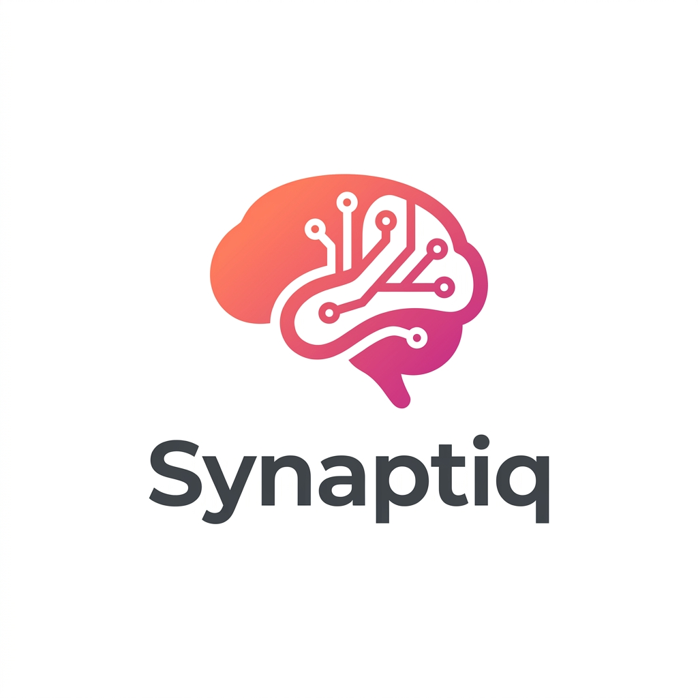
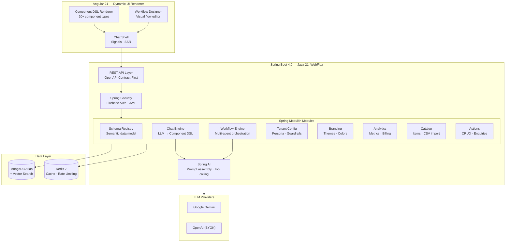
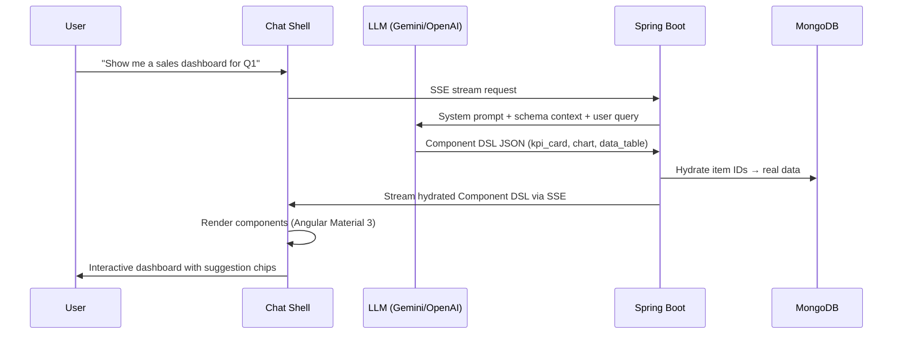

<p align="center">
  
</p>

<h1 align="center">Synaptiq</h1>

<p align="center">
  <strong>The AI‑native application platform where conversation becomes computation — and data becomes UI.</strong>
</p>

<p align="center">
  <a href="https://github.com/spectrayan/synaptiq/actions"></a>
  <a href="https://github.com/spectrayan/synaptiq/blob/main/LICENSE"></a>
  <a href="https://github.com/spectrayan/synaptiq/releases"></a>
  <a href="https://github.com/spectrayan/synaptiq/stargazers"></a>
</p>

<p align="center">
  <a href="#-quick-start">Quick Start</a> ·
  <a href="#-what-synaptiq-does">What It Does</a> ·
  <a href="#-architecture">Architecture</a> ·
  <a href="#-api-reference">API Reference</a> ·
  <a href="CONTRIBUTING.md">Contributing</a> ·
  <a href="https://github.com/spectrayan/synaptiq/discussions">Community</a>
</p>

---

## 🎯 What is Synaptiq?

Modern business software is still built the old way: static screens, rigid dashboards, endless forms, and complex navigation. Even with AI bolted on, most tools remain fundamentally manual and brittle.

**Synaptiq flips this model.**

> **The future of software isn't apps with AI inside — it's AI that *becomes* the app.**

Synaptiq is a **chat‑native, data‑driven application platform** where businesses define their data, and the system **dynamically generates dashboards, workflows, reports, and entire UI experiences at runtime**. No manual UI building. No dashboard design. No workflow coding. Just natural language.

| Problem | Synaptiq Solution |
|---------|-------------------|
| Users drown in static dashboards | **Dynamic UI generation** — ask in natural language, get the exact interface you need |
| Building internal tools takes weeks | **AI-generated applications** — describe what you want, Synaptiq assembles it in seconds |
| Data is scattered across systems | **Semantic data layer** — define entities, metrics, and relationships; AI reasons over them |
| Workflows are rigid and coded | **Conversational orchestration** — create multi-step workflows through natural language |
| Every user gets the same experience | **Personalized, context‑aware UX** — the UI adapts to the user, not the other way around |
| Employees waste time navigating software | **Chat *is* the operating system** — just ask, and Synaptiq assembles what you need |

---

## 🧠 What Synaptiq Does

### 1. Conversational Intelligence

Users interact with their business through natural language:

- *"Show me a sales dashboard for Q1."*
- *"Drill into the Northeast region."*
- *"Create a workflow that alerts me when churn spikes."*
- *"Generate a report comparing last quarter to this one."*

Synaptiq interprets intent, reasons over the data model, and generates the appropriate UI or action.

### 2. Dynamic UI Generation (Component DSL)

Synaptiq doesn't rely on prebuilt screens. Instead, it generates UI **at runtime** using a strict, declarative Component DSL — 20+ rich component types rendered inline in the conversation:

| Category | Components |
|----------|------------|
| **Data Visualization** | KPI cards, charts (bar, line, pie, donut via ECharts), stat grids, metric tables |
| **Catalog & Lists** | Item cards, item grids, comparison tables, data tables, filter summaries |
| **Workflows & Actions** | Kanban boards, timelines, progress trackers, action confirmations |
| **Forms & Input** | Dynamic forms with validation, conditional visibility, file upload |
| **Layout** | Composable views with tabs, sidebars, columns, grids — dashboard-grade layouts assembled by AI |
| **Navigation** | Launchpad — personalized home surface with saved views and suggestion chips |

### 3. Semantic Data Understanding

Businesses define their entities, metrics, dimensions, relationships, permissions, and vocabulary. Synaptiq uses this semantic layer to ensure accuracy, governance, and safe reasoning — the AI knows exactly what data exists and how to query it.

### 4. Multi-Agent Workflow Orchestration

Synaptiq can generate and execute complex workflows through natural language:
- Sequential, parallel, and supervisor agent flows
- Visual workflow designer with drag-and-drop node editor
- CRUD operations, alerts, approvals, and external integrations
- Community templates for common patterns

---

## ✨ Platform Capabilities

| Module | Description | Status |
|--------|-------------|--------|
| **Dynamic UI Engine** | 20+ component types rendered at runtime from AI-generated declarative JSON specs | ✅ Stable |
| **Semantic Schema Registry** | Auto-inference from document sampling, field-level type/cardinality analysis, per-tenant registration | ✅ Stable |
| **AI Chat Engine** | Streaming SSE responses, Gemini & OpenAI adapters, BYOK support, circuit breaker + keyword fallback | ✅ Stable |
| **Vector Search** | MongoDB Atlas Vector Search with Gemini embeddings, automatic re-embedding on schema changes | ✅ Stable |
| **Agent Workflow Engine** | Multi-agent orchestration (sequential, parallel, supervisor) with visual flow designer | ✅ Stable |
| **Multi-Tenant Architecture** | Subdomain-based isolation, RBAC (platform admin → viewer), per-tenant rate limiting | ✅ Stable |
| **Admin via Chat** | Configure AI persona, guardrails, branding, analytics — all through the chat interface itself | ✅ Stable |
| **Per-Tenant Branding** | Logos, color palettes, fonts, named theme presets (max 5), WCAG AA contrast validation | ✅ Stable |
| **Analytics** | Conversation metrics, token usage vs plan limits, billing reports, platform-wide rollups | ✅ Stable |
| **Actions Engine** | Save items, contact enquiries, CRUD operations — audit-logged with retry + backoff | ✅ Stable |

---

## 🏗️ Architecture

Synaptiq is built as a **modular monolith** using Spring Modulith with a reactive API layer, event-driven module communication, and a declarative Component DSL that bridges the AI backend to a rich Angular rendering engine.



### How Dynamic UI Generation Works



### Design Principles

| Principle | Implementation |
|-----------|---------------|
| **AI generates the UI** | LLM emits declarative Component DSL JSON; frontend renders natively |
| **Secure by design** | Backend hydration — LLM never sees sensitive data; no executable code in UI specs |
| **API-First** | OpenAPI spec → generated Java interfaces + Angular SDK |
| **Hexagonal Architecture** | Domain core is pure POJOs — no framework annotations |
| **Event-Driven** | Modules communicate via `@ApplicationModuleListener` events only |
| **Reactive End-to-End** | WebFlux + Reactive MongoDB for non-blocking I/O |
| **RFC 9457 Errors** | Standardized `application/problem+json` responses across all APIs |

---

## 🛠️ Tech Stack

| Layer | Technology |
|-------|------------|
| **Frontend** | Angular 21 · TypeScript 5.9 · Angular Material 3 · Signals · SSR |
| **Component DSL** | 20+ declarative component types · ECharts · dynamic form engine |
| **Backend** | Java 21 · Spring Boot 4 · Spring Framework 7 · WebFlux |
| **AI / LLM** | Spring AI (Vertex AI Gemini · OpenAI BYOK) · tool calling · prompt assembly |
| **Modularity** | Spring Modulith (module boundaries, event-driven, hexagonal) |
| **Database** | MongoDB Atlas + Vector Search (reactive driver) |
| **Cache** | Redis 7 (reactive, rate limiting, prompt cache) |
| **Auth** | Firebase Auth (multi-tenant, custom claims) + built-in JWT |
| **API Spec** | OpenAPI 3.0 · openapi-generator for Java + TypeScript codegen |
| **Build** | Nx 22 monorepo · Maven (backend) · pnpm (frontend) |

---

## 🚀 Quick Start

### Prerequisites

| Tool | Version |
|------|---------|
| Java | 21+ (JDK) |
| Node.js | 22+ |
| pnpm | 10+ |
| Maven | 3.9+ |
| Docker | Latest |

### 1. Clone & Install

```bash
git clone https://github.com/spectrayan/synaptiq.git
cd synaptiq
pnpm install
```

### 2. Start Infrastructure

<details>
<summary><strong>Option A: Docker Compose (recommended)</strong></summary>

```bash
# MongoDB Atlas Local (vector search) + Redis + Firebase Auth Emulator
docker compose up -d
```

</details>

<details>
<summary><strong>Option B: Local services (no Docker)</strong></summary>

```bash
# Requires MongoDB and Redis running locally
# Uses built-in JWT auth (no Firebase dependency)
scripts\start-local.bat     # Windows
scripts/start-local.sh      # macOS / Linux
```

</details>

### 3. Seed Demo Data (optional)

```bash
scripts\seed-data.bat       # Windows
# or
pip install pymongo && python seed-data/seed_all.py
```

### 4. Run the Platform

```bash
# Start both backend and frontend
scripts\start-local.bat

# Or run individually:
cd apps/backend/spring-apis && mvn spring-boot:run -Dspring-boot.run.profiles=dev
pnpm nx serve shell
```

### 5. Open the App

| Service | URL |
|---------|-----|
| **Frontend** | [http://localhost:4200](http://localhost:4200) |
| **Backend API** | [http://localhost:8080](http://localhost:8080) |
| **Swagger UI** | [http://localhost:8080/swagger-ui.html](http://localhost:8080/swagger-ui.html) |
| **Default Login** | `admin@synaptiq.local` / `admin` |

---

## 📡 API Reference

Full interactive docs are available at **`/swagger-ui.html`** when the backend is running.

### Chat & AI

| Method | Endpoint | Description |
|--------|----------|-------------|
| `POST` | `/api/v1/chat/message` | SSE streaming chat — returns Component DSL specs |
| `POST/DELETE` | `/api/v1/sessions` | Session lifecycle |
| `GET` | `/api/v1/sessions/{id}/history` | Conversation history |

### Schema & Catalog

| Method | Endpoint | Description |
|--------|----------|-------------|
| `POST` | `/api/v1/catalog/schema/import` | Import schema (OpenAPI / JSON / YAML) |
| `GET/PATCH` | `/api/v1/catalog/schema` | View / annotate catalog schema |
| `POST` | `/api/v1/catalog/items` | Create catalog item |
| `GET` | `/api/v1/catalog/items` | List items (paginated, filtered) |
| `POST` | `/api/v1/catalog/import/csv` | Bulk CSV import |

### Workflows

| Method | Endpoint | Description |
|--------|----------|-------------|
| `POST` | `/api/v1/workflows` | Create workflow definition |
| `POST` | `/api/v1/workflows/{id}/execute` | Execute multi-agent workflow |
| `POST` | `/api/v1/workflows/generate` | AI-generate workflow from description |
| `GET` | `/api/v1/workflows/templates` | Community workflow templates |

### Admin & Config

| Method | Endpoint | Description |
|--------|----------|-------------|
| `POST` | `/api/v1/tenants` | Create tenant (platform admin) |
| `GET/PATCH` | `/api/v1/config/ai` | AI persona, guardrails config |
| `GET/PATCH` | `/api/v1/config/branding` | Theme, colors, logo |
| `GET` | `/api/v1/analytics/summary` | Usage metrics & billing |

---

## 📁 Monorepo Structure

```
synaptiq/                              # Nx 22 monorepo root
├── apps/
│   ├── frontend/web/shell/            # Angular 21 SSR — chat shell + DSL renderer
│   └── backend/spring-apis/           # Spring Boot 4 (WebFlux + Modulith)
│       └── src/main/java/com/synaptiq/
│           ├── chat/                  #   SSE chat streaming + LLM orchestration
│           ├── catalog/               #   Schema import, item CRUD, CSV
│           ├── workflow/              #   Multi-agent workflow engine
│           ├── tenantconfig/          #   AI persona, guardrails, BYOK
│           ├── branding/              #   Theme, logo, colors
│           ├── analytics/             #   Metrics, billing, usage
│           ├── schemaregistry/        #   Schema registry + semantic data model
│           └── shared/                #   Cross-cutting config, security, events
├── libs/
│   ├── frontend/
│   │   ├── dsl-renderer/             # 20+ DSL component renderers (the dynamic UI engine)
│   │   ├── auth/                     # AuthService, AuthGuard, login page
│   │   ├── chat/                     # Chat UI — message list, input, streaming
│   │   └── theme/                    # M3 theme service + CSS var injection
│   ├── backend/
│   │   └── agent-flow-spring/        # Spring-based multi-agent workflow engine
│   └── shared/
│       ├── openapi-spec/             # OpenAPI 3.0 contract (source of truth)
│       ├── sdks/                     # Generated Angular SDK
│       ├── apis/                     # Generated Spring server stubs
│       └── constants/                # Component DSL type definitions
├── docs/
│   ├── vision.md                     # Platform vision & strategy
│   ├── research/                     # Market research & gap analysis
│   └── architecture.md              # System architecture
├── seed-data/                        # Database seeding scripts
├── scripts/                          # Start/stop/seed batch scripts
└── docker-compose.yml                # MongoDB + Redis + Firebase Auth Emulator
```

---

## 🗺️ Roadmap

Synaptiq's current implementation provides strong semantic data modeling, dynamic UI generation, and business rule encoding. The roadmap targets deeper enterprise connectivity:

| Phase | Capability | Status |
|-------|-----------|--------|
| ✅ | Semantic Data Model + Schema Registry | Complete |
| ✅ | Dynamic Component DSL (20+ types) | Complete |
| ✅ | Multi-agent Workflow Engine | Complete |
| ✅ | Per-tenant Branding & Theming | Complete |
| 🔶 | General-purpose RAG Pipeline | In Progress |
| ⬜ | MCP Server (expose Synaptiq as tools) | Planned |
| ⬜ | MCP Client + External Connector Registry | Planned |
| ⬜ | A2A Protocol for Agent Federation | Planned |
| ⬜ | Unstructured Data Ingestion (PDF, email) | Planned |

> See [docs/research/](docs/research/) for full market analysis and gap assessments.

---

## 🤝 Contributing

We welcome contributions of all kinds! Please see our **[Contributing Guide](CONTRIBUTING.md)** for full details.

```bash
# Quick start for contributors
git clone https://github.com/<your-username>/synaptiq.git
cd synaptiq
pnpm install
docker compose up -d
pnpm nx serve shell
```

---

## 🌐 Community

- 🐛 [Report a Bug](https://github.com/spectrayan/synaptiq/issues/new?template=bug_report.md)
- 💡 [Request a Feature](https://github.com/spectrayan/synaptiq/issues/new?template=feature_request.md)
- 💬 [Discussions](https://github.com/spectrayan/synaptiq/discussions)
- 📧 [developer@spectrayan.com](mailto:developer@spectrayan.com)
- 🔒 [Security Policy](SECURITY.md)

---

## 📚 Documentation

- [Vision](./docs/vision.md) — Platform vision & strategy
- [Architecture](./docs/architecture.md) — System architecture & data flow
- [Market Research](./docs/research/AI-Native%20App%20Platform%20Market%20Research.md) — Full market feasibility analysis
- [A2UI Comparison](./docs/research/a2ui_vs_synaptiq_analysis.md) — Google A2UI vs Synaptiq Component DSL
- [Gap Analysis](./docs/research/core_mechanics_gap_analysis.md) — Core mechanics roadmap
- [Contributing](./CONTRIBUTING.md) — How to contribute

---

## 📄 License

This project is licensed under the **MIT License** — see the [LICENSE](LICENSE) file for details.

---

<p align="center">
  Built with ❤️ by <a href="https://github.com/spectrayan">Spectrayan</a>
</p>
