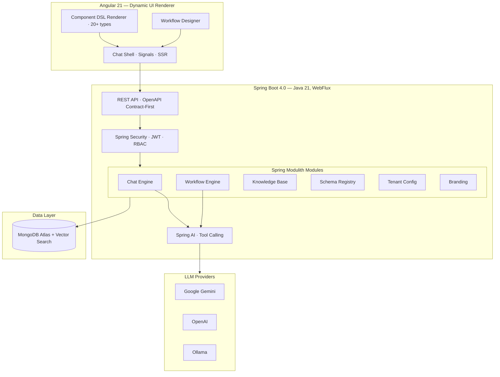

<p align="center">
  
</p>

<h1 align="center">Synaptiq</h1>

<p align="center">
  <strong>The AI‑native application platform where conversation becomes computation — and data becomes UI.</strong>
</p>

<p align="center">
  <a href="https://github.com/spectrayan/synaptiq/actions"></a>
  <a href="https://github.com/spectrayan/synaptiq/blob/main/LICENSE"></a>
  <a href="https://github.com/spectrayan/synaptiq/releases"></a>
  <a href="https://github.com/spectrayan/synaptiq/stargazers"></a>
</p>

<p align="center">
  <a href="#-quick-start">Quick Start</a> ·
  <a href="#-what-synaptiq-does">What It Does</a> ·
  <a href="#-architecture">Architecture</a> ·
  <a href="#-use-cases">Use Cases</a> ·
  <a href="https://spectrayan.github.io/synaptiq/">Documentation</a> ·
  <a href="CONTRIBUTING.md">Contributing</a>
</p>

---

## 🎯 What is Synaptiq?

Modern business software is still built the old way: static screens, rigid dashboards, endless forms, and complex navigation. Even with AI bolted on, most tools remain fundamentally manual and brittle.

**Synaptiq flips this model.**

> **The future of software isn't apps with AI inside — it's AI that *becomes* the app.**

Synaptiq is a **chat‑native, data‑driven application platform** where businesses define their data, and the system **dynamically generates dashboards, workflows, reports, and entire UI experiences at runtime**. No manual UI building. No dashboard design. No workflow coding. Just natural language.

| Problem | Synaptiq Solution |
|---------|-------------------|
| Users drown in static dashboards | **Dynamic UI generation** — ask in natural language, get the exact interface you need |
| Building internal tools takes weeks | **AI-generated applications** — describe what you want, Synaptiq assembles it in seconds |
| Data is scattered across systems | **Semantic data layer** — define entities, metrics, and relationships; AI reasons over them |
| Workflows are rigid and coded | **Multi-agent orchestration** — create workflows through natural language |
| Every user gets the same experience | **Personalized, context‑aware UX** — the UI adapts to the user |

---

## 🧠 What Synaptiq Does

### 1. Conversational Intelligence

Users interact with their business through natural language:

- *"Show me a sales dashboard for Q1."*
- *"Generate therapy goals for this client profile."*
- *"Create a compliance report for the Henderson portfolio."*
- *"Find summer dresses under $50 with good reviews."*

Synaptiq interprets intent, reasons over the data model, and generates the appropriate UI or action.

### 2. Dynamic UI Generation (Component DSL)

Synaptiq generates UI **at runtime** using a declarative Component DSL — 20+ rich component types rendered inline in the conversation:

| Category | Components |
|----------|------------|
| **Data Visualization** | KPI cards, charts (bar, line, pie, donut via ECharts), stat grids, metric tables |
| **Catalog & Lists** | Item cards, item grids, comparison tables, data tables, filter summaries |
| **Workflows & Actions** | Kanban boards, timelines, progress trackers, action confirmations |
| **Forms & Input** | Dynamic forms with validation, conditional visibility, file upload |
| **Layout** | Composable views with tabs, sidebars, columns, grids |
| **Navigation** | Launchpad — personalized home surface with suggestion chips |

### 3. Multi-Agent Workflow Orchestration

Complex business processes are handled by multiple specialized AI agents:

| Flow Type | Pattern | Example |
|-----------|---------|---------|
| **Sequential** | Agent A → B → C | Research → Analyze → Report |
| **Parallel** | Agents A, B, C simultaneously | Multi-analyst market assessment |
| **Supervisor** | Coordinator manages specialists | ABA therapy goal generation |
| **Dynamic** | Runtime routing based on results | Customer support triage |

### 4. Semantic Data Understanding

Organizations define entities, metrics, dimensions, relationships, and vocabulary. The AI uses this semantic layer for accurate, governed reasoning — it knows exactly what data exists and how to query it.

### 5. Knowledge Base & RAG

Documents are ingested, chunked, embedded, and stored in MongoDB Atlas Vector Search. Chat responses are automatically grounded in your organization's actual documents with source citations.

---

## ✨ Platform Capabilities

| Module | Description | Status |
|--------|-------------|--------|
| **Dynamic UI Engine** | 20+ component types rendered at runtime from AI-generated JSON specs | ✅ Stable |
| **Semantic Schema Registry** | Auto-inference from document sampling, field-level analysis | ✅ Stable |
| **Per-Tenant Branding** | Logos, colors, fonts, named theme presets, WCAG AA validation | ✅ Stable |
| **AI Chat Engine** | Streaming SSE responses, Gemini & OpenAI adapters, BYOK support | 🔶 Beta |
| **Vector Search & RAG** | MongoDB Atlas Vector Search with embedding models | 🔶 Beta |
| **Agent Workflow Engine** | Multi-agent orchestration (sequential, parallel, supervisor, dynamic) | 🔶 Beta |
| **Knowledge Base** | Document ingestion, vector embeddings, contextual RAG | 🔶 Beta |
| **Multi-Tenant Architecture** | Tenant isolation, per-tenant config, RBAC | 🔶 Beta |
| **Auth & RBAC** | Built-in JWT + Firebase Auth, scope-based authorization (46 scopes) | 🔶 Beta |
| **Actions Engine** | Save items, CRUD operations, audit-logged with retry | 🔶 Beta |

---

## 🏗️ Architecture



### Design Principles

| Principle | Implementation |
|-----------|---------------|
| **AI generates the UI** | LLM emits declarative Component DSL JSON; frontend renders natively |
| **Secure by design** | Backend hydration — LLM never sees sensitive data |
| **API-First** | OpenAPI spec → generated Java + Angular + Kotlin + Swift SDKs |
| **Hexagonal Architecture** | Domain core is pure POJOs — no framework annotations |
| **Event-Driven** | Modules communicate via `@ApplicationModuleListener` events |
| **Reactive End-to-End** | WebFlux + Reactive MongoDB for non-blocking I/O |

---

## 🛠️ Tech Stack

| Layer | Technology |
|-------|------------|
| **Frontend** | Angular 21 · TypeScript 5.9 · Angular Material 3 · Signals · SSR |
| **Component DSL** | 20+ declarative component types · ECharts · dynamic form engine |
| **Backend** | Java 21 · Spring Boot 4 · Spring Framework 7 · WebFlux |
| **AI / LLM** | Spring AI (Google Gemini · OpenAI BYOK · Ollama) · tool calling |
| **Modularity** | Spring Modulith (module boundaries, event-driven, hexagonal) |
| **Database** | MongoDB Atlas + Vector Search (reactive driver) |
| **Auth** | Built-in JWT + Firebase Auth (multi-tenant) |
| **API Spec** | OpenAPI 3.0 · codegen for Java + TypeScript + Kotlin + Swift |
| **Build** | Nx 22 monorepo · Maven (backend) · pnpm (frontend) |

---

## 🚀 Quick Start

### Prerequisites

| Tool | Version |
|------|---------|
| Java | 21+ (JDK) |
| Node.js | 22+ |
| pnpm | 10+ |
| Maven | 3.9+ |
| Docker | Latest |

### 1. Clone & Install

```bash
git clone https://github.com/spectrayan/synaptiq.git
cd synaptiq
pnpm install
```

### 2. Start Infrastructure

```bash
docker compose up -d
```

### 3. Configure Environment

```bash
# Required
export GOOGLE_API_KEY="your-gemini-api-key"
export AUTH_PROVIDER="builtin"

# Optional: Ollama for embeddings (RAG)
# ollama serve && ollama pull nomic-embed-text
```

### 4. Run the Platform

```bash
# Backend (Spring Boot on :8080)
GOOGLE_API_KEY="$GOOGLE_API_KEY" AUTH_PROVIDER="builtin" \
  mvn spring-boot:run -f apps/backend/spring-apis/pom.xml \
  -Dspring-boot.run.profiles=dev -Dmaven.test.skip=true

# Frontend (Angular on :4200)
pnpm nx serve synaptiq
```

### 5. Open the App

| Service | URL |
|---------|-----|
| **Frontend** | [http://localhost:4200](http://localhost:4200) |
| **Backend API** | [http://localhost:8080](http://localhost:8080) |
| **Swagger UI** | [http://localhost:8080/swagger-ui.html](http://localhost:8080/swagger-ui.html) |
| **Default Login** | `admin@synaptiq.dev` / `admin123` |

> **Full setup guide:** [Quick Start Documentation](https://spectrayan.github.io/synaptiq/getting-started/quickstart/)

---

## 🏥 Use Cases

### Healthcare — ABA Therapy Goal Generation

A supervisor agent coordinates four specialist agents (ABA, Speech Therapy, OT, CBT) to generate a consolidated 12-month therapy plan with quarterly milestones — reducing the process from **2-3 weeks to minutes**.

### Financial Services — Portfolio Advisory

Relationship managers ask natural language questions (*"Show me risk exposure for the Henderson account"*) and receive dynamically generated KPI cards, allocation charts, and compliance-ready reports.

### E-Retail — Intelligent Catalog

Conversational product discovery (*"Find summer dresses under $50 with good reviews"*) generates item grids, comparison tables, and personalized recommendations in real-time.

### Enterprise — Internal Tool Automation

Replace custom-built internal tools (HR onboarding, IT support, executive dashboards) with AI-generated interfaces powered by your organization's knowledge base.

> **Full use case documentation:** [Use Cases](https://spectrayan.github.io/synaptiq/about/use-cases/)

---

## 📁 Monorepo Structure

```
synaptiq/                              # Nx 22 monorepo root
├── apps/
│   ├── frontend/web/shell/            # Angular 21 — chat shell + DSL renderer
│   └── backend/spring-apis/           # Spring Boot 4 (WebFlux + Modulith)
│       └── src/main/java/.../synaptiq/
│           ├── chat/                  #   Chat engine + LLM orchestration
│           ├── workflow/              #   Multi-agent workflow engine
│           ├── knowledgebase/         #   Knowledge base + RAG pipeline
│           ├── schemaregistry/        #   Semantic data model
│           ├── tenantconfig/          #   AI persona, guardrails
│           ├── branding/              #   Theme, logo, colors
│           ├── auth/                  #   Authentication + RBAC
│           └── shared/                #   Cross-cutting config, security
├── libs/
│   ├── frontend/
│   │   ├── dsl-renderer/             # 20+ DSL component renderers
│   │   ├── auth/                     # Auth service, guards, login
│   │   ├── chat/                     # Chat UI — messages, input, streaming
│   │   └── theme/                    # M3 theme service + CSS vars
│   ├── backend/
│   │   └── agent-flow-spring/        # Multi-agent workflow engine library
│   └── shared/
│       ├── openapi-spec/             # OpenAPI 3.0 contract (source of truth)
│       ├── sdks/                     # Generated SDKs (Angular, Kotlin, Swift)
│       └── apis/                     # Generated Spring server stubs
├── docs/
│   ├── site-docs/                    # MkDocs documentation site
│   ├── architecture.md               # System architecture
│   └── vision.md                     # Platform vision
├── seed-data/                        # Database seeding scripts
└── docker-compose.yml                # MongoDB infrastructure
```

---

## 🗺️ Roadmap

| Phase | Capability | Status |
|-------|-----------|--------|
| ✅ | Semantic Data Model + Schema Registry | Complete |
| ✅ | Dynamic Component DSL (20+ types) | Complete |
| ✅ | Multi-agent Workflow Engine (4 flow types) | Complete |
| ✅ | Per-tenant Branding & Theming | Complete |
| ✅ | Knowledge Base & RAG Pipeline | Complete |
| 🔶 | End-to-End Workflow Stability | In Progress |
| ⬜ | MCP Server (expose Synaptiq as tools) | Planned |
| ⬜ | MCP Client + External Connector Registry | Planned |
| ⬜ | A2A Protocol for Agent Federation | Planned |
| ⬜ | Unstructured Data Ingestion (PDF, email) | Planned |

---

## 📚 Documentation

Full documentation is available at **[spectrayan.github.io/synaptiq](https://spectrayan.github.io/synaptiq/)**

| Section | Content |
|---------|---------|
| **[About](https://spectrayan.github.io/synaptiq/about/why-synaptiq/)** | Why Synaptiq, key concepts, use cases, comparison, FAQ |
| **[Getting Started](https://spectrayan.github.io/synaptiq/getting-started/quickstart/)** | Quick start, platform overview |
| **[User Guide](https://spectrayan.github.io/synaptiq/user-guide/chat/)** | Chat, workflows, knowledge base, admin |
| **[Architecture](https://spectrayan.github.io/synaptiq/architecture/overview/)** | System overview, Component DSL, multi-agent, ADRs |
| **[Deep Dives](https://spectrayan.github.io/synaptiq/deep-dives/chat-engine/)** | Chat engine, workflow engine, semantic data, auth, branding |
| **[Operations](https://spectrayan.github.io/synaptiq/operations/deployment/)** | Deployment, contributing, security, changelog |

---

## 🤝 Contributing

We welcome contributions of all kinds! Please see our **[Contributing Guide](CONTRIBUTING.md)** for full details.

```bash
git clone https://github.com/<your-username>/synaptiq.git
cd synaptiq && pnpm install
docker compose up -d
pnpm nx serve synaptiq
```

---

## 🌐 Community

- 🐛 [Report a Bug](https://github.com/spectrayan/synaptiq/issues/new?template=bug_report.md)
- 💡 [Request a Feature](https://github.com/spectrayan/synaptiq/issues/new?template=feature_request.md)
- 💬 [Discussions](https://github.com/spectrayan/synaptiq/discussions)
- 📧 [developer@spectrayan.com](mailto:developer@spectrayan.com)
- 🔒 [Security Policy](SECURITY.md)

---

## 📄 License

This project is licensed under the **MIT License** — see the [LICENSE](LICENSE) file for details.

---

<p align="center">
  Built with ❤️ by <a href="https://github.com/spectrayan">Spectrayan</a>
</p>
