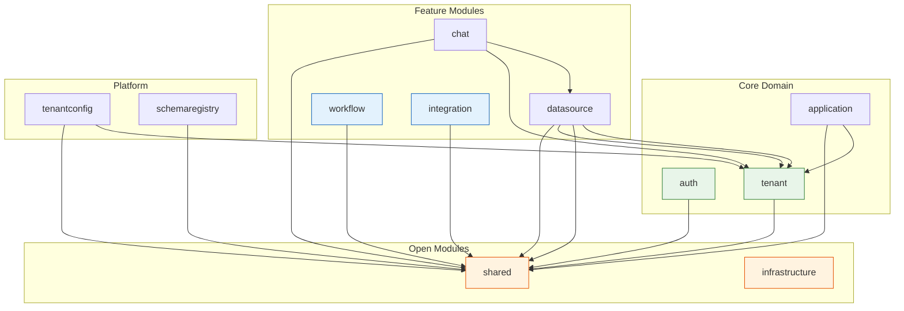

# ADR-001: Modular Monolith with Spring Modulith

**Status:** Accepted  
**Date:** 2026-05-05  
**Authors:** Spectrayan Team

---

## Context

Synaptiq's backend serves 10+ bounded contexts (Auth, Tenant, DataSource, Chat, Workflow, Integration, TenantConfig, Application, SchemaRegistry, Notification). A microservices architecture would introduce premature operational complexity (service mesh, distributed tracing, inter-service auth) for a team and product at this stage.

We needed an architecture that:
1. Enforces module boundaries as strictly as microservices
2. Allows deployment as a single artifact (simplifies DevOps)
3. Provides a clear migration path to microservices if scale demands it
4. Supports independent domain evolution within each bounded context

## Decision

Use **Spring Modulith** on top of a **hexagonal (ports & adapters) architecture** within a single Spring Boot 4 application.

### Module Structure



### Hexagonal Package Convention

Every module follows the same internal structure:

```
com.spectrayan.synaptiq.{module}/
├── domain/                 # Pure domain model (no framework deps)
│   ├── model/              # Entities, value objects
│   └── service/            # Domain services
├── application/            # Use cases
│   ├── port/
│   │   ├── in/             # Inbound ports (interfaces)
│   │   └── out/            # Outbound ports (interfaces)
│   └── service/            # Application service implementations
└── infrastructure/         # Framework-specific adapters
    ├── in/
    │   └── web/            # Controllers implementing OpenAPI interfaces
    └── out/
        └── persistence/    # MongoDB repository implementations
```

### Rules

1. **Domain layer has zero framework imports** — pure Java POJOs
2. **Application services only depend on ports** — never on infrastructure directly
3. **Controllers implement generated OpenAPI interfaces** — contract-first (see ADR-002)
4. **Inter-module communication via Spring Application Events** — no direct cross-module method calls
5. **`@ApplicationModuleTest`** validates boundaries at compile time

## Consequences

### Positive
- Single deployable artifact — one Cloud Run service, one CI pipeline
- Compile-time boundary enforcement prevents accidental coupling
- Hexagonal layers keep domain logic testable without Spring context
- Clear migration path: extract a module into its own service by implementing the same ports

### Negative
- All modules share a single database connection pool
- Vertical scaling only (all modules scale together)
- Spring Modulith context loading can slow down integration tests

## References

- [Spring Modulith Documentation](https://docs.spring.io/spring-modulith/reference/)
- [Hexagonal Architecture (Alistair Cockburn)](https://alistair.cockburn.us/hexagonal-architecture/)
