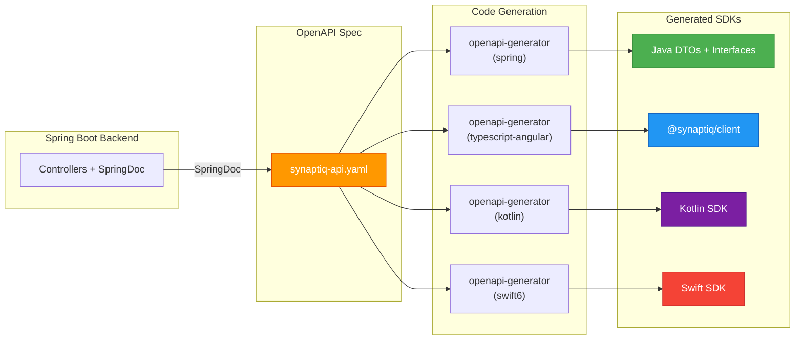

# ADR-002: Contract-First API Design with OpenAPI Codegen

**Status:** Accepted  
**Date:** 2026-05-05  
**Authors:** Spectrayan Team

---

## Context

Synaptiq is a full-stack monorepo with a Spring Boot 4 backend and Angular 21 frontend, with planned Kotlin (Android) and Swift (iOS) mobile clients. The frontend needs typed HTTP clients for every API endpoint. Manual client creation is error-prone and drifts from the actual API contract.

We needed a strategy that:
1. Guarantees all clients (Angular, Kotlin, Swift) stay in sync with the backend
2. Eliminates manual DTO creation on every platform
3. Generates type-safe services with proper return types per platform

## Decision

Adopt a **contract-first** approach using OpenAPI 3.0 specification and multi-platform code generation.

### Pipeline



### Generated SDK Locations

```
libs/shared/
├── apis/v1/synaptiq-apis/          # Java DTOs + controller interfaces
├── sdks/v1/angular/synaptiq-client/ # Angular SDK (@synaptiq/client)
├── sdks/v1/kotlin/synaptiq-client/  # Kotlin SDK
└── sdks/v1/swift/SynaptiqClient/    # Swift SDK
```

### Rules

1. **OpenAPI spec is the single source of truth** — all DTOs are generated, never hand-written
2. **Controllers implement generated interfaces** — `IntegrationController implements IntegrationsApi`
3. **Never manually edit generated files** — re-run `/generate-sdk` workflow
4. **Only facades may inject generated services** on the frontend (see ADR-005)
5. **MapStruct mappers bridge** domain ↔ generated DTOs at the infrastructure boundary

## Consequences

### Positive
- Single source of truth: spec → typed clients on 4 platforms
- Zero manual DTO maintenance
- Type-safe API calls with compile-time checking on every platform
- IDE autocompletion for all API methods and response shapes

### Negative
- Generator output can be verbose (mitigated by tree-shaking)
- Regeneration required after API changes (mitigated by `/generate-sdk` workflow)
- OpenAPI spec must be maintained carefully — it drives all downstream code

## References

- [OpenAPI Generator](https://openapi-generator.tech/)
- [SpringDoc OpenAPI](https://springdoc.org/)
