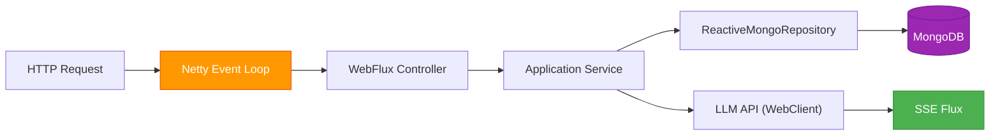

# ADR-003: Reactive Persistence with WebFlux & MongoDB

**Status:** Accepted  
**Date:** 2026-05-05  
**Authors:** Spectrayan Team

---

## Context

Synaptiq's backend handles concurrent chat sessions with LLM streaming, webhook inbound traffic from integrations, and real-time SSE notifications. A blocking I/O model would exhaust thread pools under load, especially during LLM API calls (1–10s latency each).

We evaluated:
1. **Spring MVC + Virtual Threads** — simpler programming model, but limited reactive operator support for SSE/streaming
2. **Spring WebFlux + Reactive MongoDB** — fully non-blocking, native streaming support

## Decision

Use **Spring WebFlux** with **Reactive MongoDB** (`spring-boot-starter-data-mongodb-reactive`) for all I/O operations. The entire request pipeline is non-blocking.

### Reactive Stack

### Convention

| Return Type | When |
|-------------|------|
| `Mono<T>` | Single item operations (findById, save, delete) |
| `Flux<T>` | Collections, streaming results, SSE |
| `Mono<Void>` | Fire-and-forget operations |

### Rules

1. **Never call `.block()`** in the request processing pipeline (controllers, services, repositories)
2. **`.block()` is allowed only** in `SmartLifecycle` startup hooks and `@EventListener` handlers
3. **Use `Schedulers.boundedElastic()`** for wrapping blocking calls (e.g., Camel route loading)
4. **All repositories extend `ReactiveMongoRepository`** — no blocking `MongoRepository`
5. **Domain-to-document mapping** uses manual mapper methods (not MapStruct for Mongo documents)

## Consequences

### Positive
- Netty event loop handles thousands of concurrent connections on minimal threads
- Native `Flux<ServerSentEvent>` for LLM token streaming — no adapter needed
- Back-pressure support for high-throughput webhook ingestion
- MongoDB change streams integrate naturally with reactive pipelines

### Negative
- Steeper learning curve for developers unfamiliar with reactive programming
- Stack traces are harder to read (reactive operator chains)
- Testing requires `StepVerifier` instead of simple assertions

## References

- [Spring WebFlux Documentation](https://docs.spring.io/spring-framework/reference/web/webflux.html)
- [Spring Data MongoDB Reactive](https://docs.spring.io/spring-data/mongodb/reference/mongodb/reactive-repositories.html)
