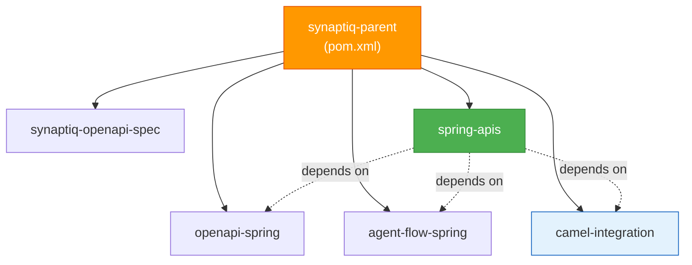

# ADR-004: Parent POM Dependency Management

**Status:** Accepted  
**Date:** 2026-05-10  
**Authors:** Spectrayan Team

---

## Context

Synaptiq's backend consists of multiple Maven modules:

```
synaptiq-parent (reactor root)
├── synaptiq-openapi-spec
├── openapi-spring (generated DTOs)
├── agent-flow-spring
├── camel-integration
└── spring-apis (main application)
```

Initially, each module independently declared its own dependency versions, Spring Boot parent, and plugin configurations. This caused:
1. **Version drift** — different modules using different versions of shared dependencies
2. **Duplicated configuration** — Jackson, Lombok, MapStruct versions repeated in every POM
3. **Build failures** — conflicting transitive dependency versions

## Decision

Introduce a **parent POM** (`synaptiq-parent`) that centralizes all dependency versioning, BOM imports, and plugin configuration. Child modules inherit from the parent and never declare version numbers.

### POM Hierarchy



### What the Parent POM Manages

| Concern | Managed By |
|---------|------------|
| Spring Boot version | `spring-boot-starter-parent` as grandparent |
| Java version (21) | `<maven.compiler.release>` |
| Lombok, MapStruct versions | `<dependencyManagement>` |
| Apache Camel BOM | `<dependencyManagement>` |
| Compiler plugin config | `<pluginManagement>` (annotation processors) |
| Consistent encoding | `<project.build.sourceEncoding>` |

### Rules

1. **Child modules never declare `<version>` on managed dependencies**
2. **New shared dependencies go into parent `<dependencyManagement>`**
3. **`mvn clean compile` at the reactor root builds all modules** in dependency order
4. **Library modules (`camel-integration`, `agent-flow-spring`) have `<packaging>jar</packaging>`** — no Spring Boot fat JAR plugin

## Consequences

### Positive
- Single place to update dependency versions
- `mvn clean compile` from root validates the entire build
- No version conflicts between modules
- New modules inherit all configuration automatically

### Negative
- All modules must use the same Spring Boot version (acceptable — they deploy together)
- Parent POM changes affect all modules (intentional — ensures consistency)
