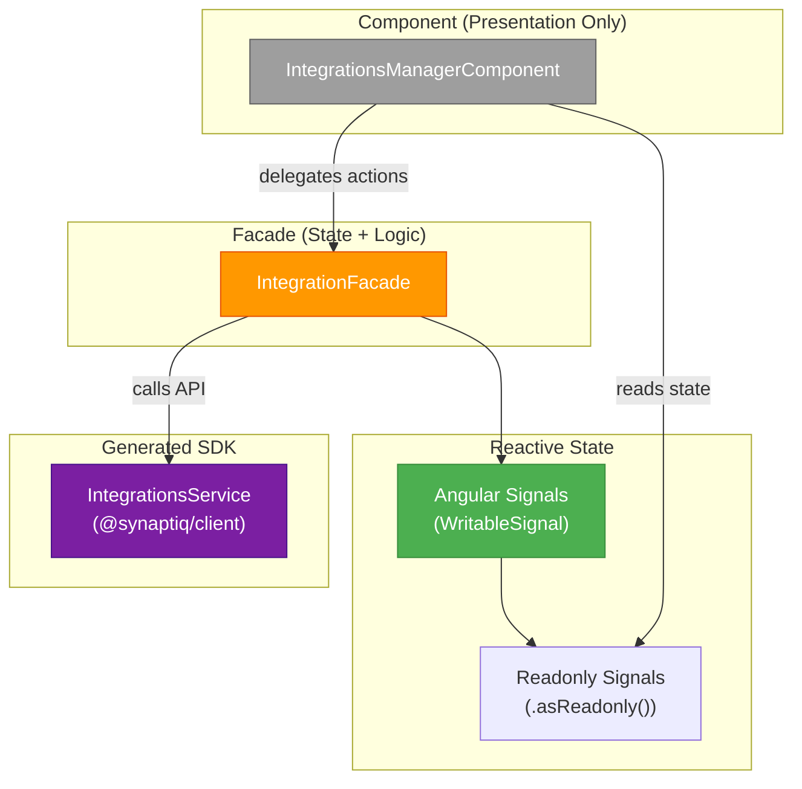

# ADR-005: Facade Pattern for Angular Components

**Status:** Accepted  
**Date:** 2026-05-10  
**Authors:** Spectrayan Team

---

## Context

Synaptiq's Angular 21 frontend has feature modules (Integrations, Workflows, Admin) that need to interact with backend APIs, manage local UI state, and coordinate toast notifications. Without a clear pattern, components accumulate business logic, direct SDK calls, and state management — making them hard to test and maintain.

## Decision

Mandate the **Facade pattern** for all feature modules. Components are purely presentational. A `@Injectable({ providedIn: 'root' })` facade service owns all state, business logic, and API interactions.

### Layer Architecture



### Rules

1. **Components contain ZERO business logic** — only template bindings and event delegation
2. **Components never inject SDK services** — only the facade
3. **Facades own all state** via `signal()` with `.asReadonly()` selectors
4. **Facades are `providedIn: 'root'`** — singleton across the application
5. **Components use `ChangeDetectionStrategy.OnPush`** — signals handle reactivity
6. **Each feature has exactly 3+ files**: `component.ts`, `component.html`, `component.scss`, `facade.ts`

### Example: IntegrationFacade

```typescript
@Injectable({ providedIn: 'root' })
export class IntegrationFacade {
  // Private writable state
  private _integrations = signal<IntegrationResponse[]>([]);
  private _loading = signal(false);
  
  // Public readonly selectors
  readonly integrations = this._integrations.asReadonly();
  readonly loading = this._loading.asReadonly();
  
  // Actions (called by component)
  loadIntegrations(tenantId: string): void { /* SDK call → update signals */ }
  createIntegration(request: CreateIntegrationRequest): void { /* ... */ }
  deleteIntegration(id: string): void { /* ... */ }
}
```

## Consequences

### Positive
- Components are trivially testable (mock the facade)
- State management is centralized and consistent
- Easy to swap signal-based state for NgRx if complexity grows
- Clean separation of concerns visible at file level

### Negative
- Extra file per feature (facade.ts) — minor overhead
- Developers must resist the temptation to add "just one API call" to a component

## References

- [Angular Signals](https://angular.dev/guide/signals)
- [Facade Pattern (GoF)](https://en.wikipedia.org/wiki/Facade_pattern)
