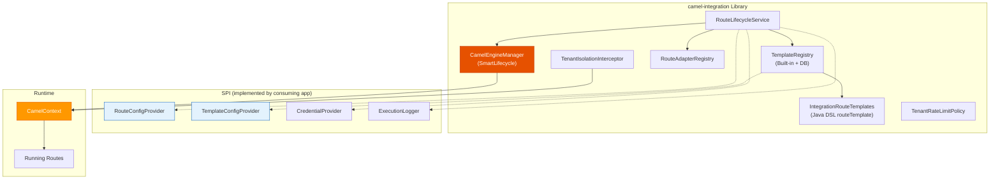

# ADR-006: Apache Camel Integration Engine

**Status:** Accepted  
**Date:** 2026-05-10  
**Authors:** Spectrayan Team

---

## Context

Synaptiq needs to let tenants connect to external systems — REST APIs, webhooks, Slack, email, databases, and more. We evaluated several integration frameworks:

| Option | Pros | Cons |
|--------|------|------|
| Custom HTTP adapter layer | Simple, full control | Reinventing the wheel for every protocol |
| n8n (embedded) | Visual workflow builder | Node.js dependency, separate runtime |
| Apache Camel | 300+ connectors, Java-native, battle-tested | Learning curve, XML/YAML DSL |
| Spring Integration | Spring-native | Less mature connector ecosystem than Camel |

## Decision

Use **Apache Camel 4.18** via `camel-spring-boot-starter`, packaged as a standalone Maven library (`camel-integration`) with Spring Boot auto-configuration.

### Why Camel over Standalone Library

The `camel-spring-boot-starter` provides:
1. **Auto-managed CamelContext lifecycle** coordinated with Spring's `SmartLifecycle`
2. **Component auto-discovery** — drop `camel-slack` on the classpath and the Slack component is available
3. **Health indicators** integrated with Spring Boot Actuator
4. **Native `RoutesLoader`** for loading YAML DSL at runtime

### Engine Architecture

### Route Construction — 2 Native Paths Only

| Path | Mechanism | Use Case |
|------|-----------|----------|
| **Template-based** | Camel `TemplatedRouteBuilder` (Java DSL) | Standard integrations — tenant picks a template and fills parameters |
| **Custom YAML** | Camel `RoutesLoader` (YAML DSL) | Power users who write raw Camel YAML |

**No custom YAML string generation** — adapters only validate and test connectivity, never build routes.

### Multi-Tenant Isolation

- **Route naming**: `{tenantId}__{routeConfigId}` — enables per-tenant route listing
- **Header injection**: `TenantIsolationInterceptor` adds `X-Tenant-Id` to every exchange
- **Rate limiting**: `TenantRateLimitPolicy` enforces max routes per tenant

## Consequences

### Positive
- 300+ pre-built Camel components available immediately
- Routes load/unload dynamically without application restart
- YAML DSL allows non-developers to define integrations
- Library packaging (`@AutoConfiguration`) makes it zero-config to adopt

### Negative
- Camel has a learning curve for the team
- YAML DSL errors are harder to debug than Java compilation errors
- CamelContext is a heavyweight object (mitigated by single shared context)

## References

- [Apache Camel Documentation](https://camel.apache.org/)
- [Camel Spring Boot Starter](https://camel.apache.org/camel-spring-boot/latest/)
- [Camel Route Templates](https://camel.apache.org/manual/route-template.html)
