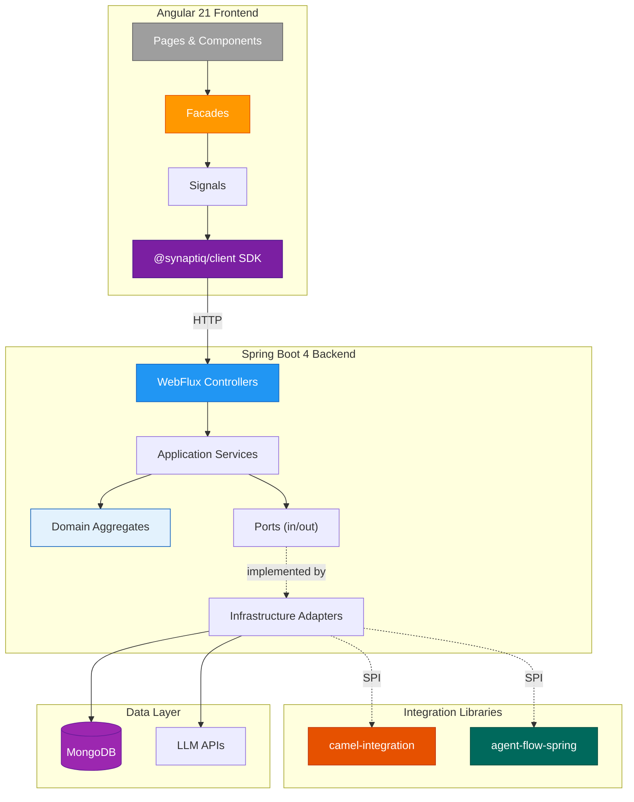

# 📐 Architecture Decision Records

**Project:** Synaptiq — AI-Native Application Platform  
**Maintained by:** [Spectrayan](https://github.com/spectrayan)

---

This directory contains **Architecture Decision Records (ADRs)** documenting the key technical decisions made during the design and implementation of Synaptiq.

## What are ADRs?

ADRs capture the **context**, **decision**, and **consequences** of architecturally significant choices. They serve as a knowledge base for current and future contributors, explaining *why* things are built the way they are.

## ADR Standard

All ADRs follow a consistent format:

- **Authors** — Spectrayan Team
- **Diagrams** — All diagrams use [Mermaid](https://mermaid.js.org/) (no ASCII art)
- **Status** — One of: `Proposed` · `Accepted` · `Deprecated` · `Superseded`

---

## 📋 ADR Index

| # | Title | Status | Key Topic |
|---|-------|--------|-----------|
| [001](001-modular-monolith-spring-modulith.md) | Modular Monolith with Spring Modulith | Accepted | Hexagonal architecture, bounded contexts |
| [002](002-contract-first-openapi.md) | Contract-First API Design | Accepted | OpenAPI codegen, multi-platform SDKs |
| [003](003-reactive-persistence-mongodb.md) | Reactive Persistence with WebFlux & MongoDB | Accepted | Non-blocking I/O, document mapping |
| [004](004-parent-pom-dependency-management.md) | Parent POM Dependency Management | Accepted | Maven reactor, centralized versioning |
| [005](005-facade-pattern-angular.md) | Facade Pattern for Angular Components | Accepted | Signals, presentation-only components |
| [006](006-camel-integration-engine.md) | Apache Camel Integration Engine | Accepted | Dynamic routing, multi-tenant isolation |
| [007](007-db-driven-templates.md) | DB-Driven Integration Templates | Accepted | Runtime template CRUD, no-code extensibility |
| [008](008-multi-tenant-isolation.md) | Multi-Tenant Isolation Strategy | Accepted | Row-level scoping, subdomain routing |
| [009](009-spi-driven-library-design.md) | SPI-Driven Library Design | Accepted | Autoconfiguration, decoupled persistence |
| [010](010-workflow-engine-foblex.md) | Visual Workflow Engine | Accepted | Foblex Flow, canvas-based editing |

---

## 🏛️ High-Level Architecture

---

## 📎 Related

- [Architecture Overview](../architecture.md) — full system design
- [Vision](../vision.md) — product vision document
- [Main README](../../README.md) — project overview and quick start

---

  Part of the <a href="https://github.com/spectrayan/synaptiq">Synaptiq</a> platform

