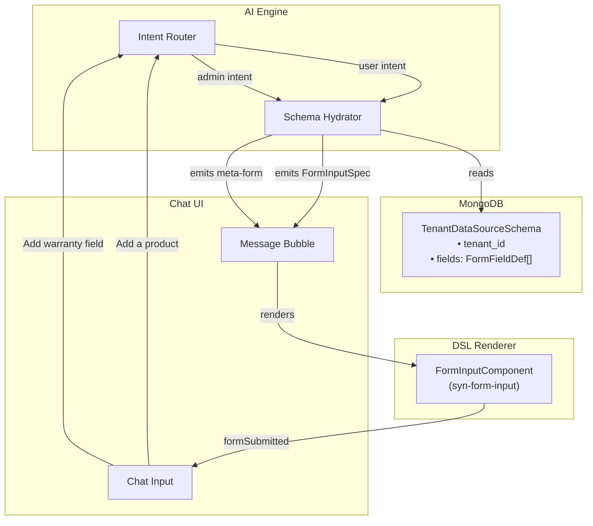

# Synaptiq Form Architecture — Conversational Schema Management

> **Task**: T7.14 — REQ-FORM-1  
> **Status**: ✅ Types + Component implemented, lint-clean  
> **Date**: 2026-04-19

---

## 1. Design Philosophy

Synaptiq uses a **hybrid form approach** — the same `FormInputComponent` serves both:

| Context | Who fills it | What generates it |
|---|---|---|
| **End-user data entry** | End user | AI reads tenant data source schema → emits `FormInputSpec` |
| **Admin schema config** | Tenant admin | AI emits a meta-form to define field definitions |

> [!IMPORTANT]
> There is no separate admin panel for form configuration. The admin manages their entire data schema through the same conversational UI. This is Synaptiq's key differentiator.

---

## 2. Architecture Layers



---

## 3. Type System

### FormFieldDef — Single Source of Truth

Defined in [dsl-types.ts](file:///home/bharat/git/synaptiq/libs/shared/constants/src/lib/dsl-types.ts#L108-L148):

```typescript
interface FormFieldDef {
  field: string;           // unique key: "warranty_months"
  label: string;           // display: "Warranty Period"
  type: FormFieldType;     // text | number | select | multi_select | date | textarea | file | toggle | currency
  required?: boolean;
  placeholder?: string;
  unit?: string;           // "months", "kg"
  options?: FormFieldOption[];
  validation?: FormFieldValidation;
  default_value?: unknown;
  hint?: string;
  position?: number;
  currency_code?: string;  // "USD", "INR"
  accept?: string;         // ".csv,.xlsx"
}
```

### FormInputSpec — DSL Component

Defined in [dsl-types.ts](file:///home/bharat/git/synaptiq/libs/shared/constants/src/lib/dsl-types.ts#L168-L192):

```typescript
interface FormInputSpec {
  type: 'form_input';
  title?: string;
  description?: string;
  fields: FormFieldDef[];
  submit_label?: string;
  submit_action: string;   // "create_item", "update_schema"
  cancellable?: boolean;
  initial_values?: Record<string, unknown>;
  suggestions?: AISuggestion[];
}
```

### FormSubmitEvent — Output Payload

```typescript
interface FormSubmitEvent {
  action: string;            // matches submit_action
  values: Record<string, unknown>;  // field_key → value
}
```

---

## 4. Component Inventory (13 total)

| # | Component | Selector | Spec Type | Status |
|---|---|---|---|---|
| 1 | ItemCard | `syn-item-card` | `ItemCardSpec` | ✅ Signals |
| 2 | ItemGrid | `syn-item-grid` | `ItemGridSpec` | ✅ Signals |
| 3 | ItemDetail | `syn-item-detail` | `ItemDetailSpec` | ✅ Signals |
| 4 | ComparisonTable | `syn-comparison-table` | `ComparisonTableSpec` | ✅ Signals |
| 5 | FilterSummary | `syn-filter-summary` | `FilterSummarySpec` | ✅ Signals |
| 6 | ResultCount | `syn-result-count` | `ResultCountSpec` | ✅ Signals |
| 7 | EmptyState | `syn-empty-state` | `EmptyStateSpec` | ✅ Signals |
| 8 | ActionConfirm | `syn-action-confirm` | `ActionConfirmSpec` | ✅ Signals |
| 9 | InfoBanner | `syn-info-banner` | `InfoBannerSpec` | ✅ Signals |
| 10 | DataTable | `syn-data-table` | `DataTableSpec` | ✅ Signals |
| 11 | SuggestionBar | `syn-suggestion-bar` | `AISuggestion[]` | ✅ Signals |
| 12 | **FormInput** | `syn-form-input` | `FormInputSpec` | ✅ **NEW** |
| 13 | DslRenderer | `syn-dsl-renderer` | `ComponentSpec` | ✅ Dispatcher |

---

## 5. Supported Field Types

| Type | Material Component | Features |
|---|---|---|
| `text` | `mat-form-field` + `input` | Placeholder, hint, pattern validation |
| `number` | `mat-form-field` + `input[type=number]` | Min/max, unit suffix |
| `currency` | `mat-form-field` + prefix | Currency code prefix, min/max |
| `select` | `mat-select` | Options list, placeholder |
| `multi_select` | `mat-select[multiple]` | Multi-selection chips |
| `date` | `mat-datepicker` | Calendar picker, icon toggle |
| `textarea` | `textarea[matInput]` | Multi-line, auto-rows |
| `toggle` | `mat-slide-toggle` | Boolean on/off, hint |
| `file` | Hidden `input[type=file]` + button | Accept filter, a11y label |

---

## 6. Conversational Flows

### Flow A: End-User Adding a Product

```
USER: "I want to add a new product"

AI: [emits FormInputSpec]
  {
    type: "form_input",
    title: "Add New Product",
    fields: [
      { field: "name", label: "Product Name", type: "text", required: true },
      { field: "price", label: "Price", type: "currency", currency_code: "USD", required: true },
      { field: "category", label: "Category", type: "select", options: [...] },
      { field: "description", label: "Description", type: "textarea" }
    ],
    submit_action: "create_item",
    submit_label: "Add Product",
    suggestions: [{ label: "Import from CSV", prompt: "Import products from CSV" }]
  }

USER: [fills form, clicks Submit]
  → formSubmitted: { action: "create_item", values: { name: "...", price: 29.99, ... } }

AI: [emits ActionConfirm]
  "Product 'Widget Pro' created successfully!"
```

### Flow B: Admin Configuring Schema

```
ADMIN: "Add a warranty field to my data schema"

AI: [emits FormInputSpec — a meta-form]
  {
    type: "form_input",
    title: "Configure New Field",
    fields: [
      { field: "label", label: "Field Label", type: "text", required: true, default_value: "Warranty" },
      { field: "field_type", label: "Field Type", type: "select", options: [
          { label: "Text", value: "text" },
          { label: "Number", value: "number" },
          { label: "Date", value: "date" }, ...
        ], required: true },
      { field: "required", label: "Required?", type: "toggle", default_value: false },
      { field: "unit", label: "Unit", type: "text", placeholder: "e.g. months, kg" },
      { field: "min_val", label: "Minimum", type: "number" },
      { field: "max_val", label: "Maximum", type: "number" }
    ],
    submit_action: "update_schema",
    submit_label: "Add Field",
    cancellable: true,
    suggestions: [
      { label: "Make it required", prompt: "Set required to true" },
      { label: "See all fields", prompt: "Show me all data fields" }
    ]
  }
```

---

## 7. MongoDB Schema (Backend — Future)

```typescript
// Stored per-tenant in MongoDB
interface TenantDataSourceSchema {
  _id: ObjectId;
  tenant_id: string;
  fields: FormFieldDef[];  // SAME type as DSL — no mapping needed
  created_at: Date;
  updated_at: Date;
  version: number;
}
```

> [!TIP]
> Because `FormFieldDef` is shared between frontend (DSL) and backend (MongoDB schema), there is zero mapping layer. The AI reads the schema and passes the `fields` array directly into the `FormInputSpec`.

---

## 8. File Inventory

| File | Purpose |
|---|---|
| [dsl-types.ts](file:///home/bharat/git/synaptiq/libs/shared/constants/src/lib/dsl-types.ts) | `FormFieldDef`, `FormInputSpec`, `FormFieldType`, `FormFieldOption`, `FormFieldValidation` |
| [form-input.component.ts](file:///home/bharat/git/synaptiq/libs/frontend/dsl-renderer/src/lib/form-input/form-input.component.ts) | Component logic — dynamic form builder, validation, signals |
| [form-input.component.html](file:///home/bharat/git/synaptiq/libs/frontend/dsl-renderer/src/lib/form-input/form-input.component.html) | Template — Material form fields, 9 field types |
| [form-input.component.scss](file:///home/bharat/git/synaptiq/libs/frontend/dsl-renderer/src/lib/form-input/form-input.component.scss) | Styles — 2-col grid, dark theme, `--syn-` tokens |
| [dsl-renderer.ts](file:///home/bharat/git/synaptiq/libs/frontend/dsl-renderer/src/lib/dsl-renderer/dsl-renderer.ts) | Dispatcher — routes `form_input` to `FormInputComponent` |
| [dsl-renderer.html](file:///home/bharat/git/synaptiq/libs/frontend/dsl-renderer/src/lib/dsl-renderer/dsl-renderer.html) | Dispatcher template — `@case ('form_input')` |

---

## 9. Next Steps

1. **Chat Integration** — Wire `formSubmitted` event from `DslRenderer` → Chat container → backend API
2. **Schema CRUD API** — Spring Boot endpoints for `GET/POST/PUT /api/tenants/{id}/schema`
3. **AI Intent Mapping** — Train AI engine to emit `form_input` specs from natural language
4. **File Upload Service** — Handle `file` field type with multipart upload to storage
5. **Conditional Fields** — Add `visible_when` predicate to show/hide fields based on other values
