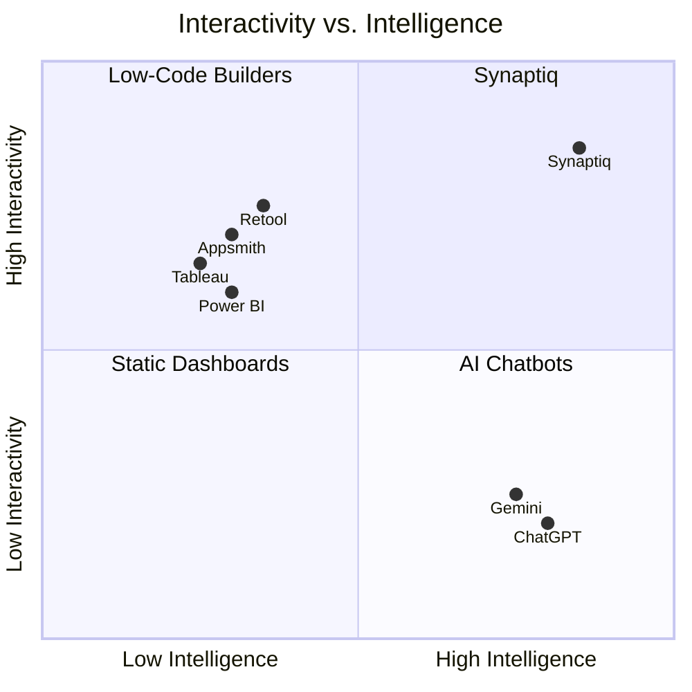

# Comparison

How does Synaptiq compare to existing tools? This page positions Synaptiq relative to traditional BI platforms, low-code builders, and conversational AI assistants.

---

## Feature Matrix

| Capability | Traditional BI | Low-Code Builders | Conversational AI | **Synaptiq** |
|-----------|:-:|:-:|:-:|:-:|
| Natural language interaction | ❌ | ❌ | ✅ | ✅ |
| Dynamic UI generation | ❌ | ❌ | ❌ | ✅ |
| Rich interactive components | ✅ | ✅ | ❌ | ✅ |
| Multi-agent workflows | ❌ | ❌ | ❌ | ✅ |
| Semantic data understanding | 🔶 | ❌ | ❌ | ✅ |
| RAG knowledge base | ❌ | ❌ | 🔶 | ✅ |
| Per-tenant branding | 🔶 | ✅ | ❌ | ✅ |
| Self-hostable | 🔶 | 🔶 | ❌ | ✅ |
| No-code app building | ❌ | ✅ | ❌ | ✅ |
| Code-free deployment | ❌ | ✅ | ✅ | ✅ |

---

## Synaptiq vs. Traditional BI (Tableau, Power BI, Looker)

| Dimension | Traditional BI | Synaptiq |
|-----------|---------------|----------|
| **Dashboard creation** | Manual design by analysts, weeks of iteration | AI-generated from natural language in seconds |
| **Ad-hoc questions** | Requires pre-built reports or SQL knowledge | Just ask — the UI adapts to the question |
| **User experience** | Static, one-size-fits-all dashboards | Personalized, context-aware interfaces |
| **Workflow integration** | Separate tools (JIRA, ServiceNow) | Built-in multi-agent workflow orchestration |
| **Cost** | Expensive per-seat licensing | Open source, self-hostable |
| **Learning curve** | Weeks of training for dashboard authors | Natural language — no training required |

!!! tip "When to choose Traditional BI"
    Traditional BI tools excel at **pre-designed, pixel-perfect dashboards** used by the same team every day. Choose them when you have a stable set of known reports that rarely change.

---

## Synaptiq vs. Low-Code Builders (Retool, Appsmith, Budibase)

| Dimension | Low-Code Builders | Synaptiq |
|-----------|------------------|----------|
| **UI building** | Drag-and-drop visual editor | AI generates UI from natural language |
| **Database queries** | Write SQL/API queries manually | Semantic layer — AI writes queries from intent |
| **Workflow logic** | Configure steps in visual editor | Describe workflow in natural language |
| **AI integration** | Add-on, requires custom code | AI-native — LLM is the core engine |
| **Iteration speed** | Hours to build a new page | Seconds — describe what you want |
| **Maintenance** | Every page requires manual updates | UI adapts automatically as data changes |

!!! tip "When to choose Low-Code Builders"
    Low-code tools excel at **custom internal tools** with complex business logic, integrations with dozens of APIs, and precise layout requirements that don't change frequently.

---

## Synaptiq vs. Conversational AI (ChatGPT, Gemini, Claude)

| Dimension | Conversational AI | Synaptiq |
|-----------|------------------|----------|
| **Output format** | Text and markdown | Rich interactive components (charts, tables, forms, dashboards) |
| **Data connectivity** | Limited (file upload, plugins) | Deep integration with organizational data via semantic layer |
| **Multi-agent** | Single-agent conversation | Multi-agent orchestration with supervisor coordination |
| **Workflows** | Stateless conversations | Persistent workflows with execution history |
| **Enterprise features** | Limited RBAC, no multi-tenancy | Full multi-tenant RBAC with per-tenant config |
| **Self-hosting** | Cloud-only (mostly) | Self-hostable, your data stays on-premise |
| **UI rendering** | Text-only responses | 20+ component types rendered natively |

!!! tip "When to choose Conversational AI"
    General-purpose AI assistants excel at **creative tasks, code generation, and open-ended exploration**. Choose them when you need broad knowledge rather than deep organizational data integration.

---

## Synaptiq's Unique Position

Synaptiq occupies the **high-intelligence, high-interactivity** quadrant — combining the conversational AI capabilities of modern LLMs with the rich, interactive UI components of traditional enterprise tools.
