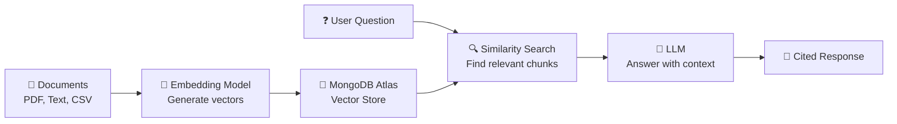

# Key Concepts

Understanding Synaptiq's core concepts helps you get the most out of the platform. This page explains the fundamental building blocks.

---

## Component DSL

The **Component DSL** (Domain-Specific Language) is Synaptiq's declarative specification format for describing user interfaces. Instead of generating HTML or executable code, the LLM emits structured JSON that the Angular frontend interprets and renders natively.

### How It Works

1. **User asks a question** in natural language
2. **LLM reasons** over the semantic data model and determines what UI components best answer the question
3. **LLM emits Component DSL** — a JSON spec describing the layout, components, and data bindings
4. **Backend hydrates** the spec with real data from MongoDB (LLM never sees raw data)
5. **Frontend renders** the spec into rich, interactive Angular Material 3 components

### Component Types (20+)

| Category | Components |
|----------|------------|
| **Data Visualization** | KPI cards, bar charts, line charts, pie charts, donut charts (ECharts), stat grids, metric tables |
| **Catalog & Lists** | Item cards, item grids, comparison tables, data tables, filter summaries |
| **Workflows & Actions** | Kanban boards, timelines, progress trackers, action confirmations |
| **Forms & Input** | Dynamic forms with validation, conditional visibility, file upload |
| **Layout** | Composable views with tabs, sidebars, columns, grids — dashboard-grade layouts |
| **Navigation** | Launchpad — personalized home surface with saved views and suggestion chips |

### Example

When a user asks *"Show me this month's top products"*, the LLM might emit:

```json
{
  "type": "composite_view",
  "layout": "grid",
  "children": [
    {
      "type": "kpi_card",
      "title": "Total Revenue",
      "value": "$142,500",
      "change": "+12.3%",
      "trend": "up"
    },
    {
      "type": "chart",
      "chartType": "bar",
      "title": "Revenue by Product",
      "data": { "ref": "products_by_revenue" }
    },
    {
      "type": "data_table",
      "title": "Top 10 Products",
      "columns": ["Name", "Units", "Revenue", "Margin"],
      "data": { "ref": "top_products" }
    }
  ]
}
```

!!! note "Security by Design"
    The `"data": { "ref": "..." }` pattern means the LLM specifies *what* data to show, but the **backend hydrates** the actual values. The LLM never sees sensitive data.

---

## Semantic Data Layer

The **Semantic Data Layer** is Synaptiq's structured representation of an organization's data universe. It defines:

| Concept | Description | Example |
|---------|-------------|---------|
| **Entities** | Business objects | `Customer`, `Order`, `Product`, `Employee` |
| **Metrics** | Quantitative measures | `Revenue`, `Order Count`, `Average Rating` |
| **Dimensions** | Qualitative categorizations | `Region`, `Product Category`, `Time Period` |
| **Relationships** | How entities connect | Customer → Orders → Products |
| **Vocabulary** | Domain-specific terms | "Churn" = customer inactive for 90+ days |
| **Permissions** | Data access rules | Field-level, role-based visibility |

The semantic layer ensures the AI:

- **Knows what data exists** — no hallucinated columns or metrics
- **Understands context** — "revenue" means gross revenue in sales, net revenue in finance
- **Respects governance** — doesn't expose data the user shouldn't see
- **Generates accurate queries** — uses the right fields, aggregations, and filters

---

## Multi-Agent Orchestration

Synaptiq's **workflow engine** coordinates multiple specialized AI agents to solve complex problems that no single agent can handle alone.

### Flow Types

| Type | Pattern | Best For |
|------|---------|----------|
| **Sequential** | Agent A → Agent B → Agent C | Linear pipelines (analysis → validation → report) |
| **Parallel** | Agents A, B, C simultaneously → merge | Multiple independent analyses (multi-specialist assessment) |
| **Supervisor** | Supervisor delegates to specialists, synthesizes results | Complex multi-domain problems (therapy goal generation) |
| **Dynamic** | Agents decide which agent to call next based on results | Adaptive workflows (troubleshooting, triage) |

### Agent Configuration

Each agent in a workflow is configured with:

- **System Prompt** — defines the agent's role, expertise, and constraints
- **Model** — which LLM to use (Gemini, OpenAI, Ollama)
- **Temperature** — creativity vs. precision balance
- **Tools** — optional function calling capabilities
- **Input/Output Schema** — structured data contracts between agents

---

## Tenant Isolation

Synaptiq is a **multi-tenant platform** where each organization (tenant) gets:

| Feature | Isolation Level |
|---------|----------------|
| **Data** | Separate MongoDB collections with tenant ID filtering |
| **Configuration** | Independent AI persona, guardrails, and model selection |
| **Branding** | Custom themes, logos, colors, and fonts |
| **RBAC** | Per-tenant roles: Platform Admin → Tenant Admin → User → Viewer |
| **Rate Limiting** | Per-tenant API rate limits and token budgets |

---

## RAG Pipeline

The **RAG (Retrieval-Augmented Generation) Pipeline** connects Synaptiq's chat engine to your organization's knowledge base:



1. **Ingestion** — Documents are chunked, embedded, and stored in MongoDB Atlas Vector Search
2. **Retrieval** — User questions are embedded and matched against stored vectors
3. **Generation** — Relevant context is injected into the LLM prompt alongside the user's question
4. **Response** — The LLM generates answers grounded in your actual documents, with source citations

---

## Hexagonal Architecture

Synaptiq follows **hexagonal architecture** (ports & adapters) to keep domain logic framework-independent:

```
┌──────────────────────────────────────────────┐
│                  Domain Core                 │
│         Pure POJOs — no annotations          │
│    Entities · Value Objects · Domain Events  │
├──────────────────────────────────────────────┤
│              Application Layer               │
│      Use Cases · Port Interfaces · DTOs      │
├────────────────┬─────────────────────────────┤
│   Driving      │        Driven               │
│   Adapters     │        Adapters              │
│   (IN)         │        (OUT)                 │
│   Web API      │        MongoDB               │
│   WebSocket    │        LLM Providers          │
│   CLI          │        Event Bus              │
└────────────────┴─────────────────────────────┘
```

| Layer | Convention | Example |
|-------|-----------|---------|
| **Domain** | `*.domain.model` | `Workflow`, `FlowSettings`, `AgentNode` |
| **Application** | `*.application.service` | `WorkflowCommandUseCase`, `ChatMessageService` |
| **Ports (IN)** | `*.application.port.in` | `WorkflowQueryUseCase` interface |
| **Ports (OUT)** | `*.application.port.out` | `WorkflowRepository` interface |
| **Adapters (IN)** | `*.infrastructure.web` | `WorkflowController` |
| **Adapters (OUT)** | `*.infrastructure.persistence` | `WorkflowMongoRepository` |
