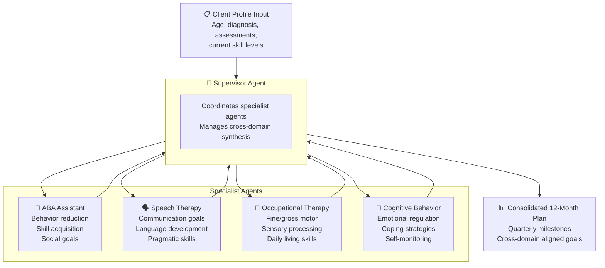
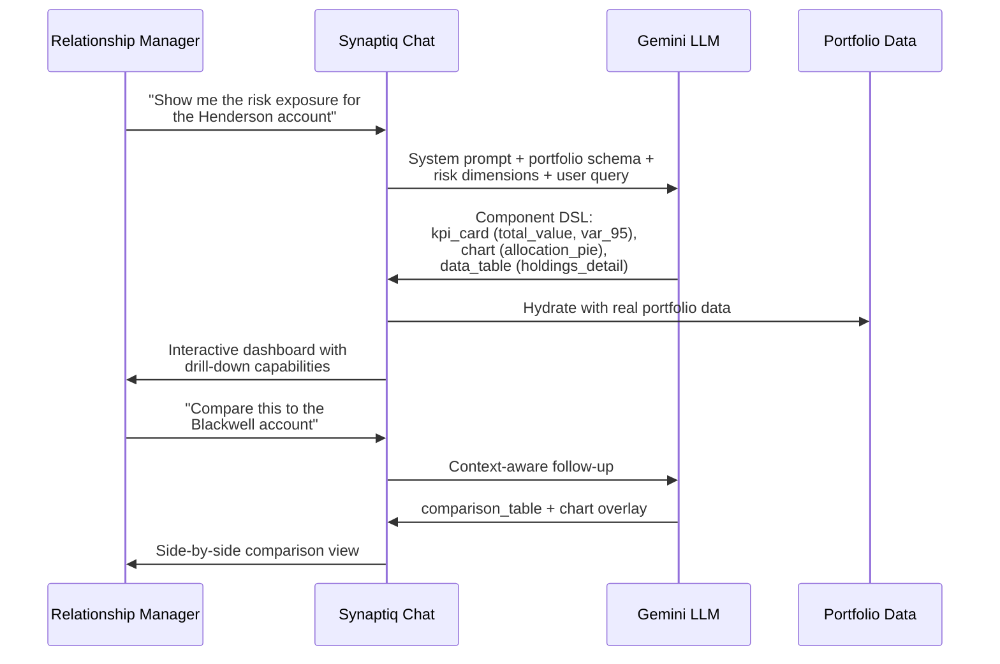
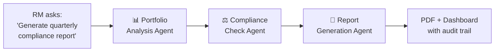
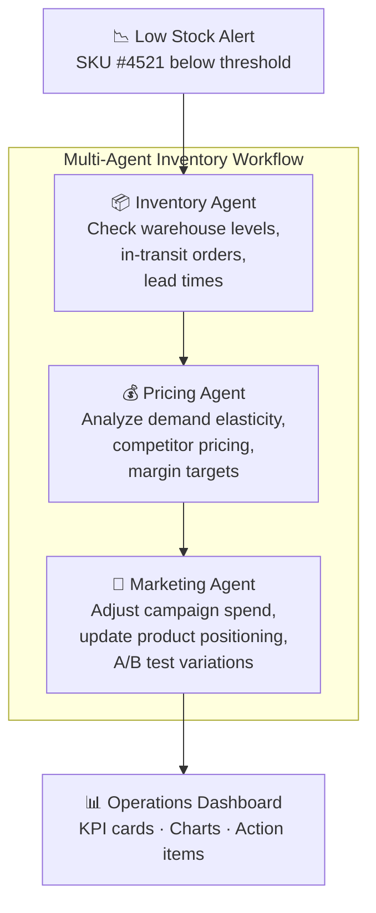
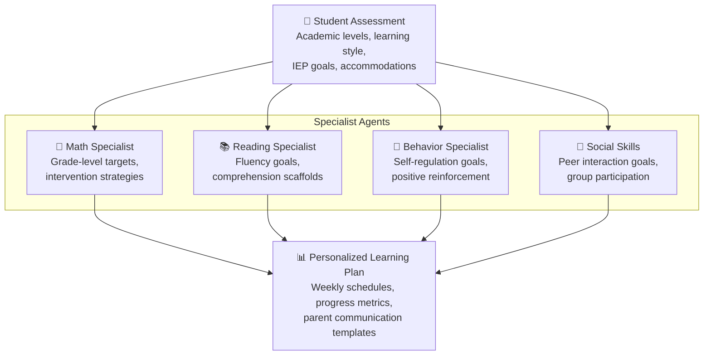

# Use Cases

Synaptiq is designed for any organization that wants to replace static dashboards, rigid workflows, and manual UI building with AI-native, conversational interfaces. Below are detailed use cases across industries — each demonstrating how Synaptiq's dynamic UI generation, multi-agent orchestration, and semantic data layer solve real business problems.

---

## Why AI-Native Applications Matter

The shift from traditional software to AI-native platforms is driven by fundamental limitations in how businesses interact with their data:

- **80% of business users** struggle to extract insights from existing BI tools — the dashboards they need either don't exist or require IT tickets to build
- **Enterprise software wastes 3–4 hours per employee per day** on navigation, form-filling, and context-switching between tools
- **Multi-agent AI systems** can now coordinate specialized reasoning that would take human teams days to complete
- **Dynamic UI generation** means the interface adapts to the question, not the other way around

> **Synaptiq eliminates the gap between "I need this information" and "here it is" — from days to seconds.**

---

## 🏥 Healthcare — ABA Therapy Goal Generation

!!! tip "Reference Implementation"
    This use case is implemented in the [spectrayan-health](https://github.com/spectrayan/spectrayan-health) repository and serves as the reference workflow for Synaptiq's multi-agent orchestration engine.

### The Challenge

Applied Behavior Analysis (ABA) therapy requires comprehensive, individualized treatment plans for each client. Developing these plans involves:

- **Multiple specialists** — ABA therapists, speech-language pathologists, occupational therapists, and cognitive behavior analysts must all contribute goals
- **Cross-domain coordination** — goals from different specialists must be aligned, not contradictory
- **Quarterly milestones** — plans span 12 months with measurable quarterly checkpoints
- **Regulatory compliance** — HIPAA requirements, documentation standards, and evidence-based practice guidelines

Currently, this process takes **2–3 weeks of manual coordination** across specialists, with goals often created in silos and reconciled afterward.

### How Synaptiq Solves It

Synaptiq's **multi-agent workflow engine** automates the entire goal generation process:



#### Step-by-Step Workflow

1. **Client Profile Input** — The clinician enters the client's demographics, diagnosis (e.g., ASD Level 2), current assessments (VB-MAPP, Vineland-3), and prioritized areas of concern

2. **Supervisor Agent Delegation** — The supervisor agent analyzes the profile and delegates to four specialist agents simultaneously:

    === "ABA Assistant"
        Generates behavior reduction goals (e.g., reducing tantrum frequency), skill acquisition targets (e.g., independent task completion), and social skill objectives. Goals follow the SMART framework with baseline, target, and measurement criteria.

    === "Speech Therapy"
        Creates communication goals across receptive language, expressive language, and pragmatic skills. Addresses specific deficits identified in the assessment (e.g., "increase MLU from 2.1 to 3.5 words").

    === "Occupational Therapy"
        Develops goals for fine motor skills, sensory processing, and activities of daily living (ADLs). Includes adaptive equipment recommendations and sensory diet protocols.

    === "Cognitive Behavior Analysis"
        Generates emotional regulation objectives, coping strategy development, and self-monitoring skills. Addresses anxiety management, frustration tolerance, and cognitive flexibility.

3. **Cross-Domain Synthesis** — The supervisor agent reviews all specialist outputs for:
    - **Contradictions** — e.g., one specialist increasing social demands while another reduces them
    - **Dependencies** — e.g., communication goals that must precede social skills goals
    - **Resource conflicts** — e.g., scheduling overlaps in therapy sessions

4. **Consolidated Output** — A single, unified 12-month plan with quarterly milestones

#### Example Output

!!! example "Sample Goal — Quarter 1"

    **Domain:** Applied Behavior Analysis — Social Skills

    | Field | Value |
    |-------|-------|
    | **Goal** | Client will initiate peer interactions during structured play activities |
    | **Baseline** | 0 initiations per 30-minute observation period |
    | **Q1 Target** | 2 initiations per session with adult prompting |
    | **Q2 Target** | 4 initiations per session with visual support only |
    | **Q3 Target** | 6 initiations per session independently |
    | **Q4 Target** | 8 initiations per session across settings |
    | **Measurement** | Direct observation with frequency recording, 3x weekly |
    | **Cross-Domain Links** | Speech Therapy Goal #3 (requesting items from peers) |

#### HIPAA Compliance

- **No PHI in LLM prompts** — client identifiers are replaced with anonymized tokens before agent processing
- **Audit trail** — every agent interaction is logged with timestamps and tenant isolation
- **Data residency** — all data stays within the organization's MongoDB instance
- **Access control** — RBAC ensures only authorized clinicians can view/edit treatment plans

---

## 💰 Financial Services — Portfolio Advisory

### The Challenge

Wealth management firms need to:

- Provide **personalized portfolio analysis** to clients on demand
- Generate **compliance-ready reports** for regulatory filings
- Monitor **risk exposure** across diverse asset classes in real-time
- Enable **relationship managers** (who are not data analysts) to answer complex client questions

Traditional BI tools require pre-built dashboards that can't adapt to ad-hoc questions. Building new reports takes weeks and requires engineering support.

### How Synaptiq Solves It

Relationship managers interact with Synaptiq through natural language:



#### Dynamic Dashboard Components

When a relationship manager asks *"Show me a risk analysis for the Henderson portfolio"*, Synaptiq generates:

| Component | Content |
|-----------|---------|
| **KPI Cards** | Total portfolio value ($4.2M), YTD return (+7.3%), VaR 95% ($142K), Sharpe ratio (1.24) |
| **Allocation Pie Chart** | Equity 55%, Fixed Income 25%, Alternatives 12%, Cash 8% |
| **Risk Heatmap** | Sector concentration risks — Technology (28%, HIGH), Healthcare (15%, MEDIUM) |
| **Holdings Table** | Sortable table with ticker, allocation, return, beta, and risk score |
| **Suggestion Chips** | "Rebalance to target", "Generate client report", "Compare to benchmark" |

#### Compliance Workflow



The multi-agent workflow ensures:

- **Suitability checks** — portfolio aligns with client's stated risk tolerance and investment objectives
- **Concentration limits** — no single position exceeds regulatory or internal limits
- **Performance attribution** — returns are decomposed by factor and asset class
- **Audit trail** — every data access and report generation is logged for SOC 2 / SEC compliance

#### Regulatory Compliance

| Requirement | Synaptiq Feature |
|-------------|-----------------|
| **SOC 2 Type II** | Immutable audit logs for all data access and report generation |
| **SEC Rule 17a-4** | Conversation history preserved with timestamps and user attribution |
| **FINRA Suitability** | Automated suitability checks before portfolio recommendations |
| **Data Residency** | Self-hosted deployment keeps all data on-premises |

---

## 🛒 E-Retail — Intelligent Catalog & Customer Engagement

### The Challenge

E-commerce businesses face:

- **Catalog discovery** — customers can't find products that match complex, multi-attribute preferences
- **Seasonal agility** — marketing teams need to rapidly update product positioning and campaigns
- **Personalization at scale** — every customer should see relevant products, not a generic feed
- **Operations visibility** — operations teams need real-time dashboards that adapt to the question being asked

### How Synaptiq Solves It

#### Conversational Product Discovery

Instead of filtering through rigid faceted search, customers (or internal teams) interact naturally:

!!! example "Conversational Shopping"

    **User:** *"Find me summer dresses under $50 in blue or teal, size M, with good reviews"*

    **Synaptiq generates:**

    - **Filter Summary** — Active filters: Category=Dresses, Season=Summer, Price<$50, Color=Blue/Teal, Size=M, Rating≥4★
    - **Item Grid** — 12 matching products with images, prices, ratings, and "Quick View" actions
    - **Comparison Table** — Top 3 products compared across price, material, rating, return policy
    - **Suggestion Chips** — "Similar in green", "Add to wishlist", "Check store availability"

#### Inventory Management Workflow



#### Seasonal Campaign Management

| Scenario | Natural Language Query | Generated UI |
|----------|----------------------|--------------|
| Holiday planning | *"Show me Black Friday performance vs. last year"* | KPI cards (revenue, orders, AOV), line chart (hourly traffic comparison), data table (top sellers) |
| Inventory forecasting | *"Which SKUs will we run out of before Christmas?"* | Risk-scored table with reorder recommendations, timeline chart, action buttons |
| Campaign ROI | *"Compare email vs. social ad ROI for summer campaign"* | Side-by-side comparison table, funnel charts, recommendation cards |
| Customer segmentation | *"Show me high-value customers who haven't purchased in 90 days"* | Cohort analysis chart, customer cards with contact actions, workflow trigger |

---

## 🏢 Enterprise Operations — Internal Tool Automation

### The Challenge

Every enterprise runs dozens of internal tools — HR onboarding forms, IT support ticketing, executive dashboards, procurement workflows. Each requires custom development, maintenance, and a learning curve for users.

### How Synaptiq Solves It

#### HR Onboarding Assistant

```
Employee: "I'm starting on Monday — what do I need to complete?"

Synaptiq generates:
├── Progress Tracker (4 of 12 tasks completed)
├── Dynamic Form (tax withholding, emergency contact, equipment request)
├── Timeline (orientation schedule, training milestones)
├── Action Cards (badge request, parking assignment, team introductions)
└── Suggestion Chips: "IT equipment request", "Benefits enrollment", "Meet my team"
```

#### IT Support with Knowledge Base RAG

Synaptiq's **RAG pipeline** ingests IT documentation, runbooks, and FAQ articles into the vector store. When employees ask questions, the system retrieves relevant context and generates accurate, source-cited answers:

| Query | RAG Context | Generated Response |
|-------|-------------|-------------------|
| *"How do I reset my VPN?"* | IT Runbook §4.2 | Step-by-step guide with screenshots, "Still not working?" escalation button |
| *"What's the policy on remote work?"* | HR Policy Doc v2.1 | Policy summary with key dates, exception request form, manager approval workflow |
| *"My laptop won't connect to the printer"* | Known Issues KB | Troubleshooting checklist, driver download link, IT ticket creation button |

#### Executive Dashboard Generation

A VP of Engineering asks: *"Show me engineering velocity for the last 3 sprints"*

Synaptiq generates a complete dashboard:

- **KPI Cards** — Story points delivered (142, +12% vs target), Cycle time (3.2 days, -0.5), Sprint burndown completion (94%)
- **Bar Chart** — Points by team (Platform: 48, Mobile: 36, Backend: 58)
- **Trend Line** — Velocity over 6 sprints with trendline
- **Data Table** — Detailed sprint breakdown with drill-down
- **Action Items** — "Generate sprint report", "Compare to Q1", "Share with stakeholders"

---

## 🎓 Education — Personalized Learning Plans

### The Challenge

Educational institutions need to:

- Create **individualized education plans (IEPs)** that account for each student's unique learning profile
- Track **progress across multiple dimensions** (academic, behavioral, social-emotional)
- Coordinate between **teachers, specialists, and parents**
- Meet **IDEA compliance requirements** with documented progress monitoring

### How Synaptiq Solves It

#### Multi-Agent Curriculum Design



#### Progress Dashboard

Teachers ask: *"Show me Jordan's progress this quarter"*

| Component | Content |
|-----------|---------|
| **Progress Tracker** | Overall: 72% of IEP goals on track |
| **Radar Chart** | Skill dimensions: Math (85%), Reading (68%), Writing (55%), Social (78%) |
| **Timeline** | Milestone achievements with dates and evidence notes |
| **Comparison** | Current vs. beginning of year vs. grade-level expectations |
| **Action Cards** | "Schedule parent conference", "Update IEP goals", "Generate progress report" |

---

## Summary

| Use Case | Domain | Key Synaptiq Features | Outcome |
|----------|--------|----------------------|---------|
| ABA Therapy Goals | Healthcare | Multi-agent orchestration, cross-domain synthesis | 2-3 weeks → minutes |
| Portfolio Advisory | Finance | Dynamic dashboards, compliance workflows | Self-service analytics for RMs |
| Catalog Discovery | E-Retail | Conversational search, dynamic item grids | Higher conversion, faster campaigns |
| Internal Tools | Enterprise | RAG knowledge base, dynamic forms | Eliminate custom tool development |
| Learning Plans | Education | Multi-agent curriculum design, progress tracking | Personalized IEPs at scale |

No matter your industry or team size, if your users need to interact with data, generate reports, or orchestrate complex workflows — **Synaptiq replaces weeks of development with seconds of conversation.**
