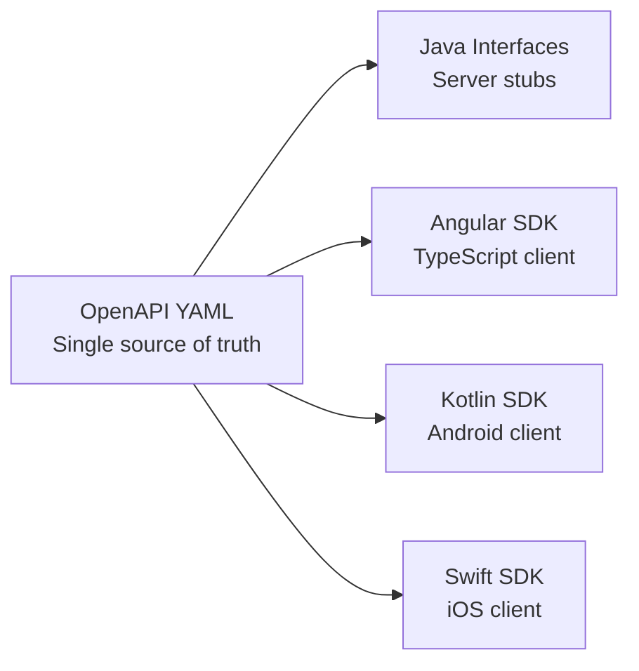

# ADR-002: Contract-First API Design

**Status:** Accepted  
**Authors:** Spectrayan Team  
**Date:** 2025-06-15

---

## Context

Synaptiq is a full-stack monorepo with a Spring Boot backend and Angular frontend. We need a single source of truth for API contracts that generates both server stubs and client SDKs.

## Decision

Adopt **contract-first API design** using OpenAPI 3.0:

1. **Single spec** — `libs/shared/openapi-spec/synaptiq-api.yaml` is the canonical API definition
2. **Server generation** — `openapi-generator` produces Java interfaces in `libs/shared/apis/`
3. **Client generation** — `openapi-generator` produces Angular SDK in `libs/shared/sdks/v1/angular/`
4. **Additional SDKs** — Kotlin (`/kotlin/`) and Swift (`/swift/`) SDKs for mobile clients

## Consequences

- **Positive:** Frontend and backend always agree on API shape
- **Positive:** Type-safe clients in 4 languages from one spec
- **Positive:** Swagger UI auto-generated for API exploration
- **Negative:** Spec changes require regeneration of all SDKs
- **Negative:** Generated code can be verbose
