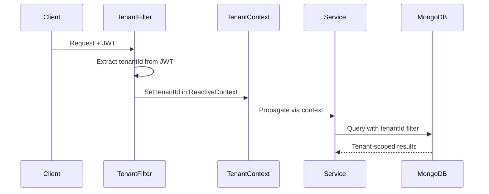

# ADR-007: Multi-Tenant Isolation

**Status:** Accepted  
**Authors:** Spectrayan Team  
**Date:** 2025-07-01

---

## Context

Synaptiq serves multiple organizations (tenants) from a single deployment. Data, configuration, branding, and access control must be isolated per tenant.

## Decision

Implement **logical multi-tenancy** with tenant ID propagation:

### Data Isolation

- Every MongoDB document includes a `tenantId` field
- All repository queries are automatically scoped by `tenantId`
- Tenant ID is extracted from the JWT token and propagated via `ReactiveSecurityContextHolder`

### Configuration Isolation

| Layer | Isolation |
|-------|-----------|
| **AI Configuration** | Per-tenant model, temperature, guardrails |
| **Branding** | Per-tenant theme, logo, colors, fonts |
| **RBAC** | Per-tenant role assignments and scope mappings |
| **Rate Limiting** | Per-tenant API rate limits and token budgets |

### Request Flow

## Consequences

- **Positive:** Single deployment serves all tenants — simpler ops
- **Positive:** Tenant-scoped queries prevent data leakage
- **Positive:** Each tenant can configure AI behavior independently
- **Negative:** Noisy neighbor risk — one tenant's heavy usage can impact others
- **Negative:** MongoDB indexes must include `tenantId` for performance
