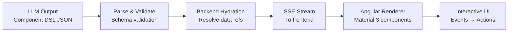

# Component DSL

The Component DSL (Domain-Specific Language) is Synaptiq's declarative specification for describing user interfaces. The LLM generates these specs, and the Angular frontend renders them into rich, interactive components.

---

## Design Philosophy

| Principle | Rationale |
|-----------|-----------|
| **Declarative, not imperative** | JSON specs describe *what* to render, not *how* |
| **Safe by design** | No executable code — only data structures |
| **Backend hydration** | LLM specifies data references; backend fills in real values |
| **Framework-native** | Specs map directly to Angular Material 3 components |

---

## Component Catalog

### Data Visualization

#### KPI Card

```json
{
  "type": "kpi_card",
  "title": "Monthly Revenue",
  "value": "$142,500",
  "change": "+12.3%",
  "trend": "up",
  "icon": "trending_up",
  "color": "success"
}
```

Renders a compact metric card with value, trend arrow, and change percentage. Supports colors: `success`, `warning`, `danger`, `info`.

#### Charts (ECharts)

```json
{
  "type": "chart",
  "chartType": "bar",
  "title": "Revenue by Region",
  "data": {
    "labels": ["North", "South", "East", "West"],
    "datasets": [{ "label": "Revenue", "data": [42000, 38000, 55000, 28000] }]
  }
}
```

Supported chart types: `bar`, `line`, `pie`, `donut`, `area`, `scatter`.

#### Stat Grid

```json
{
  "type": "stat_grid",
  "columns": 4,
  "stats": [
    { "label": "Total Users", "value": "12,450", "icon": "people" },
    { "label": "Active Sessions", "value": "342", "icon": "chat" },
    { "label": "Avg Response Time", "value": "1.2s", "icon": "speed" },
    { "label": "Satisfaction", "value": "94%", "icon": "star" }
  ]
}
```

### Catalog & Lists

#### Item Card

```json
{
  "type": "item_card",
  "title": "Premium Wireless Headphones",
  "subtitle": "$79.99",
  "image": { "ref": "product_image_123" },
  "badges": ["Best Seller", "Free Shipping"],
  "rating": 4.7,
  "actions": [
    { "label": "Add to Cart", "action": "add_to_cart", "data": { "sku": "WH-100" } }
  ]
}
```

#### Data Table

```json
{
  "type": "data_table",
  "title": "Top 10 Products",
  "columns": [
    { "key": "name", "label": "Product", "sortable": true },
    { "key": "revenue", "label": "Revenue", "sortable": true, "format": "currency" },
    { "key": "units", "label": "Units Sold", "sortable": true },
    { "key": "margin", "label": "Margin", "format": "percentage" }
  ],
  "data": { "ref": "top_products" },
  "pagination": { "pageSize": 10 }
}
```

#### Comparison Table

```json
{
  "type": "comparison_table",
  "items": [
    { "name": "Plan A", "price": "$29/mo", "storage": "10 GB", "support": "Email" },
    { "name": "Plan B", "price": "$49/mo", "storage": "100 GB", "support": "Priority", "highlight": true },
    { "name": "Plan C", "price": "$99/mo", "storage": "Unlimited", "support": "Dedicated" }
  ]
}
```

### Workflows & Actions

#### Timeline

```json
{
  "type": "timeline",
  "events": [
    { "date": "2026-01-15", "title": "Assessment Complete", "status": "completed" },
    { "date": "2026-02-01", "title": "Goals Approved", "status": "completed" },
    { "date": "2026-03-15", "title": "Q1 Review", "status": "in_progress" },
    { "date": "2026-06-15", "title": "Q2 Review", "status": "pending" }
  ]
}
```

#### Progress Tracker

```json
{
  "type": "progress_tracker",
  "steps": [
    { "label": "Profile", "status": "completed" },
    { "label": "Assessment", "status": "completed" },
    { "label": "Goal Setting", "status": "in_progress" },
    { "label": "Implementation", "status": "pending" },
    { "label": "Review", "status": "pending" }
  ]
}
```

### Forms & Input

#### Dynamic Form

```json
{
  "type": "form",
  "title": "Client Profile",
  "fields": [
    { "key": "name", "label": "Full Name", "type": "text", "required": true },
    { "key": "age", "label": "Age", "type": "number", "min": 0, "max": 120 },
    { "key": "diagnosis", "label": "Diagnosis", "type": "select",
      "options": ["ASD Level 1", "ASD Level 2", "ASD Level 3"] },
    { "key": "notes", "label": "Clinical Notes", "type": "textarea",
      "visibleWhen": { "field": "diagnosis", "notEmpty": true } }
  ],
  "submitAction": { "type": "workflow_trigger", "workflowId": "aba-goal-gen" }
}
```

### Layout

#### Composite View

```json
{
  "type": "composite_view",
  "layout": "grid",
  "columns": 3,
  "children": [
    { "type": "kpi_card", "span": 1, "..." : "..." },
    { "type": "chart", "span": 2, "..." : "..." },
    { "type": "data_table", "span": 3, "..." : "..." }
  ]
}
```

Layout types: `grid`, `tabs`, `sidebar`, `columns`, `stack`.

---

## Rendering Pipeline



---

## Security Model

| Concern | Mitigation |
|---------|-----------|
| **Code injection** | DSL is pure data — no executable code, no HTML, no scripts |
| **Data exposure** | LLM sees only data references (`ref`), not actual values |
| **Component limits** | Frontend validates component types against an allowlist |
| **Action authorization** | All user actions go through backend RBAC before execution |
