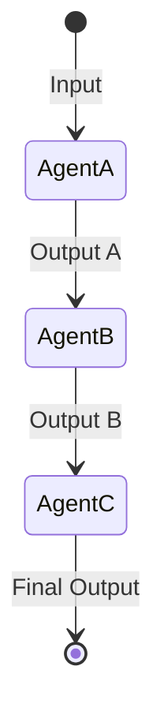
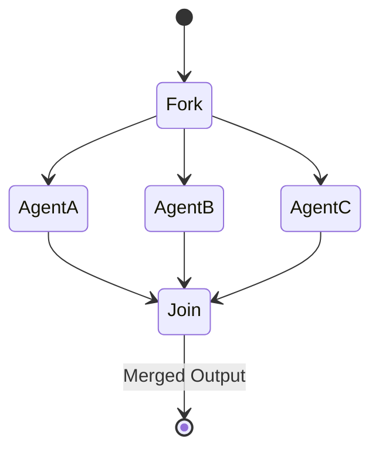
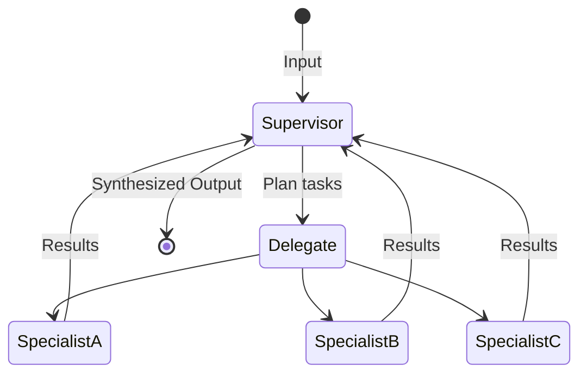
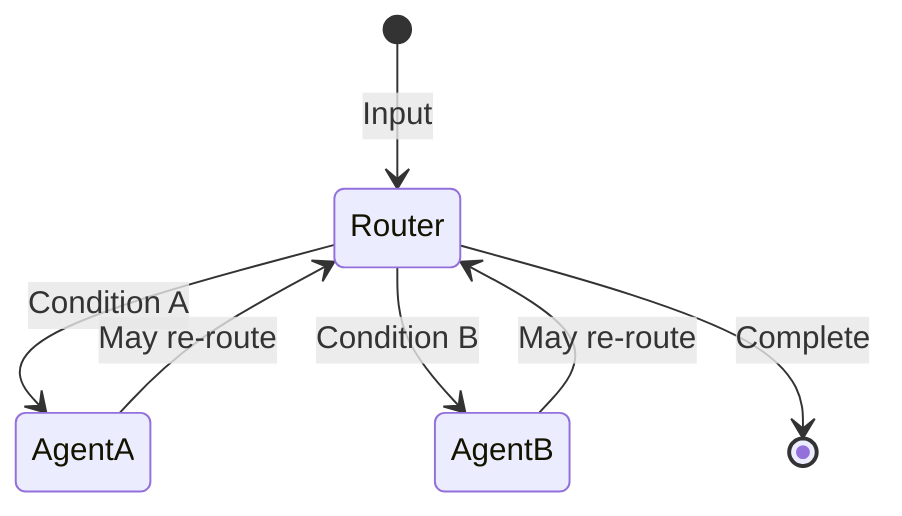
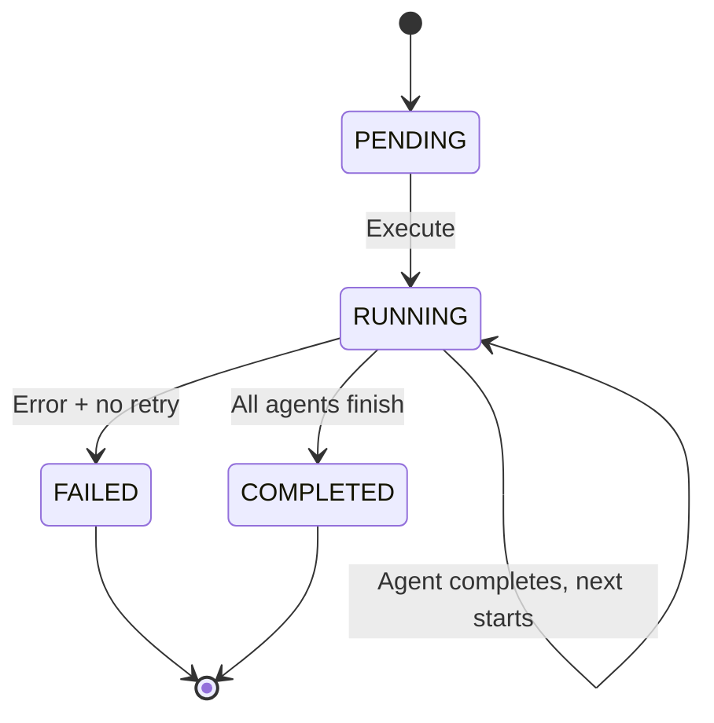
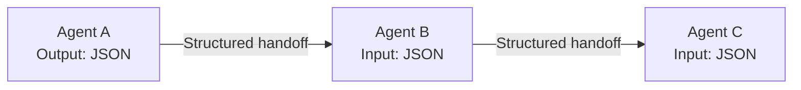

# Multi-Agent Orchestration

Synaptiq's workflow engine coordinates multiple specialized AI agents to solve complex problems. Built on the `agent-flow-spring` library, it supports sequential, parallel, supervisor, and dynamic flow patterns.

---

## Agent Model

Each agent in a workflow is configured with:

```yaml
Agent:
  id: "aba-specialist"
  name: "ABA Therapy Assistant"
  systemPrompt: |
    You are a Board Certified Behavior Analyst (BCBA) specializing in...
  model: "gemini-2.5-flash"
  temperature: 0.3
  maxTokens: 4096
  tools: []            # Optional MCP tools
  inputSchema: {}      # Expected input format
  outputSchema: {}     # Required output format
```

---

## Flow Types

### Sequential Flow



**Use case:** Linear pipelines where each step refines the previous output.

**Example:** Research → Analysis → Report Generation

```json
{
  "type": "SEQUENTIAL",
  "nodes": [
    { "id": "research", "systemPrompt": "Research the topic..." },
    { "id": "analysis", "systemPrompt": "Analyze the research findings..." },
    { "id": "report", "systemPrompt": "Generate a comprehensive report..." }
  ],
  "edges": [
    { "from": "research", "to": "analysis" },
    { "from": "analysis", "to": "report" }
  ]
}
```

### Parallel Flow



**Use case:** Independent analyses that can run concurrently.

### Supervisor Flow



**Use case:** Complex multi-domain problems requiring cross-domain coordination.

**Example (Healthcare ABA):**

```json
{
  "type": "SUPERVISOR",
  "supervisor": {
    "id": "supervisor",
    "systemPrompt": "You are a clinical supervisor coordinating a multidisciplinary team..."
  },
  "specialists": [
    { "id": "aba", "systemPrompt": "You are a BCBA specializing in ABA therapy..." },
    { "id": "speech", "systemPrompt": "You are an SLP specializing in pediatric..." },
    { "id": "ot", "systemPrompt": "You are an OTR specializing in sensory..." },
    { "id": "cbt", "systemPrompt": "You are a licensed psychologist specializing in CBT..." }
  ]
}
```

### Dynamic Flow



**Use case:** Adaptive workflows with conditional branching based on intermediate results.

---

## Execution Engine

The execution engine (`agent-flow-spring`) manages:

1. **Flow orchestration** — routes data between agents based on the flow type
2. **State management** — tracks execution state for each agent and the overall workflow
3. **Error handling** — retries, timeouts, and fallback agents
4. **Event emission** — SSE events for real-time UI updates

### Execution Lifecycle



### Event Types

| Event | Description |
|-------|-------------|
| `workflow_start` | Workflow execution begins |
| `agent_start` | Individual agent begins processing |
| `agent_output` | Agent produces output |
| `agent_complete` | Agent finishes successfully |
| `agent_error` | Agent encounters an error |
| `workflow_complete` | All agents finished, final output ready |
| `workflow_error` | Workflow failed |

---

## Inter-Agent Communication

Agents communicate through structured data contracts:



The supervisor agent can:
- **Merge** outputs from parallel agents
- **Resolve conflicts** between contradictory specialist recommendations
- **Request clarification** by re-invoking a specialist with additional context
- **Prioritize** based on domain importance or client preferences
