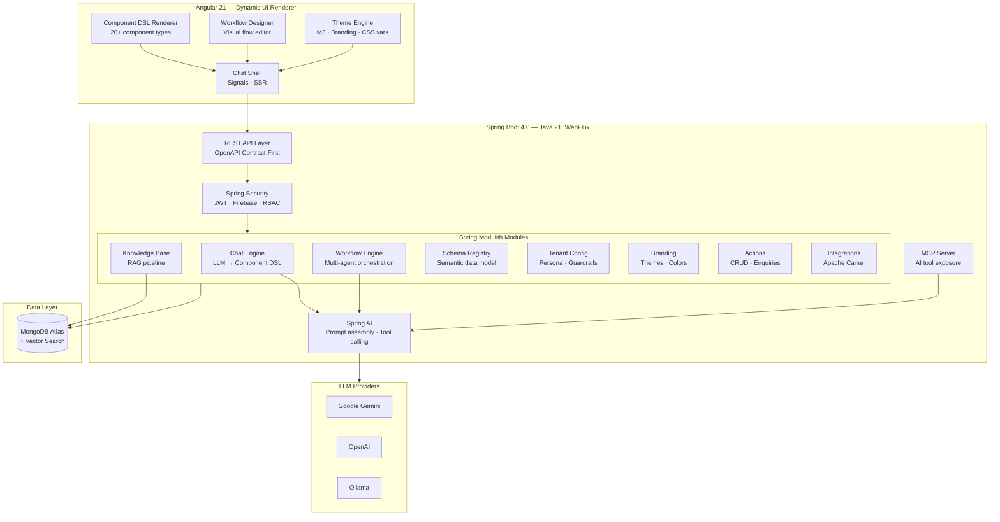
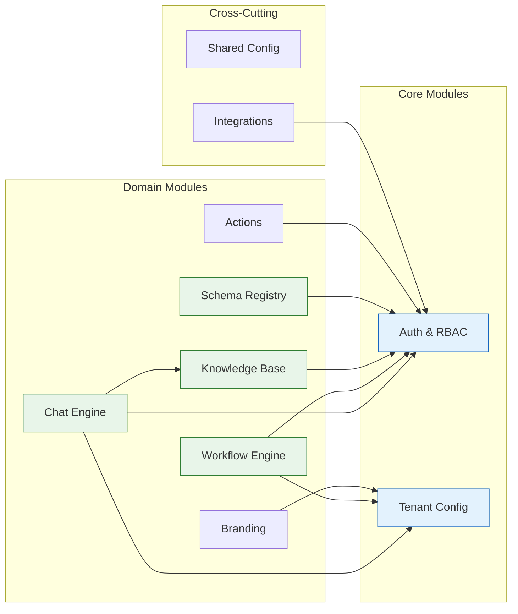
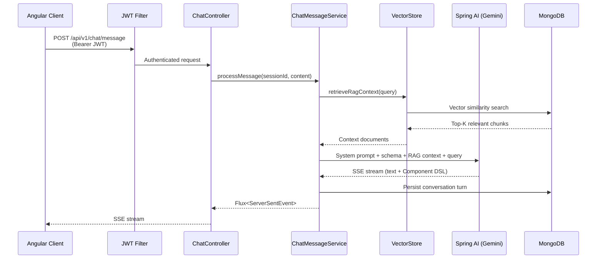

# Architecture Overview

Synaptiq is built as a **modular monolith** using Spring Modulith — combining the simplicity of a single deployment unit with the module isolation of microservices.

---

## System Architecture



---

## Design Principles

| Principle | Implementation |
|-----------|---------------|
| **AI generates the UI** | LLM emits declarative Component DSL JSON; frontend renders natively |
| **Secure by design** | Backend hydration — LLM never sees sensitive data |
| **API-First** | OpenAPI spec → generated Java interfaces + Angular SDK |
| **Hexagonal Architecture** | Domain core is pure POJOs — no framework annotations |
| **DDD Bounded Contexts** | Each module owns its aggregate root and domain events |
| **Event-Driven** | Modules communicate via `@ApplicationModuleListener` events only |
| **Reactive End-to-End** | WebFlux + Reactive MongoDB for non-blocking I/O |
| **RFC 9457 Errors** | Standardized `application/problem+json` responses |
| **Contract-First SDK** | Single OpenAPI spec generates Java server + Angular + Kotlin + Swift clients |

---

## Module Dependency Map



---

## Data Flow

### Chat Request Flow



---

## Monorepo Structure

```
synaptiq/                              # Nx 22 monorepo root
├── apps/
│   ├── frontend/web/shell/            # Angular 21 — chat shell + DSL renderer
│   └── backend/spring-apis/           # Spring Boot 4 (WebFlux + Modulith)
│       └── src/main/java/com/spectrayan/synaptiq/
│           ├── chat/                  #   Chat engine module
│           ├── workflow/              #   Multi-agent workflow engine
│           ├── knowledgebase/         #   Knowledge base + RAG
│           ├── schemaregistry/        #   Schema registry
│           ├── tenantconfig/          #   AI persona, guardrails
│           ├── branding/              #   Theme, logo, colors
│           ├── auth/                  #   Authentication + RBAC
│           ├── integration/           #   Apache Camel integrations
│           └── shared/                #   Cross-cutting config, security
├── libs/
│   ├── frontend/
│   │   ├── dsl-renderer/             # 20+ DSL component renderers
│   │   ├── auth/                     # AuthService, AuthGuard, login
│   │   ├── chat/                     # Chat UI — message list, input
│   │   └── theme/                    # M3 theme service + CSS vars
│   ├── backend/
│   │   └── agent-flow-spring/        # Spring-based multi-agent engine
│   └── shared/
│       ├── openapi-spec/             # OpenAPI 3.0 contract
│       ├── sdks/                     # Generated SDKs (Angular, Kotlin, Swift)
│       ├── apis/                     # Generated Spring server stubs
│       └── constants/                # Component DSL type definitions
├── docs/
│   ├── site-docs/                    # MkDocs documentation site
│   ├── architecture.md               # Detailed architecture doc
│   └── vision.md                     # Platform vision & strategy
├── seed-data/                        # Database seeding scripts
├── scripts/                          # Start/stop/seed scripts
└── docker-compose.yml                # MongoDB infrastructure
```
