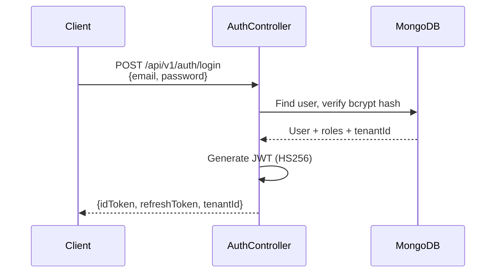

# 🔐 Auth & RBAC — Deep Dive

Synaptiq supports dual authentication modes and a scope-based RBAC system for fine-grained access control.

---

## Authentication Modes

### Built-in JWT Auth

For self-hosted deployments without external auth providers:



JWT payload:

```json
{
  "sub": "user-id",
  "email": "admin@synaptiq.dev",
  "tenantId": "demo-tenant",
  "roles": ["PLATFORM_ADMIN"],
  "iat": 1716660000,
  "exp": 1716746400
}
```

### Firebase Auth

For production deployments with Google Cloud:

- **Firebase Auth** handles user registration, password reset, MFA
- **Custom claims** carry `tenantId` and `roles`
- Backend validates Firebase JWT using Google's public keys

---

## RBAC Model

### Roles

| Role | Level | Permissions |
|------|-------|------------|
| `PLATFORM_ADMIN` | Global | All operations across all tenants |
| `TENANT_ADMIN` | Tenant | Manage users, config, branding within tenant |
| `USER` | Tenant | Chat, workflows, knowledge base |
| `VIEWER` | Tenant | Read-only access |

### Scope-Based Authorization

The `ScopeAuthorizationManager` evaluates access based on path-to-scope mappings stored in MongoDB:

```java
@Component
public class ScopeAuthorizationManager 
    implements ReactiveAuthorizationManager<AuthorizationContext> {
    
    public Mono<AuthorizationDecision> check(
            Mono<Authentication> auth, AuthorizationContext context) {
        String path = context.getExchange().getRequest().getPath().value();
        String method = context.getExchange().getRequest().getMethod().name();
        
        return scopeRepository.findByPathAndMethod(path, method)
            .flatMap(scope -> auth.map(a -> 
                hasScope(a, scope.getRequiredScope())))
            .defaultIfEmpty(new AuthorizationDecision(false));
    }
}
```

### Scope Mappings

| Path | Method | Required Scope |
|------|--------|---------------|
| `/api/v1/chat/**` | ALL | `chat:access` |
| `/api/v1/workflow/**` | ALL | `workflow:access` |
| `/api/v1/kb/**` | ALL | `kb:access` |
| `/api/v1/config/**` | PATCH | `admin:config` |
| `/api/v1/users/**` | ALL | `admin:users` |
| `/api/v1/tenants/**` | ALL | `platform:admin` |

---

## Security Configuration

```java
@Configuration
@EnableWebFluxSecurity
public class SecurityConfig {
    
    @Bean
    public SecurityWebFilterChain filterChain(ServerHttpSecurity http) {
        return http
            .csrf(ServerHttpSecurity.CsrfSpec::disable)
            .cors(cors -> cors.configurationSource(corsConfig()))
            .authorizeExchange(auth -> auth
                .pathMatchers("/api/v1/auth/**").permitAll()
                .pathMatchers("/actuator/**").permitAll()
                .pathMatchers("/api/v1/chat/**").permitAll()
                .pathMatchers("/api/v1/workflow/**").permitAll()
                .pathMatchers("/api/v1/kb/**").permitAll()
                .anyExchange().authenticated()
            )
            .addFilterBefore(jwtAuthFilter, SecurityWebFiltersOrder.AUTHENTICATION)
            .build();
    }
}
```

---

## Tenant Context Propagation

The tenant ID flows through the entire request lifecycle:

```
JWT → JwtAuthFilter → SecurityContext → TenantContext → Repository Query
```

All MongoDB queries are automatically scoped by `tenantId`:

```java
// Repository method — automatically filtered by tenant
Flux<WorkflowDocument> findByTenantId(String tenantId);
```
