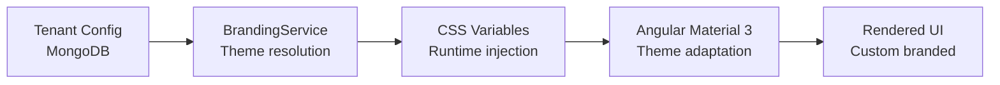

# 🎨 Branding & Theming — Deep Dive

Synaptiq's per-tenant branding system allows each organization to customize the visual identity of their platform instance.

---

## Architecture



---

## Theme Configuration

### Color System

| Token | Description | Default |
|-------|-------------|---------|
| `--brand-primary` | Primary brand color | `#00897b` (Teal) |
| `--brand-accent` | Accent/highlight color | `#00bcd4` (Cyan) |
| `--brand-surface` | Background surface | `#ffffff` / `#1e1e1e` |
| `--brand-on-primary` | Text on primary | `#ffffff` |
| `--brand-error` | Error states | `#d32f2f` |

### Font Configuration

| Setting | Options | Default |
|---------|---------|---------|
| `fontFamily` | Any Google Font | `Inter` |
| `headingFont` | Optional heading font | Same as body |
| `fontSize` | Base size (px) | `14` |

### Logo

- **Header logo** — displayed in the top navigation bar
- **Favicon** — browser tab icon
- **Login logo** — displayed on the login page
- Supported formats: PNG, SVG, WebP
- Recommended size: 180×40px (header), 512×512px (favicon)

---

## WCAG AA Compliance

Synaptiq automatically validates color contrast ratios:

| Requirement | Ratio | Check |
|-------------|-------|-------|
| Normal text | 4.5:1 | Primary text on surface |
| Large text | 3:1 | Headings on surface |
| UI components | 3:1 | Buttons, icons, borders |

```java
public class ContrastValidator {
    public static boolean meetsWCAGAA(String foreground, String background) {
        double ratio = calculateContrastRatio(
            parseColor(foreground), 
            parseColor(background)
        );
        return ratio >= 4.5; // AA standard for normal text
    }
}
```

!!! warning "Contrast Warnings"
    When a tenant sets custom colors that fail WCAG AA, the branding API returns a warning in the response without blocking the change. The admin UI displays the warning prominently.

---

## Theme Presets

Each tenant can save up to **5 named theme presets**:

| Preset | Primary | Accent | Mode |
|--------|---------|--------|------|
| Corporate Teal | `#00897b` | `#00bcd4` | Light |
| Dark Professional | `#37474f` | `#80cbc4` | Dark |
| Healthcare Blue | `#1565c0` | `#42a5f5` | Light |
| Sunset Warm | `#e65100` | `#ff9800` | Light |
| Midnight | `#1a237e` | `#7c4dff` | Dark |

---

## CSS Variable Injection

Branding is applied at runtime via CSS custom properties:

```typescript
@Injectable()
export class ThemeService {
    applyBranding(config: BrandingConfig): void {
        const root = document.documentElement;
        root.style.setProperty('--brand-primary', config.primaryColor);
        root.style.setProperty('--brand-accent', config.accentColor);
        root.style.setProperty('--brand-font', config.fontFamily);
        
        // Apply to Angular Material 3 theme
        this.updateM3Theme(config);
    }
}
```

This approach means:
- ✅ No page reload required when changing themes
- ✅ Different tenants see different branding on the same deployment
- ✅ Angular Material 3 components automatically adopt brand colors
