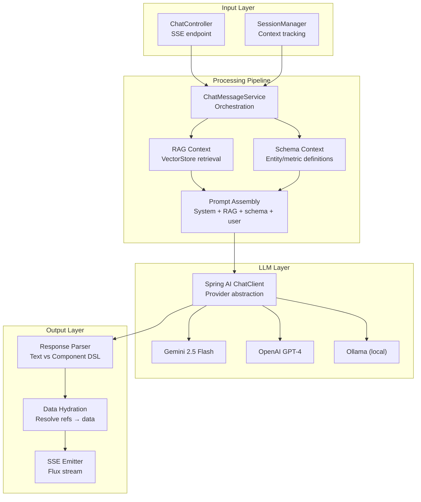

# 💬 Chat Engine — Deep Dive

The Chat Engine is Synaptiq's core module — it receives natural language queries and produces Component DSL specifications via LLM orchestration.

---

## Architecture



---

## LLM Provider Abstraction

Synaptiq uses **Spring AI** to abstract LLM providers:

```java
@Service
public class ChatMessageService {
    private final ChatClient chatClient;
    
    public Flux<ServerSentEvent<String>> processMessage(
            String sessionId, String content, String tenantId) {
        
        String ragContext = retrieveRagContext(content);
        String schemaContext = getSchemaContext(tenantId);
        
        return chatClient.prompt()
            .system(buildSystemPrompt(schemaContext, ragContext))
            .user(content)
            .stream()
            .chatResponse()
            .map(response -> ServerSentEvent.builder(response.getResult()
                .getOutput().getText()).build());
    }
}
```

### Provider Configuration

=== "Google Gemini"
    ```yaml
    spring:
      ai:
        google:
          genai:
            api-key: ${GOOGLE_API_KEY}
            chat:
              options:
                model: gemini-2.5-flash
                temperature: 0.7
    ```

=== "OpenAI"
    ```yaml
    spring:
      ai:
        openai:
          api-key: ${OPENAI_API_KEY}
          chat:
            options:
              model: gpt-4o
    ```

=== "Ollama"
    ```yaml
    spring:
      ai:
        ollama:
          base-url: http://localhost:11434
          chat:
            model: llama3.2
    ```

---

## System Prompt Assembly

The system prompt is assembled from multiple layers:

```
┌──────────────────────────────────────────────┐
│ 1. Base System Prompt                        │
│    Role definition, behavior guidelines      │
├──────────────────────────────────────────────┤
│ 2. Component DSL Schema                      │
│    Available component types, JSON format     │
├──────────────────────────────────────────────┤
│ 3. Semantic Schema Context                   │
│    Entities, metrics, dimensions for tenant   │
├──────────────────────────────────────────────┤
│ 4. RAG Context                               │
│    Relevant document chunks from vector store │
├──────────────────────────────────────────────┤
│ 5. Guardrails                                │
│    Content restrictions, domain limits        │
├──────────────────────────────────────────────┤
│ 6. User Message                              │
│    The actual query                           │
└──────────────────────────────────────────────┘
```

---

## RAG Integration

The chat engine integrates with the knowledge base for context-aware responses:

```java
private String retrieveRagContext(String query) {
    try {
        List<Document> docs = vectorStore.similaritySearch(
            SearchRequest.builder()
                .query(query)
                .topK(5)
                .similarityThreshold(0.7)
                .build()
        );
        return docs.stream()
            .map(Document::getText)
            .collect(Collectors.joining("\n\n"));
    } catch (Exception e) {
        log.warn("RAG retrieval failed, continuing without context", e);
        return "";
    }
}
```

!!! note "Graceful Degradation"
    If the vector store is unavailable (e.g., Ollama embedding model is not running), the chat engine continues without RAG context. This ensures the core chat functionality is always available.

---

## SSE Streaming

Responses are streamed via Server-Sent Events:

```
event: message
data: {"text": "Based on your Q1 data, "}

event: message  
data: {"text": "here's a revenue dashboard:"}

event: component
data: {"type": "kpi_card", "title": "Q1 Revenue", "value": "$2.4M"}

event: component
data: {"type": "chart", "chartType": "bar", ...}

event: done
data: {"sessionId": "abc123", "messageId": "msg456"}
```

---

## Error Handling

| Error | Strategy |
|-------|----------|
| LLM timeout | Circuit breaker with 30s timeout, fallback to error message |
| Rate limit | Exponential backoff with 3 retries |
| Invalid response | Parse error → return text-only response |
| Vector store down | Skip RAG context, continue without knowledge base |
| Auth failure | 401 Unauthorized, no LLM call |
