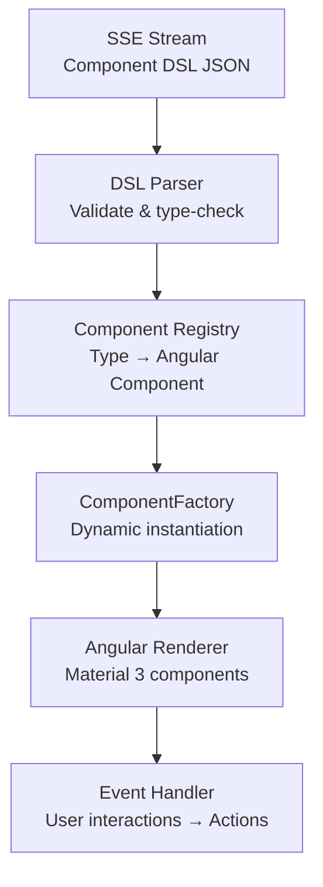

# 🎨 Dynamic UI Renderer — Deep Dive

The Dynamic UI Renderer is the Angular frontend engine that converts Component DSL specifications into rich, interactive Material Design 3 components.

---

## Rendering Architecture



---

## Component Registry

The renderer maps DSL types to Angular components:

```typescript
const COMPONENT_REGISTRY: Record<string, Type<DslComponent>> = {
  'kpi_card':          KpiCardComponent,
  'chart':             EchartsComponent,
  'stat_grid':         StatGridComponent,
  'data_table':        DataTableComponent,
  'item_card':         ItemCardComponent,
  'item_grid':         ItemGridComponent,
  'comparison_table':  ComparisonTableComponent,
  'timeline':          TimelineComponent,
  'progress_tracker':  ProgressTrackerComponent,
  'kanban':            KanbanComponent,
  'form':              DynamicFormComponent,
  'composite_view':    CompositeViewComponent,
  'filter_summary':    FilterSummaryComponent,
  'action_card':       ActionCardComponent,
  'suggestion_chips':  SuggestionChipsComponent,
};
```

---

## ECharts Integration

Charts are rendered using Apache ECharts with automatic theme adaptation:

| Chart Type | Configuration |
|-----------|--------------|
| **Bar** | Vertical/horizontal, stacked, grouped |
| **Line** | Smooth/stepped, area fill, multi-series |
| **Pie** | Standard pie with labels and legend |
| **Donut** | Pie with center hole and summary stat |
| **Area** | Gradient fill with time-series data |

---

## Dynamic Forms

The form engine supports:

- **Field types:** text, number, email, select, multi-select, textarea, date, checkbox, toggle, file upload
- **Validation:** required, min/max, pattern, custom validators
- **Conditional visibility:** fields show/hide based on other field values
- **Layout:** single column, multi-column, grouped sections
- **Submit actions:** API calls, workflow triggers, data persistence

---

## Responsive Design

All components adapt to screen size:

| Breakpoint | Layout | Behavior |
|-----------|--------|----------|
| **Mobile** (<768px) | Single column | Cards stack, tables scroll horizontally |
| **Tablet** (768-1024px) | 2 columns | Sidebar collapses, charts resize |
| **Desktop** (>1024px) | Full grid | Dashboard-grade layouts |

---

## Interaction Events

User interactions on rendered components emit events back to the chat engine:

| Event | Trigger | Example |
|-------|---------|---------|
| `chip_click` | Suggestion chip selected | "Show me more details" |
| `action_click` | Action button pressed | "Add to Cart" |
| `form_submit` | Form submitted | Client profile data |
| `row_click` | Table row selected | Drill into specific record |
| `chart_click` | Chart element clicked | Drill into region data |
