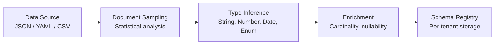
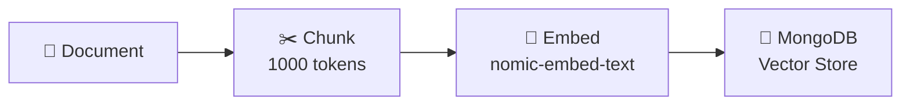

# 📊 Semantic Data Model — Deep Dive

The Semantic Data Model is Synaptiq's structured representation of an organization's data universe — enabling accurate, governed AI reasoning.

---

## Schema Registry

### Auto-Inference Pipeline



### Entity Model

```json
{
  "entities": [
    {
      "name": "Product",
      "fields": [
        { "name": "id", "type": "string", "primary": true },
        { "name": "name", "type": "string", "searchable": true },
        { "name": "price", "type": "number", "metric": "revenue" },
        { "name": "category", "type": "enum", "dimension": true,
          "values": ["Electronics", "Clothing", "Home", "Sports"] },
        { "name": "rating", "type": "number", "metric": "satisfaction" }
      ],
      "relationships": [
        { "target": "Order", "type": "one-to-many", "via": "productId" }
      ]
    }
  ]
}
```

### Metrics & Dimensions

| Concept | Definition | Example |
|---------|-----------|---------|
| **Metric** | Quantitative, aggregatable value | Revenue, Order Count, Avg Rating |
| **Dimension** | Qualitative, categorical attribute | Region, Category, Time Period |
| **Measure** | Computed from metrics | Profit Margin = (Revenue - Cost) / Revenue |
| **Vocabulary** | Domain-specific terms | "Churn" = inactive > 90 days |

---

## Vector Search Integration

### MongoDB Atlas Vector Search

```javascript
// Vector search index definition
{
  "type": "vectorSearch",
  "fields": [
    {
      "path": "embedding",
      "type": "vector",
      "numDimensions": 768,
      "similarity": "cosine"
    },
    {
      "path": "tenantId",
      "type": "filter"
    }
  ]
}
```

### Embedding Pipeline



| Setting | Default | Description |
|---------|---------|-------------|
| Chunk size | 1000 tokens | Size of each document chunk |
| Chunk overlap | 200 tokens | Overlap between adjacent chunks |
| Embedding model | nomic-embed-text | Ollama embedding model |
| Dimensions | 768 | Vector dimensions |
| Similarity | Cosine | Similarity metric |
| Top-K | 5 | Number of results per query |

---

## How the AI Uses the Schema

When a user asks a question, the semantic schema is injected into the system prompt:

```
You have access to the following data model:

Entity: Product
  - name (string, searchable)
  - price (number, metric: revenue)  
  - category (enum: Electronics, Clothing, Home, Sports)
  - rating (number, metric: satisfaction)
  
Entity: Order
  - orderId (string, primary)
  - customerId (string, FK → Customer)
  - total (number, metric: revenue)
  - status (enum: pending, shipped, delivered, returned)

Relationships:
  Customer → Orders (one-to-many)
  Order → Products (many-to-many)
```

This ensures the AI:
- ✅ Uses real field names, not hallucinated ones
- ✅ Applies correct aggregations (sum, avg, count)
- ✅ Respects data types (doesn't try to sum strings)
- ✅ Understands relationships for joins and drill-downs
