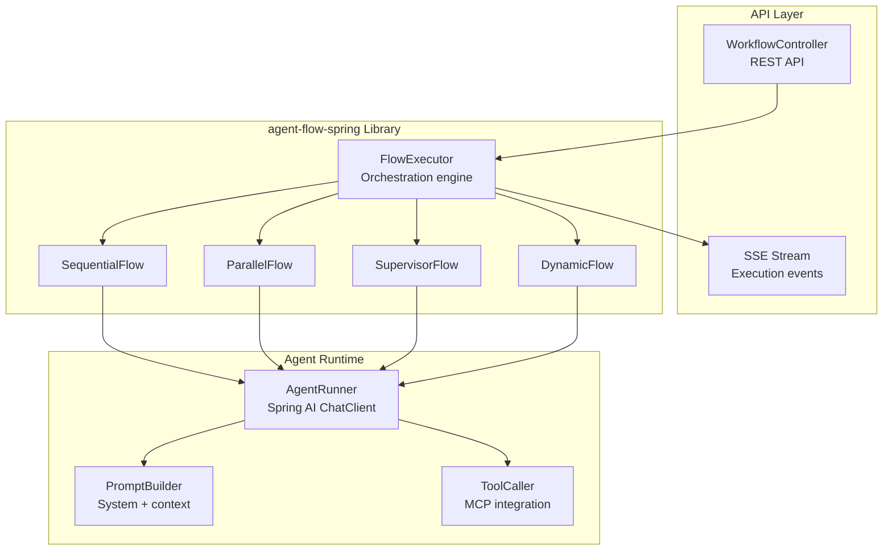
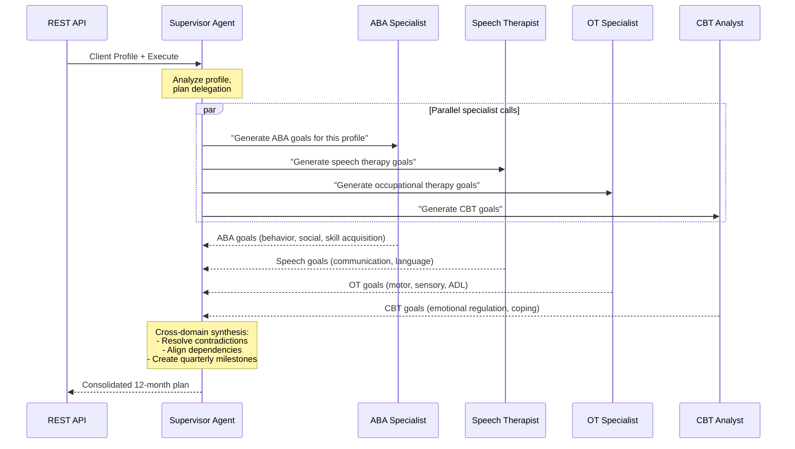

# 🔧 Workflow Engine — Deep Dive

The Workflow Engine (`agent-flow-spring`) is Synaptiq's multi-agent orchestration library. It coordinates multiple specialized AI agents to solve complex problems.

---

## Library Architecture



---

## Flow Execution Deep Dive

### Sequential Flow

```java
public class SequentialFlowExecutor implements FlowExecutor {
    
    public Mono<FlowResult> execute(FlowDefinition flow, FlowInput input) {
        return Flux.fromIterable(flow.getNodes())
            .reduce(input, (currentInput, node) -> 
                agentRunner.run(node, currentInput)
                    .doOnNext(output -> emitEvent(
                        AgentEvent.completed(node.getId(), output)))
            )
            .map(FlowResult::success);
    }
}
```

### Supervisor Flow — ABA Therapy Example

The supervisor flow is the most complex pattern. Here's how the ABA therapy goal generation works:



### Supervisor System Prompt (Healthcare)

```
You are a Clinical Supervisor coordinating a multidisciplinary team 
for ABA therapy goal development. You have access to four specialist agents:

1. ABA_ASSISTANT - Board Certified Behavior Analyst
2. SPEECH_THERAPY - Speech-Language Pathologist  
3. OCCUPATIONAL_THERAPY - Occupational Therapist
4. COGNITIVE_BEHAVIOR - Licensed Psychologist

For each client profile:
1. Delegate goal generation to ALL four specialists
2. Review outputs for contradictions and dependencies
3. Create quarterly milestones (Q1, Q2, Q3, Q4)
4. Produce a consolidated, cross-domain-aligned treatment plan
```

---

## Workflow Persistence

Workflow definitions and execution runs are stored in MongoDB:

### WorkflowDocument

```java
@Document(collection = "workflows")
public class WorkflowDocument {
    private String id;
    private String tenantId;
    private String name;
    private String description;
    private FlowSpec spec;        // nodes, edges, flow type
    private boolean isPublic;
    private Instant createdAt;
    private Instant updatedAt;
}
```

### WorkflowRunDocument

```java
@Document(collection = "workflow_runs")  
public class WorkflowRunDocument {
    private String id;
    private String workflowId;
    private String tenantId;
    private RunStatus status;     // PENDING, RUNNING, COMPLETED, FAILED
    private Map<String, Object> input;
    private Map<String, Object> output;
    private List<AgentExecution> agentExecutions;
    private Instant startedAt;
    private Instant completedAt;
}
```

---

## Financial Services Example

A portfolio compliance workflow:

```json
{
  "name": "Portfolio Compliance Review",
  "type": "SEQUENTIAL",
  "nodes": [
    {
      "id": "portfolio-analyzer",
      "name": "Portfolio Analysis Agent",
      "systemPrompt": "Analyze the portfolio holdings, calculate risk metrics (VaR, Sharpe ratio, concentration), and identify any positions exceeding regulatory limits.",
      "model": "gemini-2.5-flash",
      "temperature": 0.2
    },
    {
      "id": "compliance-checker",
      "name": "Compliance Agent",
      "systemPrompt": "Review the portfolio analysis for regulatory compliance: SEC suitability, concentration limits, FINRA margin requirements. Flag any violations.",
      "model": "gemini-2.5-flash",
      "temperature": 0.1
    },
    {
      "id": "report-generator",
      "name": "Report Agent",
      "systemPrompt": "Generate a client-facing compliance report in structured format with risk summary, compliance status, and recommended actions.",
      "model": "gemini-2.5-flash",
      "temperature": 0.3
    }
  ]
}
```

---

## E-Retail Example

An inventory management dynamic workflow:

```json
{
  "name": "Inventory Alert Response",
  "type": "DYNAMIC",
  "nodes": [
    {
      "id": "triage",
      "name": "Inventory Triage Agent",
      "systemPrompt": "Analyze the inventory alert. Route to reorder-agent if stock is critically low, to pricing-agent if demand is declining, or to marketing-agent if the product needs promotional support."
    },
    {
      "id": "reorder",
      "name": "Reorder Agent",
      "systemPrompt": "Calculate optimal reorder quantity based on lead time, demand forecast, and minimum stock levels. Generate a purchase order."
    },
    {
      "id": "pricing",
      "name": "Pricing Agent",
      "systemPrompt": "Analyze demand elasticity and competitor pricing. Recommend price adjustments to optimize margins while maintaining competitiveness."
    },
    {
      "id": "marketing",
      "name": "Marketing Agent",
      "systemPrompt": "Create a promotional campaign plan including discount strategy, email copy, and social media messaging to boost sales."
    }
  ]
}
```

---

## Performance Considerations

| Metric | Typical Value | Optimization |
|--------|--------------|-------------|
| Sequential flow (3 agents) | 8-15 seconds | Reduce system prompt size |
| Parallel flow (4 agents) | 5-8 seconds | Bounded by slowest agent |
| Supervisor flow (1 + 4 agents) | 12-25 seconds | Parallel specialist calls |
| Agent cold start | 200-500ms | Connection pooling |
