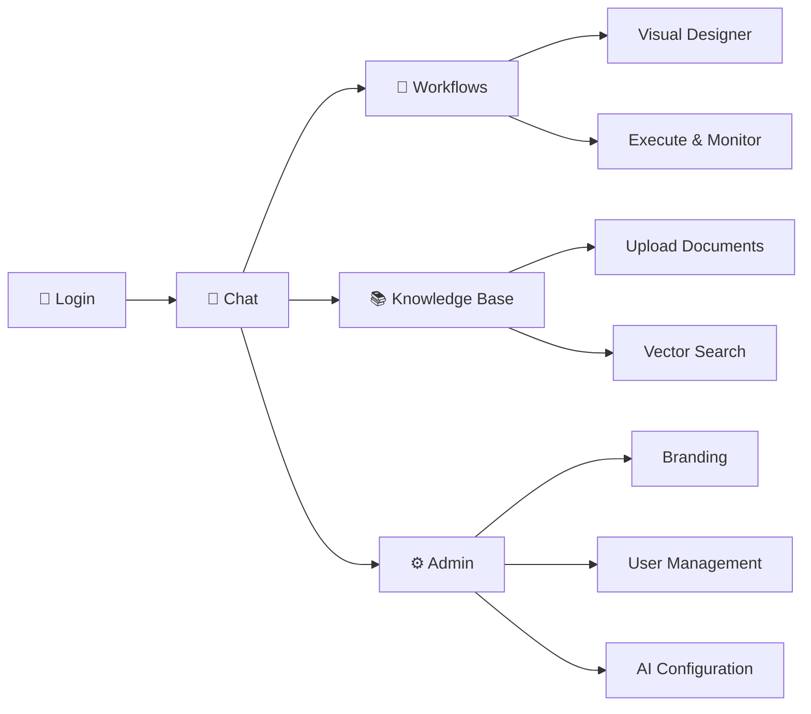

# Platform Overview

A guided tour of Synaptiq's key features and navigation.

---

## Application Layout

Synaptiq's frontend is built as an Angular 21 shell with a responsive layout:

```
┌─────────────────────────────────────────────────────┐
│  🧠 Synaptiq          [Theme Toggle] [User Menu]    │  ← Header
├──────────┬──────────────────────────────────────────┤
│          │                                          │
│  Chat    │     Main Content Area                    │
│  History │                                          │
│          │  ┌──────────────────────────────────┐    │
│  ────────│  │  Chat Messages                   │    │
│          │  │  + Component DSL Rendering        │    │
│  Workflow│  │  + Interactive Components          │    │
│  List    │  │                                    │    │
│          │  └──────────────────────────────────┘    │
│          │                                          │
│          │  ┌──────────────────────────────────┐    │
│          │  │  💬 Message Input                  │    │
│          │  └──────────────────────────────────┘    │
└──────────┴──────────────────────────────────────────┘
```

---

## Key Features

### 💬 Chat Interface

The chat interface is the primary interaction surface. Users type natural language queries, and Synaptiq responds with:

- **Text responses** — natural language answers
- **Component DSL** — rich, interactive UI components rendered inline
- **Suggestion chips** — contextual follow-up actions
- **Streaming** — responses appear in real-time via Server-Sent Events (SSE)

### 🔧 Workflow Designer

The workflow designer provides:

- **Visual flow editor** — drag-and-drop node-based workflow builder
- **Natural language generation** — describe a workflow in plain English, Synaptiq generates the flow
- **Templates** — pre-built workflow patterns for common use cases
- **Execution history** — view past runs with detailed step-by-step results

### 📚 Knowledge Base

The knowledge base enables RAG (Retrieval-Augmented Generation):

- **Document upload** — ingest PDFs, text files, and CSVs
- **Automatic embedding** — documents are chunked and vectorized
- **Contextual search** — relevant passages are injected into chat responses
- **Source citations** — responses reference specific document sections

### ⚙️ Administration

Tenant administrators can configure:

- **AI Persona** — customize the AI's name, behavior, and guardrails
- **Branding** — logos, color palettes, fonts, and theme presets
- **User Management** — invite users, assign roles, manage permissions
- **Model Configuration** — select LLM provider, model, temperature, and token limits

---

## Navigation Flow



---

## API Documentation

The backend exposes a full REST API documented with **OpenAPI 3.0**. Access the interactive API explorer at:

**[http://localhost:8080/swagger-ui.html](http://localhost:8080/swagger-ui.html)**

Key API groups:

| API Group | Base Path | Description |
|-----------|-----------|-------------|
| **Auth** | `/api/v1/auth` | Login, signup, token refresh |
| **Chat** | `/api/v1/chat` | Sessions, messages (SSE streaming) |
| **Workflows** | `/api/v1/workflow` | CRUD, execute, generate, templates |
| **Knowledge Base** | `/api/v1/kb` | Document upload, search |
| **Config** | `/api/v1/config` | AI persona, branding, tenant settings |
| **Admin** | `/api/v1/roles`, `/api/v1/users` | RBAC, user management |
