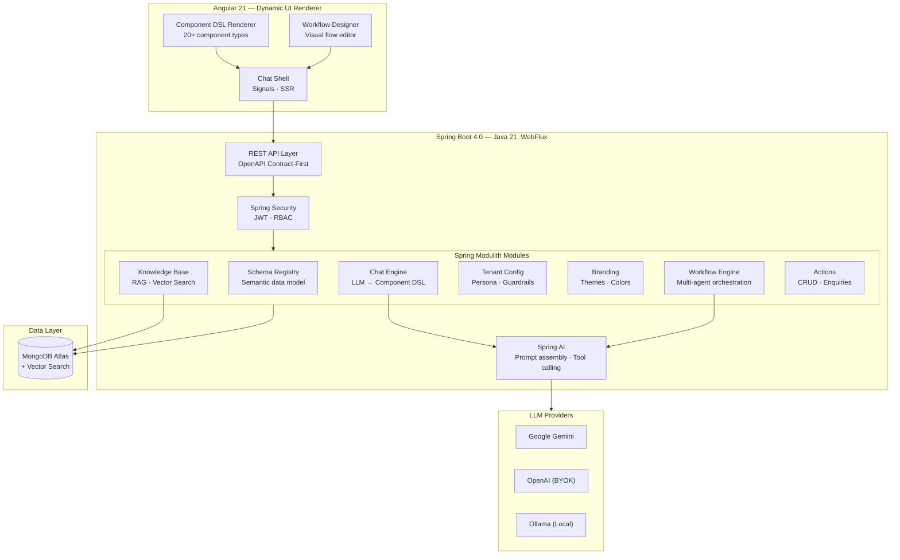
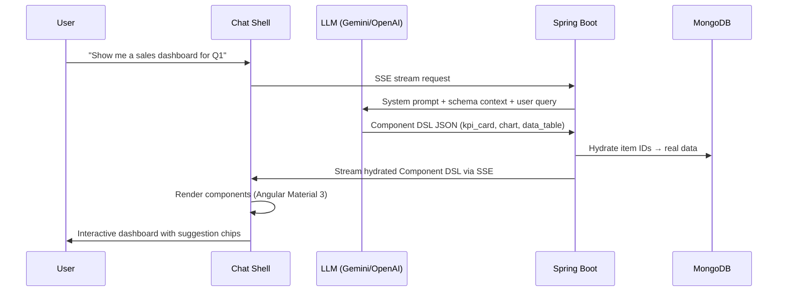

# Synaptiq

**The AI‑native application platform where conversation becomes computation — and data becomes UI.**

Synaptiq is a chat-native, data-driven application platform where businesses define their data, and the system dynamically generates dashboards, workflows, reports, and entire UI experiences at runtime. No manual UI building. No dashboard design. No workflow coding. Just natural language.

> Think: **Retool** for app building + **ChatGPT** for conversation + **Tableau** for data visualization — unified into a single AI-native platform where the UI assembles itself.

---

## Why Synaptiq?

Modern business software forces users through static screens, rigid dashboards, and complex navigation. Even with AI bolted on, most tools remain fundamentally manual and brittle.

**Synaptiq flips this model entirely.**

| Problem | Synaptiq Solution |
|---------|-------------------|
| Users drown in static dashboards | **Dynamic UI generation** — ask in natural language, get the exact interface you need |
| Building internal tools takes weeks | **AI-generated applications** — describe what you want, Synaptiq assembles it in seconds |
| Data is scattered across systems | **Semantic data layer** — define entities, metrics, and relationships; AI reasons over them |
| Workflows are rigid and coded | **Multi-agent orchestration** — create complex workflows through natural language |
| Every user gets the same experience | **Personalized, context-aware UX** — the UI adapts to the user, not the other way around |

---

## Architecture

Synaptiq is built as a **modular monolith** using Spring Modulith with a reactive API layer, event-driven module communication, and a declarative Component DSL that bridges the AI backend to a rich Angular rendering engine.



### How Dynamic UI Generation Works



---

## Tech Stack

| Layer | Technology |
|-------|------------|
| **Frontend** | Angular 21 · TypeScript 5.9 · Angular Material 3 · Signals · SSR |
| **Component DSL** | 20+ declarative component types · ECharts · dynamic form engine |
| **Backend** | Java 21 · Spring Boot 4 · Spring Framework 7 · WebFlux |
| **AI / LLM** | Spring AI (Google Gemini · OpenAI BYOK · Ollama) · tool calling |
| **Modularity** | Spring Modulith (module boundaries, event-driven, hexagonal) |
| **Database** | MongoDB Atlas + Vector Search (reactive driver) |
| **Auth** | JWT (built-in) + Firebase Auth (multi-tenant, custom claims) |
| **API Spec** | OpenAPI 3.0 · openapi-generator for Java + TypeScript codegen |
| **Build** | Nx 22 monorepo · Maven (backend) · pnpm (frontend) |
| **Containers** | Docker · Docker Compose |

---

## Platform Capabilities

| Module | Description | Status |
|--------|-------------|--------|
| **Dynamic UI Engine** | 20+ component types rendered at runtime from AI-generated declarative JSON specs | ✅ Stable |
| **Semantic Schema Registry** | Auto-inference from document sampling, field-level type/cardinality analysis | ✅ Stable |
| **Per-Tenant Branding** | Logos, color palettes, fonts, named theme presets, WCAG AA validation | ✅ Stable |
| **AI Chat Engine** | Streaming SSE responses, Gemini & OpenAI adapters, BYOK support | 🔶 Beta |
| **Vector Search** | MongoDB Atlas Vector Search with embedding models, RAG integration | 🔶 Beta |
| **Agent Workflow Engine** | Multi-agent orchestration (sequential, parallel, supervisor, dynamic) | 🔶 Beta |
| **Knowledge Base** | Document ingestion, vector embeddings, contextual RAG for chat | 🔶 Beta |
| **Multi-Tenant Architecture** | Subdomain-based isolation, RBAC, per-tenant configuration | 🔶 Beta |
| **Auth & RBAC** | Built-in JWT + Firebase Auth, scope-based authorization manager | 🔶 Beta |
| **Actions Engine** | Save items, contact enquiries, CRUD operations — audit-logged | 🔶 Beta |

---

## Design Principles

| Principle | Implementation |
|-----------|---------------|
| **AI generates the UI** | LLM emits declarative Component DSL JSON; frontend renders natively |
| **Secure by design** | Backend hydration — LLM never sees sensitive data; no executable code in UI specs |
| **API-First** | OpenAPI spec → generated Java interfaces + Angular SDK |
| **Hexagonal Architecture** | Domain core is pure POJOs — no framework annotations |
| **Event-Driven** | Modules communicate via `@ApplicationModuleListener` events only |
| **Reactive End-to-End** | WebFlux + Reactive MongoDB for non-blocking I/O |
| **RFC 9457 Errors** | Standardized `application/problem+json` responses across all APIs |

---

## Quick Start

```bash
# 1. Clone & install
git clone https://github.com/spectrayan/synaptiq.git && cd synaptiq
pnpm install

# 2. Start infrastructure
docker compose up -d

# 3. Start backend & frontend
GOOGLE_API_KEY="your-key" AUTH_PROVIDER="builtin" \
  mvn spring-boot:run -f apps/backend/spring-apis/pom.xml -Dspring-boot.run.profiles=dev
pnpm nx serve shell

# 4. Open http://localhost:4200
# Login: admin@synaptiq.dev / admin123
```

→ **[Full Quick Start Guide](getting-started/quickstart.md)**

---

## Use Cases

Synaptiq serves organizations across industries that want to replace static dashboards and rigid workflows with AI-native, conversational interfaces.

<div class="hero-grid" markdown>

<div class="hero-card" markdown>

### 🏥 Healthcare
**ABA Therapy Goal Generation** — Multi-agent workflow where a supervisor agent coordinates ABA, Speech Therapy, OT, and CBT specialists to generate consolidated 12-month therapy goals with quarterly milestones.

→ [Read the Healthcare use case](about/use-cases.md#healthcare-aba-therapy-goal-generation)

</div>

<div class="hero-card" markdown>

### 💰 Financial Services
**Portfolio Advisory Dashboards** — Natural language queries like *"Show me my risk exposure"* generate KPI cards, allocation charts, and compliance reports dynamically.

→ [Read the Financial Services use case](about/use-cases.md#financial-services-portfolio-advisory)

</div>

<div class="hero-card" markdown>

### 🛒 E-Retail
**Conversational Catalog** — Product discovery through natural language: *"Find summer dresses under $50"* renders item cards, comparison tables, and personalized recommendations.

→ [Read the E-Retail use case](about/use-cases.md#e-retail-intelligent-catalog-customer-engagement)

</div>

</div>

---

## Community

- 🐛 [Report a Bug](https://github.com/spectrayan/synaptiq/issues/new?template=bug_report.md)
- 💡 [Request a Feature](https://github.com/spectrayan/synaptiq/issues/new?template=feature_request.md)
- 💬 [Discussions](https://github.com/spectrayan/synaptiq/discussions)
- 📧 [developer@spectrayan.com](mailto:developer@spectrayan.com)

---

## License

This project is licensed under the **MIT License** — see the [LICENSE](https://github.com/spectrayan/synaptiq/blob/main/LICENSE) file for details.

<p align="center">
  Built with ❤️ by <a href="https://github.com/spectrayan">Spectrayan</a>
</p>
