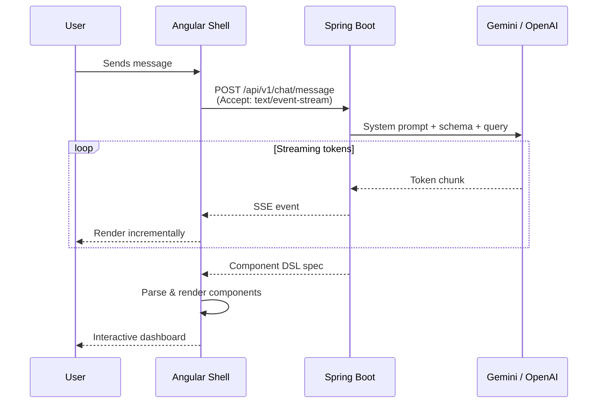

# Chat & AI

The chat interface is Synaptiq's primary interaction surface — where natural language becomes rich, interactive business applications.

---

## Sending Messages

Type your query in the message input at the bottom of the screen. Synaptiq supports:

| Query Type | Example | Response |
|-----------|---------|----------|
| **Data queries** | *"Show me Q1 revenue by region"* | KPI cards + bar chart + data table |
| **Dashboard requests** | *"Create a sales dashboard"* | Composite view with multiple components |
| **Workflow triggers** | *"Generate therapy goals for this client"* | Multi-agent workflow execution |
| **Knowledge questions** | *"What's our refund policy?"* | RAG-powered answer with source citations |
| **Admin commands** | *"Update the AI persona to be more formal"* | Configuration changes |

---

## Streaming Responses

Synaptiq uses **Server-Sent Events (SSE)** for real-time response streaming:

Responses appear in real-time as the LLM generates them. Component DSL specs are rendered into rich UI components after the full spec is received.

---

## Component DSL Rendering

When the LLM determines that a rich UI component is appropriate, it emits a **Component DSL** specification. The frontend renders these into native Angular Material 3 components:

### Data Visualization

| Component | When Used |
|-----------|-----------|
| **KPI Card** | Single metrics (revenue, count, percentage) with trend indicators |
| **Bar Chart** | Comparing values across categories |
| **Line Chart** | Trends over time |
| **Pie / Donut Chart** | Proportional breakdowns (powered by ECharts) |
| **Stat Grid** | Multiple metrics in a compact grid |

### Catalog & Lists

| Component | When Used |
|-----------|-----------|
| **Item Card** | Product/entity display with image, title, metadata |
| **Item Grid** | Grid layout of item cards |
| **Data Table** | Sortable, filterable tabular data |
| **Comparison Table** | Side-by-side comparison of entities |

### Interactive

| Component | When Used |
|-----------|-----------|
| **Dynamic Form** | Data entry with validation and conditional fields |
| **Kanban Board** | Status-based workflow visualization |
| **Timeline** | Chronological event display |
| **Progress Tracker** | Step-by-step completion status |

---

## Session Management

Each conversation is tracked as a **session**:

- **Create session** — automatically created on first message, or manually via the UI
- **Session history** — view past conversations in the left sidebar
- **Context continuity** — follow-up questions reference previous context within the session
- **Multi-session** — run multiple conversations with independent context

### API Endpoints

| Method | Endpoint | Description |
|--------|----------|-------------|
| `POST` | `/api/v1/chat/sessions` | Create a new chat session |
| `GET` | `/api/v1/chat/sessions` | List sessions for the current tenant |
| `POST` | `/api/v1/chat/message` | Send a message (SSE streaming response) |
| `GET` | `/api/v1/chat/sessions/{id}/history` | Get conversation history |

---

## RAG Context

When a knowledge base is configured, Synaptiq automatically enriches chat responses with relevant document context:

1. User's message is embedded using the configured embedding model
2. Similar document chunks are retrieved from MongoDB Atlas Vector Search
3. Retrieved context is injected into the system prompt
4. The LLM generates responses grounded in your organization's documents
5. Source citations are included in the response

!!! tip "Improving RAG Quality"
    - Upload domain-specific documents (policies, procedures, product catalogs)
    - Use clear, well-structured documents for better chunking
    - Review and curate the knowledge base regularly
