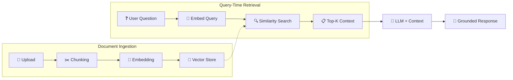

# Knowledge Base

The Knowledge Base enables **Retrieval-Augmented Generation (RAG)** — grounding AI responses in your organization's actual documents, policies, and data.

---

## How It Works



---

## Document Ingestion

### Supported Formats

| Format | Description |
|--------|-------------|
| **PDF** | Technical documents, policies, reports |
| **Text** | Plain text files, markdown |
| **CSV** | Structured data, catalogs, inventories |

### Ingestion Pipeline

Documents are processed through Apache Camel's integration engine:

1. **Upload** — via API or admin UI
2. **Tenant isolation** — documents are tagged with the tenant ID
3. **Chunking** — documents are split into manageable chunks (default: 1000 tokens with 200 token overlap)
4. **Embedding** — each chunk is converted to a vector using the configured embedding model
5. **Storage** — vectors are stored in MongoDB Atlas Vector Search

### API

```bash
# Upload a document
POST /api/v1/kb/documents
Content-Type: multipart/form-data

file: @document.pdf
sourceType: MANUAL
```

---

## Vector Search

### MongoDB Atlas Vector Search

Synaptiq uses MongoDB Atlas Vector Search for semantic similarity:

- **Index type** — HNSW (Hierarchical Navigable Small World)
- **Dimensions** — 768 (nomic-embed-text) or 1536 (OpenAI)
- **Similarity metric** — Cosine similarity
- **Top-K retrieval** — configurable (default: 5 chunks)

### Search API

```bash
# Semantic search
GET /api/v1/kb/search?q=refund+policy&limit=5
```

---

## Embedding Models

| Provider | Model | Dimensions | Notes |
|----------|-------|-----------|-------|
| **Ollama** | `nomic-embed-text` | 768 | Local, free, recommended for dev |
| **Google** | Gemini Embedding | 768 | Cloud-based, production-ready |
| **OpenAI** | `text-embedding-3-small` | 1536 | Cloud-based, high quality |

Configure in `application-dev.yml`:

```yaml
spring:
  ai:
    ollama:
      embedding:
        model: nomic-embed-text
```

---

## RAG in Chat

When a knowledge base is configured, chat responses are automatically augmented:

1. User's message is embedded
2. Top-K similar chunks are retrieved from the vector store
3. Retrieved context is injected into the system prompt
4. The LLM generates a response grounded in your documents
5. Source citations are included

!!! example "RAG-Augmented Response"

    **User:** *"What is our return policy for electronics?"*

    **Response:** *Based on the Company Returns Policy (v2.3, Section 4.2), electronics can be returned within 30 days of purchase in original packaging with receipt. Opened items are subject to a 15% restocking fee. Defective items can be exchanged within 90 days under warranty.*

    **Sources:** Returns Policy v2.3 §4.2, Warranty Terms §2.1

---

## Best Practices

!!! tip "Document Quality"
    - Use well-structured documents with clear headings and sections
    - Avoid scanned PDFs without OCR — use text-based PDFs
    - Keep documents up to date — outdated context leads to outdated answers

!!! tip "Chunk Size Optimization"
    - Smaller chunks (500 tokens) — better for precise Q&A
    - Larger chunks (2000 tokens) — better for context-heavy responses
    - Adjust overlap to prevent losing context at chunk boundaries

!!! tip "Domain-Specific Vocabularies"
    - Upload glossaries and terminology guides
    - The RAG pipeline will ground responses in your domain's language
