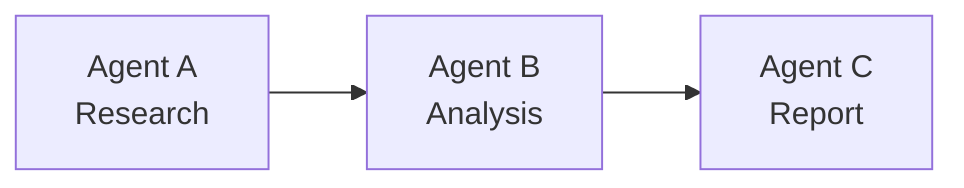
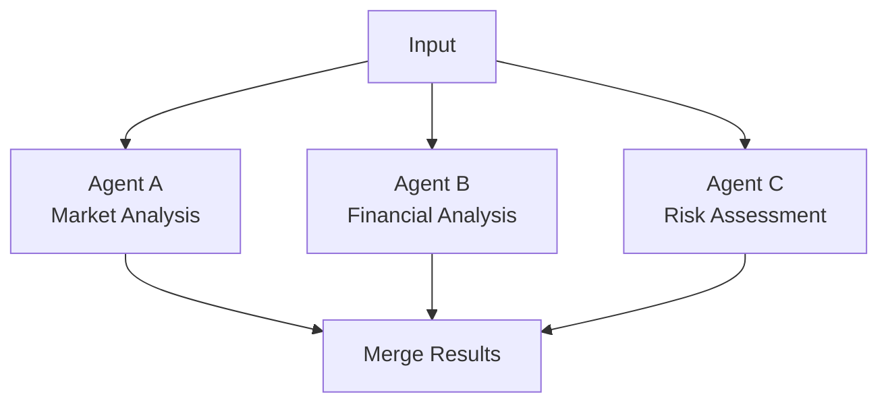
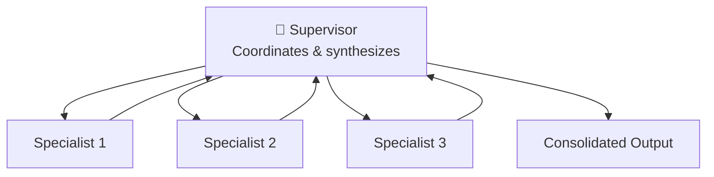
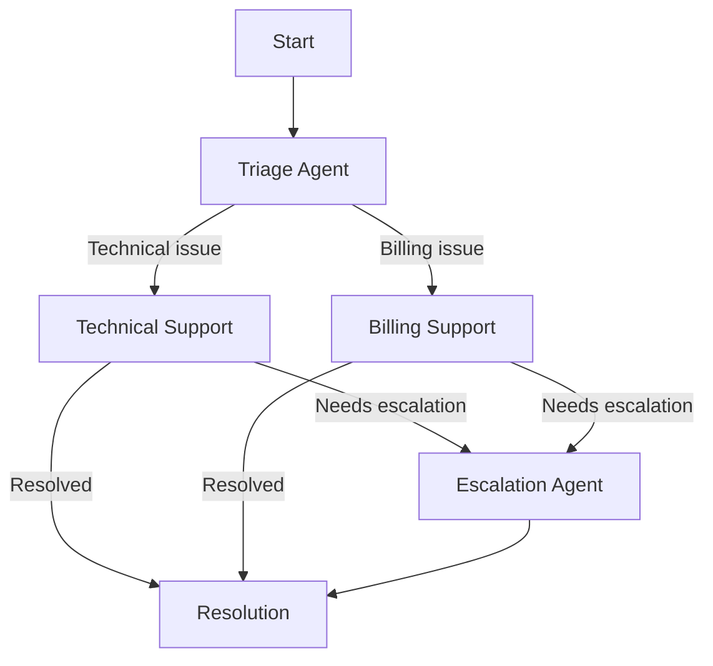

# Workflow Designer

The Workflow Designer lets you create, configure, and execute multi-agent AI workflows — visually or through natural language.

---

## Overview

Synaptiq workflows coordinate multiple AI agents to solve complex problems. Each workflow consists of:

- **Nodes** — individual AI agents with specific roles and system prompts
- **Edges** — connections defining execution order and data flow
- **Flow Type** — how agents are orchestrated (sequential, parallel, supervisor, dynamic)
- **Input/Output** — data contracts for the workflow's inputs and results

---

## Creating Workflows

### Method 1: Natural Language Generation

Describe your workflow in plain English:

```
"Create a workflow for generating ABA therapy goals. 
 It should have a supervisor agent that coordinates 
 four specialists: ABA, Speech Therapy, OT, and CBT. 
 Each specialist generates domain-specific goals, 
 and the supervisor consolidates them."
```

Synaptiq's workflow generation engine:

1. Parses the description
2. Identifies required agents and their roles
3. Generates system prompts for each agent
4. Determines the optimal flow type
5. Creates the workflow definition

### Method 2: Visual Designer

The drag-and-drop visual designer provides:

- **Node palette** — available agent types and tools
- **Canvas** — visual flow editor with grid snapping
- **Properties panel** — configure each node's prompt, model, and parameters
- **Connection drawing** — link nodes with edges to define execution flow

### Method 3: API

```bash
POST /api/v1/workflow/save
Content-Type: application/json

{
  "spec": {
    "name": "Customer Onboarding",
    "description": "Multi-step customer onboarding workflow",
    "type": "SEQUENTIAL",
    "nodes": [
      {
        "id": "welcome",
        "name": "Welcome Agent",
        "systemPrompt": "You are a friendly onboarding assistant...",
        "model": "gemini-2.5-flash"
      }
    ],
    "edges": []
  }
}
```

---

## Flow Types

### Sequential

Agents execute one after another, each receiving the previous agent's output.



**Best for:** Linear pipelines where each step depends on the previous step's output.

**Example:** Research → Analyze → Generate Report

### Parallel

Multiple agents execute simultaneously, and results are merged.



**Best for:** Independent analyses that can run concurrently.

**Example:** Multi-perspective market research

### Supervisor

A supervisor agent delegates work to specialist agents and synthesizes their outputs.



**Best for:** Complex multi-domain problems requiring cross-domain synthesis.

**Example:** ABA therapy goal generation, comprehensive market assessment

### Dynamic

Agents decide at runtime which agent to call next based on intermediate results.



**Best for:** Adaptive workflows with conditional branching.

**Example:** Customer support triage, diagnostic troubleshooting

---

## Executing Workflows

### Via UI

1. Open a workflow from the workflow list
2. Provide the required input (text or structured data)
3. Click **Execute**
4. Monitor real-time progress as each agent runs
5. View the consolidated output

### Via API

```bash
POST /api/v1/workflow/execute
Content-Type: application/json

{
  "workflowId": "workflow-id-here",
  "input": {
    "clientProfile": {
      "name": "John Doe",
      "age": 7,
      "diagnosis": "ASD Level 2"
    }
  }
}
```

The response streams execution events via SSE:

```
event: agent_start
data: {"agentId": "aba-specialist", "status": "RUNNING"}

event: agent_output
data: {"agentId": "aba-specialist", "output": "..."}

event: workflow_complete
data: {"status": "COMPLETED", "output": "..."}
```

---

## Workflow Templates

Synaptiq includes pre-built templates for common patterns:

| Template | Flow Type | Description |
|----------|-----------|-------------|
| **Research & Report** | Sequential | Research → Analyze → Generate Report |
| **Multi-Perspective Analysis** | Parallel | Multiple analysts → Consolidated view |
| **Expert Panel** | Supervisor | Coordinator manages domain experts |
| **Support Triage** | Dynamic | Auto-routes to appropriate specialist |
| **Content Pipeline** | Sequential | Draft → Edit → Review → Publish |

Access templates: `GET /api/v1/workflow/templates`

---

## Run History

Every workflow execution is recorded with:

- **Run ID** — unique identifier
- **Status** — RUNNING, COMPLETED, FAILED
- **Timestamps** — start, end, duration
- **Agent outputs** — individual results from each agent
- **Consolidated output** — final merged result

View runs: `GET /api/v1/workflow/{workflowId}/runs`

View run detail: `GET /api/v1/workflow/runs/{runId}`
