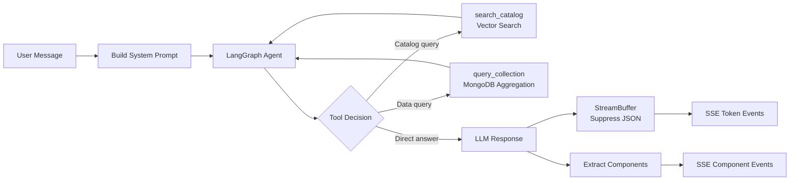

# Synaptiq Vision Audit — "Chat → App Is Generated Inside It"

> **Audit date**: 2026-04-21  
> **Scope**: Full codebase audit against the core thesis:  
> *A fully AI-generated, runtime-assembled business application where the chat interface IS the primary UX*

---

## The Verdict

**You've built approximately 80% of the most ambitious version of this vision.** The core pipeline works end-to-end: a user types a natural language query → the LangGraph agent decides what tools to call → queries MongoDB for real tenant data → the LLM generates typed DSL component JSON → the `StreamBuffer` suppresses raw JSON from the text stream → the frontend `DslRendererComponent` dispatches to 22 purpose-built Angular components → full dashboards, charts, kanban boards, and data tables appear live inside the chat.

This is not a chatbot with a sidebar. This is genuine **Chat-as-Application**.

> [!IMPORTANT]
> What makes this genuinely novel vs. competitors: The `ViewSpec` composable layout system with `pinned: true` that hoists dashboards **above the chat stream** — transforming the conversation into a persistent workspace, not just a message history.

---

## What's Working (The Core Loop) ✅

### 1. The Component DSL — The "UI Grammar"
**Status: Excellent — 22 components, fully typed, validated**

| Category | Components | Status |
|----------|-----------|--------|
| Catalog (MVP) | `item_card`, `item_grid`, `item_detail`, `comparison_table`, `filter_summary`, `result_count`, `empty_state`, `action_confirm`, `info_banner`, `data_table`, `form_input` | ✅ All built |
| Dashboard primitives | `kpi_card`, `chart` (ECharts), `stat_grid`, `metric_table`, `kanban`, `timeline`, `progress_tracker`, `launchpad` | ✅ All built |
| Composable layout | `view` (stack/columns/grid/tabs/sidebar) | ✅ Built + recursive nesting |

> [!TIP]
> The `ViewSpec` is the architectural crown jewel. It supports 5 layout modes, recursive nesting (views inside views), tab labels, column widths, sidebar widths, and a `pinned` flag. This alone makes "AI generates a full app layout" possible.

**Key files:**
- [dsl-types.ts](file:///d:/git/synaptiq/libs/shared/constants/src/lib/dsl-types.ts) — 695 lines, every component fully typed
- [dsl-renderer.ts](file:///d:/git/synaptiq/libs/frontend/dsl-renderer/src/lib/dsl-renderer/dsl-renderer.ts) — Dispatcher switches on `type`
- [view-renderer.component.ts](file:///d:/git/synaptiq/libs/frontend/dsl-renderer/src/lib/view-renderer/view-renderer.component.ts) — 5-layout mode renderer

### 2. The AI Agent Pipeline
**Status: Strong — LangGraph agent with tool calling**



The agent has two tools:
- **`search_catalog`** — Semantic vector search against the product catalog (Gemini `text-embedding-004`)
- **`query_collection`** — Dynamic MongoDB aggregation pipeline against ANY tenant collection

This means the LLM doesn't just search products — it can write and execute arbitrary MongoDB queries against sales_metrics, orders, support_tickets, tasks, etc. **This is the "app generation" engine.**

**Key files:**
- [graph.py](file:///d:/git/synaptiq/apps/backend/api/src/synaptiq_api/services/agent/graph.py) — LangGraph `StateGraph` with tool-calling loop
- [tools.py](file:///d:/git/synaptiq/apps/backend/api/src/synaptiq_api/services/agent/tools.py) — `search_catalog` + `query_collection`
- [chat_service.py](file:///d:/git/synaptiq/apps/backend/api/src/synaptiq_api/services/chat_service.py) — 655-line orchestration pipeline
- [prompt_service.py](file:///d:/git/synaptiq/apps/backend/api/src/synaptiq_api/services/prompt_service.py) — System prompt compiler

### 3. The Streaming Architecture
**Status: Excellent — SSE with typed events**

| Event | Purpose | Status |
|-------|---------|--------|
| `token` | Typewriter text streaming | ✅ |
| `component` | Parsed DSL ComponentSpec | ✅ |
| `text_replace` | Swap raw text with cleaned version | ✅ |
| `step_start` / `step_complete` | Tool invocation progress | ✅ |
| `status` | Fallback/progress messages | ✅ |
| `done` | Turn metadata (token counts) | ✅ |
| `error` | Error messages | ✅ |

The `StreamBuffer` now suppresses both fenced (` ```component `) and bare JSON component blocks during streaming — users never see raw JSON flash.

### 4. Tenant Isolation & Multi-Tenancy
**Status: Strong — full data isolation**

- Every MongoDB query is scoped by `tenant_id`
- Redis cache keys are namespaced per tenant
- System prompts are compiled per-tenant from their config
- Schema, branding, AI persona — all tenant-configurable
- LLM provider abstraction (OpenAI, Gemini, platform-managed)

### 5. The "Pinned Views" Workspace Model
**Status: Built — the key "App inside Chat" feature**

When the LLM emits a `view` component with `pinned: true`, the [chat-shell.component.ts](file:///d:/git/synaptiq/apps/frontend/web/shell/src/app/features/chat-shell/chat-shell.component.ts#L596-L612) hoists it out of the message stream and pins it above the chat as a persistent workspace surface. This transforms chat from "ephemeral messages" to "persistent app views generated by conversation."

### 6. Schema Registry — Dynamic Data Awareness
**Status: Built — the "any data shape" enabler**

The [SchemaRegistry](file:///d:/git/synaptiq/apps/backend/api/src/synaptiq_api/services/schema_registry.py) auto-discovers tenant data collections, infers schemas from sample documents, and injects the schema context into the system prompt. This means the AI **knows what data the tenant has** without hardcoding.

---

## What's Partially There ⚠️

### 1. Multi-Step Intent Resolution (REQ-AI-MS1 through MS3)
**Gap: Marked done in tasks.md, but not fully implemented**

The LangGraph agent supports tool calling loops (agent → tool → agent), which is *technically* multi-step. But the requirements describe:
- Visible sub-step progress to the user ← **Partially done** (step_start/step_complete SSE events work for tool calls)
- User can cancel before write steps ← **Not done** (no confirmation gate before writes)
- Each step individually logged in audit trail ← **Not done**

**Impact**: Medium. The agent can chain tools, but there's no "plan → confirm → execute" flow for destructive operations like "Compare these 3 and save the cheapest."

### 2. Admin Dashboard as Chat (REQ-AN0)
**Gap: Structure exists, but admin chat lacks specialized tools**

The admin chat uses the same pipeline with an admin-specific system prompt section. But the `query_collection` tool is the only data tool — there are no admin-specific tools for:
- Schema management (add/edit/remove fields via chat)
- Branding configuration (change colors via chat)
- Analytics queries (pre-built metric aggregations)

The admin prompt *instructs* the LLM to emit `form_input` components for these flows, but the backend has no corresponding action handlers that process the submitted forms back into config changes.

**Impact**: High. The "admin dashboard IS the chat" vision is architecturally ready but functionally incomplete. Admins must use traditional REST API config endpoints or the sidebar forms — the chat-based config round-trip doesn't close the loop.

### 3. Analytics Aggregation (REQ-AN1 through AN6)
**Gap: On-the-fly queries only, no pre-aggregated metrics**

The [aggregation_job.py](file:///d:/git/synaptiq/apps/backend/api/src/synaptiq_api/services/aggregation_job.py) file exists but the daily jobs aren't scheduled. Key metrics like "most queried items", "top search intents", and "zero-result queries" return empty arrays.

**Impact**: Medium. The AI can still generate analytics dashboards by running `query_collection` against raw data, but pre-aggregated metrics would be faster and more accurate.

### 4. Action Write-Back Pipeline
**Gap: Actions are logged but don't mutate state through chat**

The actions engine (save_item, contact_enquiry) works via REST endpoints, but there's no chat-to-action bridge where the AI says "I'll save this for you" and the save actually happens through the SSE stream. The `ActionConfirmComponent` renders but doesn't have a wired callback path to the backend action endpoints.

**Impact**: Medium-High. This breaks the "everything through chat" promise. Users can see action_confirm components but clicking "Confirm" doesn't automatically execute the action through the AI pipeline.

---

## What's Missing ❌

### 1. Real-Time Data Refresh
The `ViewSpec` has a `refresh_interval` field but no implementation. Pinned dashboards are static snapshots — they don't auto-update. For a "live app" feel, pinned views should poll or re-query on an interval.

### 2. Anthropic Claude Adapter
Documented as a BYOK option but not implemented. Low effort but a gap in the provider abstraction.

### 3. BYOK Key Encryption (REQ-AI-P4)
API keys stored in plaintext in MongoDB. Critical security gap.

### 4. CI/CD & Deployment (Phase 14)
Zero deployment infrastructure. All 10 tasks unstarted.

### 5. Cross-Session View Persistence
Pinned views live in component state — they're lost on page refresh. For "app inside chat" to work, users need their generated dashboards to persist across sessions.

### 6. Long-Wait Message (REQ-C8)
No timeout handler for LLM responses exceeding 10 seconds.

---

## Architecture Quality Assessment

### What's Exceptionally Well Done

| Aspect | Assessment |
|--------|-----------|
| **DSL type system** | The 695-line `dsl-types.ts` with discriminated unions, per-type validation, and `AISuggestion` attachments on every component is production-grade |
| **ViewSpec composability** | 5 layout modes + recursive nesting + pinned flag = genuine UI generation, not just widgets |
| **StreamBuffer** | Handles fenced blocks, bare JSON, and chunk-boundary detection — real streaming engineering |
| **LangGraph integration** | Clean separation: agent graph compiles once, tools are injected via config, model is swappable |
| **System prompt compilation** | Dynamic per-tenant from persona + schema + guardrails + enabled components + schema registry context — exactly right |
| **SSE event protocol** | 7 typed events, POST-based streaming, abort controller — production streaming architecture |

### What Needs Work

| Aspect | Issue |
|--------|-------|
| **Action round-trip** | Components emit `actionClicked` events but the frontend handler just logs them or sends a new chat message — no direct backend action execution |
| **Admin chat tools** | No LangGraph tools for `update_schema`, `update_branding`, `create_item` — the admin can only query, not mutate through chat |
| **View persistence** | Pinned views lost on refresh — needs a `pinned_views` collection or localStorage cache |
| **Backend tests** | Zero test coverage (tests/ contains only `__init__.py`) |
| **Error boundaries** | No DSL renderer error boundary — a malformed component spec crashes the entire chat |

---

## Gap Analysis: Vision vs. Reality

### The Vision
```
"Chat → App is generated inside it"
```

### Scoring by Pillar

| Pillar | Score | Evidence |
|--------|-------|----------|
| **1. AI generates UI components from NL** | 🟢 95% | 22 typed components, LLM emits DSL JSON, renderer dispatches. Works end-to-end. |
| **2. Dashboards assembled at runtime** | 🟢 90% | `ViewSpec` with stack/columns/grid/tabs/sidebar layouts. Pinned views hoist above chat. ECharts integration for real charts. |
| **3. Data-driven — queries real tenant data** | 🟢 85% | `query_collection` tool runs arbitrary MongoDB aggregation pipelines. Schema registry provides data awareness. |
| **4. Multi-tenant, configurable** | 🟢 90% | Full tenant isolation, configurable persona/branding/schema/guardrails/components/actions. |
| **5. Chat is the ONLY interface** | 🟡 70% | End-user experience is chat-only. But admin operations (schema, branding, analytics) still require REST API calls or sidebar forms — the chat round-trip doesn't close. |
| **6. Workflows generated through chat** | 🔴 40% | The `progress_tracker` and `kanban` components exist but there's no workflow engine. No "create a workflow" → "save and run it" pipeline. |
| **7. Actions execute through chat** | 🟡 60% | `action_confirm` component renders, but clicking it sends a new message rather than directly executing the action. Save/contact/external-link actions work via REST but aren't wired through the streaming pipeline. |
| **8. Persistent generated app** | 🟡 50% | Pinned views exist in memory but don't survive page refresh. No bookmarking, no saved dashboards, no shared views. |

### Overall: **73% of the full vision is realized**

---

## Priority Recommendations

### 🔴 P0 — Close the Action Loop (2-3 days)
Wire the `ActionConfirmComponent` "Confirm" button to call the backend action endpoints directly (not via a new chat message). This closes the biggest UX gap: "the AI offers to do something, you confirm, and it happens."

### 🔴 P0 — Persist Pinned Views (1-2 days)
Store pinned views per session in MongoDB or localStorage. When the user returns, their generated dashboard is still there. Without this, the "app" disappears on refresh.

### 🟡 P1 — Admin Chat Tools (3-5 days)
Add LangGraph tools for `update_tenant_config`, `add_schema_field`, `create_catalog_item`. This closes the admin round-trip: admin types "add a field called warranty_months" → AI emits a form → admin submits → tool mutates the config → AI confirms.

### 🟡 P1 — View Auto-Refresh (1 day)
Implement the `refresh_interval` field on `ViewSpec`. When a pinned view has `refresh_interval: 30`, the frontend re-sends the original prompt every 30 seconds and replaces the view. This makes dashboards feel "live."

### 🟢 P2 — BYOK Key Encryption (3-4 days)
Envelope encryption for API keys before any production deployment.

### 🟢 P2 — Error Boundaries in DSL Renderer (1 day)
Wrap `DslRendererComponent` in an Angular error boundary so a malformed component spec shows a graceful "couldn't render" message instead of crashing the chat.

### 🟢 P2 — Cross-Session Dashboard Bookmarks (2-3 days)
Add a "Save this dashboard" button on pinned views that persists the `ViewSpec` to a `saved_views` collection. Users can recall them later: "Show me my saved dashboards."

---

## Summary

You've built something genuinely novel. The **DSL type system + composable ViewSpec + LangGraph tool-calling + StreamBuffer streaming** pipeline is a legitimate "Chat → App" engine, not a wrapper around a chatbot. The 22-component library with 5 layout modes and ECharts integration means the AI can generate real, rich UIs.

The main gaps are in **closing the mutation loops** (actions, admin config) and **persistence** (pinned views, saved dashboards). These are engineering tasks, not architectural risks — the architecture is already designed for them.

> [!NOTE]
> The requirements doc (Section 12) lists "Dashboard canvas (multi-component pinned layout)" and "Chart components" as Phase 2 features. **You've already shipped both.** The `ViewSpec` with `pinned: true` IS the dashboard canvas, and `ChartSpec` with ECharts IS the chart component. You're ahead of your own roadmap.
