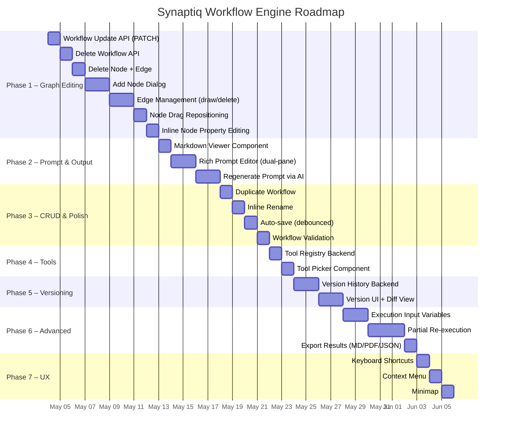

# Synaptiq Workflow Engine — Implementation Plan

## Current State Audit

### ✅ What Exists Today
| Feature | Status | Location |
|---|---|---|
| NL → Workflow generation (SSE) | ✅ Working | `workflow_service.generate_workflow()` |
| Save / Load / List workflows | ✅ Working | `workflow.py` CRUD endpoints |
| SVG canvas with auto-layout | ✅ Working | `WorkflowCanvasComponent` |
| Zoom / Pan / Node selection | ✅ Working | Canvas interactions |
| SSE execution with per-node streaming | ✅ Working | `WorkflowExecutor.execute()` |
| Run history persistence + viewer | ✅ Working | `workflow_runs` collection |
| System prompt inline editing | ✅ Partial | `onSystemPromptChange()` — edits but no save |
| Starter templates | ✅ Working | 3 built-in templates |

### ❌ What's Missing (Prioritized)
| Gap | Impact | Priority |
|---|---|---|
| No visual graph editing (add/delete/move nodes) | **Critical** — users can't iterate on generated workflows | P0 |
| No prompt editor with preview | **Critical** — system prompts are edited in a tiny textarea | P0 |
| No workflow update/patch API | **High** — edits can't be saved back | P0 |
| No markdown viewer for outputs | **High** — outputs render as raw `<pre>` text | P1 |
| No tool registry / management | **High** — tools are just string names | P1 |
| No workflow versioning | **Medium** — no undo, no history | P2 |
| No delete workflow API | **Medium** — users can't clean up | P2 |
| No workflow duplication | **Medium** — can't fork/clone | P2 |
| No partial re-execution | **Medium** — must re-run everything | P3 |
| No webhook/scheduled triggers | **Low** — manual execution only | P3 |

---

## Phase 1: Visual Graph Editing (P0)
**Goal**: Let users manually modify AI-generated workflows — add/remove/rewire nodes and edges.

### 1.1 — Add Node
**What**: Button in the toolbar or canvas right-click → opens a node creation dialog.

**Frontend** — `WorkflowCanvasComponent`
```
Files to create/modify:
  libs/frontend/chat/src/lib/workflow/
  ├── node-editor-dialog.component.ts     ← NEW
  ├── node-editor-dialog.component.html   ← NEW
  ├── node-editor-dialog.component.scss   ← NEW
  └── workflow-canvas.component.ts        ← MODIFY (add addNode method)
```

- New `NodeEditorDialogComponent` (Angular Material Dialog):
  - Form fields: `label`, `type` (dropdown: agent/tool/function/conditional/parallel), `description`, `system_prompt` (with markdown preview), `tools` (multi-select chips), `llm` (provider + model dropdowns)
  - Auto-generates `id` from label (slugified)
  - Returns an `AgentNodeSpec` on submit
- Canvas method `addNode(spec: AgentNodeSpec)`:
  - Appends to `spec.agents[]`
  - Emits `specChange` with updated spec
  - New node placed at center of current viewport (or click position)
- Toolbar button: `+ Add Node` next to zoom controls

### 1.2 — Delete Node
**What**: Right-click node → "Delete" option, or button in the inspector panel.

**Frontend** — `WorkflowCanvasComponent`
- Add `deleteNode(id: string)` method:
  - Remove from `spec.agents[]`
  - Remove all edges where `from === id` or `to === id`
  - Remove from `conditional_edges` where `from === id`
  - If deleted node was `entry_point`, reset to first remaining agent
  - Emit `specChange`
- Add delete button (🗑️) to the inspector panel header
- Add confirmation dialog before deletion

### 1.3 — Edit Node (Inline Inspector Enhancement)
**What**: Expand the existing inspector panel into a full editor.

**Frontend** — Inspector panel in `workflow-canvas.component.html`
- Make **label** editable (inline input, not just display)
- Make **description** editable (textarea)
- Make **type** editable (dropdown)
- Make **LLM config** editable (provider + model dropdowns)
- Add **Tools** management (add/remove chips with autocomplete from tool registry)
- Wire all changes through new `onNodePropertyChange(nodeId, key, value)` method
- Each edit immediately emits `specChange` for live updates

### 1.4 — Edge Management (Add / Delete Connections)
**What**: Draw edges between nodes by clicking output → input ports.

**Frontend** — `WorkflowCanvasComponent`
- Add visible **connection ports** on nodes (right side = output, left side = input)
- **Add edge**: Click output port → drag to input port → creates edge
  - Show a temporary SVG line during drag
  - On drop, open a mini-dialog for edge `label` and `condition`
  - Emit `specChange`
- **Delete edge**: Click on edge → show delete button or right-click context menu
  - Remove from `spec.edges[]`
  - Emit `specChange`
- Validate: prevent duplicate edges, self-loops

### 1.5 — Drag-to-Reposition Nodes
**What**: Users can drag nodes to custom positions and persist positions.

**Frontend** — `WorkflowCanvasComponent`
- Add `position?: { x: number; y: number }` to node spec (already in `AgentNodeSpec`)
- On mousedown on node → enter drag mode (distinguish from pan by target)
- On mousemove → update position signal
- On mouseup → write position back to spec, emit `specChange`
- Layout algorithm: if node has `position`, use it; otherwise auto-layout
- Add "Auto-layout" button to reset positions

---

## Phase 2: Prompt Editor & Markdown Viewer (P0)

### 2.1 — Rich Prompt Editor
**What**: Replace the tiny `<textarea>` with a proper editor that supports markdown preview.

```
Files to create/modify:
  libs/frontend/chat/src/lib/workflow/
  ├── prompt-editor.component.ts          ← NEW
  ├── prompt-editor.component.html        ← NEW
  └── prompt-editor.component.scss        ← NEW
```

- **Dual-pane layout**: Edit (left) | Preview (right)
- **Markdown rendering**: Use `marked` library (already common in Angular) to render system prompts as markdown
- **Template variables**: Highlight `{{variable}}` placeholders with colored chips
- **Character count / token estimate**: Show approximate token count (chars / 4)
- **Full-screen mode**: Expand editor to full viewport for complex prompts
- **Syntax highlighting**: For code blocks within prompts
- Integrate into inspector panel when editing `system_prompt`
- Also usable standalone (for workflow-level description editing)

### 2.2 — Markdown Output Viewer
**What**: Replace `<pre>{{ nodeOutput }}</pre>` with a rendered markdown view.

```
Files to create/modify:
  libs/frontend/chat/src/lib/workflow/
  ├── markdown-viewer.component.ts        ← NEW
  ├── markdown-viewer.component.html      ← NEW
  └── markdown-viewer.component.scss      ← NEW
```

- **Rendered markdown**: Parse LLM output as markdown (headings, lists, code blocks, tables)
- **Toggle raw/rendered**: Button to switch between raw text and rendered markdown
- **Copy to clipboard**: One-click copy of the raw output
- **Expand/collapse**: For long outputs, show first 500 chars with "Show more"
- Replace the `<pre class="node-output-pre">` in the inspector Output tab
- Also use in the run history detail view

### 2.3 — Regenerate Prompt via AI
**What**: Button to ask the LLM to regenerate/improve a specific node's system prompt.

**Backend** — New endpoint
```python
# POST /api/v1/workflow/regenerate-prompt
class RegeneratePromptRequest(BaseModel):
    node_id: str
    node_label: str
    node_description: str
    current_prompt: str
    instruction: str = ""  # "Make it more concise" / "Add error handling"
    workflow_context: dict  # The full spec for context
```

**Frontend** — Inspector panel
- "✨ Regenerate" button next to system prompt editor
- Opens a small dialog: "How should I improve this prompt?" with preset options:
  - "Make more specific"
  - "Add error handling"
  - "Make more concise"
  - Custom instruction text field
- Calls backend, receives improved prompt
- Shows diff between old and new prompt
- User confirms or reverts

---

## Phase 3: Workflow CRUD Completion (P0)

### 3.1 — Update Workflow API (PATCH)
**What**: Save edited workflows back to MongoDB.

**Backend** — `workflow.py`
```python
# PATCH /api/v1/workflow/{workflow_id}
class UpdateWorkflowRequest(BaseModel):
    spec: dict[str, Any]  # Full or partial spec update

@router.patch("/{workflow_id}")
async def update_workflow(workflow_id: str, body: UpdateWorkflowRequest, request: Request):
    tenant_id = request.state.tenant_id
    updated = await workflow_service.update_workflow(workflow_id, body.spec, tenant_id)
    return {"id": workflow_id, "success": True, "updated_at": updated}
```

**Backend** — `workflow_service.py`
```python
async def update_workflow(self, workflow_id: str, spec_updates: dict, tenant_id: str) -> float:
    db = await get_database()
    now = time.time()
    result = await db["workflows"].update_one(
        {"id": workflow_id, "tenant_id": tenant_id},
        {"$set": {**spec_updates, "updated_at": now}},
    )
    if result.matched_count == 0:
        raise ValueError(f"Workflow {workflow_id} not found")
    return now
```

**Frontend** — `WorkflowService`
- Add `updateWorkflow(workflowId: string, spec: WorkflowSpec): Promise<void>`
- Auto-save debounce: 2 second debounce after `specChange` emissions
- Visual indicator: "Saving..." → "✓ Saved" badge in toolbar

### 3.2 — Delete Workflow API
**What**: Allow users to delete workflows they no longer need.

**Backend** — `workflow.py`
```python
# DELETE /api/v1/workflow/{workflow_id}
@router.delete("/{workflow_id}", status_code=204)
async def delete_workflow(workflow_id: str, request: Request):
    tenant_id = request.state.tenant_id
    await workflow_service.delete_workflow(workflow_id, tenant_id)
```

**Backend** — `workflow_service.py`
```python
async def delete_workflow(self, workflow_id: str, tenant_id: str) -> None:
    db = await get_database()
    result = await db["workflows"].delete_one({"id": workflow_id, "tenant_id": tenant_id})
    if result.deleted_count == 0:
        raise ValueError(f"Workflow {workflow_id} not found")
    # Also clean up associated runs
    await db["workflow_runs"].delete_many({"workflow_id": workflow_id, "tenant_id": tenant_id})
```

**Frontend**
- Delete button in workflow list sidebar (with confirmation dialog)
- Delete button in canvas toolbar (kebab menu)

### 3.3 — Duplicate / Fork Workflow
**What**: Clone an existing workflow as a starting point for iteration.

**Backend** — `workflow.py`
```python
# POST /api/v1/workflow/{workflow_id}/duplicate
@router.post("/{workflow_id}/duplicate", status_code=201)
async def duplicate_workflow(workflow_id: str, request: Request):
    tenant_id = request.state.tenant_id
    new_id = await workflow_service.duplicate_workflow(workflow_id, tenant_id)
    return {"id": new_id, "success": True}
```

**Frontend**
- "Duplicate" button in workflow list and canvas toolbar kebab menu
- New workflow opens with name "{original_name} (Copy)"

### 3.4 — Rename Workflow (Inline)
**What**: Click on the workflow name in the canvas toolbar to edit it inline.

**Frontend** — `workflow-canvas.component.html`
- Replace `<span class="workflow-name">` with an inline-editable field
- On blur / Enter: emit `specChange` with updated `name`
- Auto-save via the debounced update mechanism

---

## Phase 4: Tool Registry & Management (P1)

### 4.1 — Backend Tool Registry
**What**: A registry of available tools that agents can use, replacing the current hardcoded string names.

```
Files to create:
  apps/backend/api/src/synaptiq_api/services/
  └── tool_registry.py                    ← NEW
```

```python
class ToolDefinition(BaseModel):
    id: str                    # "web_search"
    name: str                  # "Web Search"
    description: str           # "Search the web for information"
    category: str              # "search" | "data" | "communication" | "code"
    parameters: list[dict]     # JSON Schema for tool inputs
    icon: str                  # Material icon name
    enabled: bool = True

BUILT_IN_TOOLS: list[ToolDefinition] = [
    ToolDefinition(id="web_search", name="Web Search", ...),
    ToolDefinition(id="url_reader", name="URL Reader", ...),
    ToolDefinition(id="knowledge_base_search", name="Knowledge Base Search", ...),
    ToolDefinition(id="code_executor", name="Code Executor", ...),
    ToolDefinition(id="file_reader", name="File Reader", ...),
    ToolDefinition(id="calculator", name="Calculator", ...),
]
```

**Backend** — New endpoint
```python
# GET /api/v1/workflow/tools
@router.get("/tools")
async def list_available_tools():
    return {"tools": tool_registry.list_tools()}
```

### 4.2 — Frontend Tool Picker
**What**: Autocomplete chip-input for adding tools to agent nodes.

```
Files to create:
  libs/frontend/chat/src/lib/workflow/
  ├── tool-picker.component.ts            ← NEW
  ├── tool-picker.component.html          ← NEW
  └── tool-picker.component.scss          ← NEW
```

- Fetch available tools from `/api/v1/workflow/tools`
- Categorized dropdown with search/filter
- Each tool shows: icon, name, description
- Chip-based selection (add/remove)
- Integrate into node editor dialog and inspector panel

---

## Phase 5: Workflow Versioning (P2)

### 5.1 — Version History
**What**: Track every edit to a workflow spec, allowing undo/rollback.

**Backend** — `workflow_service.py`
- On every `update_workflow`, save the previous version to a `workflow_versions` collection:
  ```python
  {
      "workflow_id": str,
      "version": int,           # Auto-incrementing
      "spec": dict,             # Full spec snapshot
      "changed_by": str,        # tenant_id
      "changed_at": float,
      "change_summary": str,    # "Added node: Reviewer" / "Edited prompt: Researcher"
  }
  ```

**Backend** — New endpoints
```python
# GET /api/v1/workflow/{workflow_id}/versions
# GET /api/v1/workflow/{workflow_id}/versions/{version}
# POST /api/v1/workflow/{workflow_id}/revert/{version}
```

**Frontend**
- Version history panel (slide-out from right)
- Each version shows: timestamp, change summary, diff indicator
- Click to preview, button to revert
- Visual diff between versions (highlight added/removed/changed nodes)

---

## Phase 6: Enhanced Execution (P2-P3)

### 6.1 — Partial Re-Execution
**What**: Re-run the workflow from a specific node, using cached outputs for upstream nodes.

**Backend** — `WorkflowExecutor`
- Add `start_from_node` parameter to `execute()`
- Load cached outputs for all nodes before `start_from_node`
- Execute only from that node forward
- Save as a new run linked to the same workflow

**Frontend**
- Right-click on a node in a completed run → "Re-run from here"
- Shows which nodes will use cached data vs. re-execute

### 6.2 — Execution Input Variables
**What**: Allow workflows to define typed input variables that users fill before execution.

**Backend** — Extend `WorkflowSpec`
```python
class WorkflowInput(BaseModel):
    name: str             # "topic"
    type: str             # "text" | "textarea" | "number" | "select" | "file"
    label: str            # "Research Topic"
    required: bool = True
    default: str = ""
    options: list[str] = []  # For select type

# Add to WorkflowSpec:
inputs: list[WorkflowInput] = []
```

**Frontend**
- Before execution, show an input form dialog with all required variables
- Variables are injected into the entry point agent's context
- Variables can also be referenced in system prompts as `{{input.topic}}`

### 6.3 — Export Workflow Results
**What**: Export execution results as PDF, Markdown, or JSON.

**Frontend**
- Export button in completed run view
- Formats: Markdown (.md), PDF (via html2pdf), JSON (raw spec + outputs)
- Include: workflow diagram (SVG export), all node outputs, metadata

---

## Phase 7: UX Polish & Quality of Life (P1-P2)

### 7.1 — Workflow Validation
**What**: Validate workflow spec before execution, highlighting errors on the canvas.

**Frontend** — `WorkflowCanvasComponent`
- Validate on specChange:
  - ❌ No entry point set
  - ❌ Orphan nodes (no incoming or outgoing edges)
  - ❌ Missing system prompt on agent nodes
  - ❌ Dangling edges (reference non-existent node IDs)
  - ❌ Circular dependencies (without conditional routing)
  - ⚠️ Agents without tools (warning, not error)
- Show validation errors in a collapsible panel above the canvas
- Highlight problematic nodes/edges with red border/outline
- Disable "Run" button when there are blocking errors

### 7.2 — Keyboard Shortcuts
**What**: Power-user keyboard shortcuts for common actions.

| Shortcut | Action |
|---|---|
| `Delete` / `Backspace` | Delete selected node |
| `Ctrl+Z` | Undo last edit |
| `Ctrl+Shift+Z` | Redo |
| `Ctrl+S` | Save workflow |
| `Ctrl+D` | Duplicate selected node |
| `Ctrl+Enter` | Run workflow |
| `Escape` | Deselect / Close inspector |
| `+` / `-` | Zoom in / out |
| `0` | Reset zoom |

### 7.3 — Minimap
**What**: A small overview of the full graph for navigation in large workflows.

**Frontend**
```
Files to create:
  libs/frontend/chat/src/lib/workflow/
  ├── canvas-minimap.component.ts         ← NEW
  ├── canvas-minimap.component.html       ← NEW
  └── canvas-minimap.component.scss       ← NEW
```
- Fixed position in bottom-right corner (150×100px)
- Shows simplified node rectangles and edges
- Viewport indicator rectangle
- Click to jump to location
- Drag viewport rectangle to pan

### 7.4 — Context Menu (Right-Click)
**What**: Right-click on nodes, edges, or canvas background for contextual actions.

| Target | Menu Items |
|---|---|
| **Node** | Edit, Delete, Duplicate, Set as Entry Point, Regenerate Prompt |
| **Edge** | Edit Label, Delete, Change Condition |
| **Canvas** | Add Node, Paste Node, Auto-Layout, Fit to Screen |

---

## Phase 8: Recommended Advanced Features

### 8.1 — Workflow Sharing & Marketplace
- **Export as JSON**: Download/upload workflow specs for sharing
- **Import from JSON**: Paste or upload a workflow spec
- **Public templates**: Community-contributed workflow templates
- **Share via link**: Generate shareable read-only links

### 8.2 — Real-Time Collaboration
- **Live cursors**: Multiple users editing the same workflow
- **Change attribution**: Who edited what and when
- **WebSocket sync**: Bidirectional state sync between clients

### 8.3 — Agent Testing Sandbox
- **Test single node**: Execute one agent in isolation with custom input
- **Mock upstream outputs**: Provide fake context for downstream agents
- **Prompt playground**: Iterate on prompts with instant feedback
- **A/B prompt testing**: Compare two prompts side-by-side

### 8.4 — Analytics Dashboard
- **Execution analytics**: Avg. duration per node, success rates, error patterns
- **Token usage tracking**: Per-node and per-run LLM token consumption
- **Cost estimation**: Approximate cost per execution based on model pricing
- **Performance trends**: Charts showing execution time over workflow iterations

---

## Implementation Order & Timeline



---

## File Impact Summary

### New Files (~15 components/services)
| File | Purpose |
|---|---|
| `node-editor-dialog.component.ts/html/scss` | Create/edit node dialog |
| `prompt-editor.component.ts/html/scss` | Rich dual-pane prompt editor |
| `markdown-viewer.component.ts/html/scss` | Rendered markdown output viewer |
| `tool-picker.component.ts/html/scss` | Tool selection autocomplete chips |
| `canvas-minimap.component.ts/html/scss` | Navigation minimap |
| `context-menu.component.ts/html/scss` | Right-click context menu |
| `tool_registry.py` | Backend tool definitions |

### Modified Files
| File | Changes |
|---|---|
| `workflow-canvas.component.ts` | Add/delete node/edge methods, drag, context menu, validation |
| `workflow-canvas.component.html` | Connection ports, minimap slot, context menu overlay |
| `workflow-canvas.component.scss` | Port styles, drag states, validation highlights |
| `workflow.service.ts` | `updateWorkflow()`, `deleteWorkflow()`, `duplicateWorkflow()`, `listTools()`, `regeneratePrompt()` |
| `workflow.py` (router) | PATCH, DELETE, duplicate, tools, regenerate-prompt endpoints |
| `workflow_service.py` | `update_workflow()`, `delete_workflow()`, `duplicate_workflow()`, version tracking |
| `workflow_executor.py` | Partial re-execution, input variables injection |
| `chat-shell.component.ts` | Auto-save integration, specChange handler wiring |

---

## Quick Wins (Can Ship This Week)

> [!TIP]
> These are the highest-ROI items that build on existing code with minimal effort:

1. **Markdown Output Viewer** — Replace `<pre>` with `marked` rendering (~2 hours)
2. **PATCH endpoint** — Wire `specChange` → auto-save to MongoDB (~1 hour)
3. **DELETE endpoint** — Add delete to router + service (~30 min)
4. **Inline rename** — Make workflow name editable in toolbar (~30 min)
5. **Delete node** — Button in inspector + `specChange` emit (~1 hour)
6. **Workflow validation** — Basic checks on `specChange` (~2 hours)

Total for quick wins: **~7 hours** of focused work.
